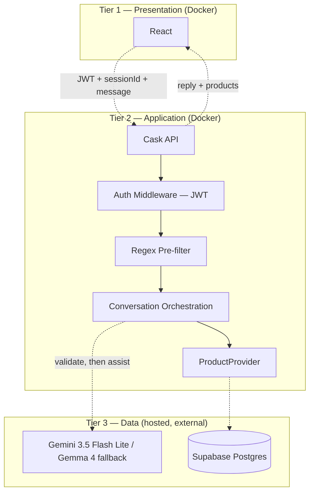

# ShopPilot

**ShopPilot** is an AI shopping assistant. Users create an account, chat in plain language (e.g. *"waterproof hiking shoes under $120"*), and the app finds matching products and explains why they fit — remembering the conversation across follow-up messages and across sessions.

**Stack:** React (frontend) · Scala / Cask (backend) · **Gemini 3.5 Flash Lite** (primary) / **Gemma 4** (fallback) via Google AI Studio · Supabase Postgres (hosted) · JWT auth

**Goal:** A working, demoable MVP — not a production system.

---

## How it works

1. You sign up or log in. The app gives you a login token so later requests know who you are.
2. You start a chat and type what you're looking for in everyday language.
3. Before the app trusts that message, it checks it isn't a prompt-injection attempt (cheap pattern check, then a small LLM "is this safe?" call). Bad messages are rejected and not saved.
4. If the message is fine, a second LLM call figures out your shopping filters (category, budget, etc.) and drafts a helpful reply, using recent chat context.
5. The backend searches the product catalog in Supabase and returns a short list of matches plus the assistant's explanation.
6. You refine ("make it under $50", "black only") and the app updates filters across turns. You can come back later to past chats from the sidebar.

Full design: [`docs/ARCHITECTURE.md`](docs/ARCHITECTURE.md).

---

## How to setup

```bash
cp .env.example .env
# fill in SUPABASE_URL, SUPABASE_KEY, GEMMA_API_KEY, JWT_SECRET, etc.
docker compose up
```

- Backend: http://localhost:8080  
- Frontend: http://localhost:5173  
- Database: team's hosted Supabase project (not in Docker)

Stop with `Ctrl+C` or `docker compose down`.

### Added a new library? (Cask, uPickle, an npm package, etc.)

1. Add it to `backend/build.sbt` (Scala) or run `npm install <package>` inside `frontend/` (React).
2. Rebuild once: `docker compose up --build`.
3. Commit and push the changed file (`build.sbt` or `package.json` + `package-lock.json`).

If you pulled someone else's dependency change, run `docker compose up --build` once after `git pull`, then go back to plain `docker compose up`.

**Rule of thumb:** `build.sbt` / `package.json` changed → `--build`. Otherwise → plain `up`.

---

## Repository structure

```
scala-shopping-assistant/
├── backend/                              # Scala API (Cask + uPickle)
│   ├── project/                          # sbt project settings
│   ├── logs/                             # runtime logs — gitignored, created at runtime
│   └── src/
│       ├── main/scala/assistant/
│       │   ├── http/                     # routes / controllers
│       │   ├── domain/                   # case classes (User, Conversation, Message, Product, ...)
│       │   ├── auth/                     # registration, login, password hashing, JWT
│       │   ├── services/                 # conversation orchestration, LLM calls, reranker
│       │   │   └── providers/            # ProductProvider interface + SupabaseProductProvider
│       │   ├── repo/                     # low-level Supabase access used by providers/auth
│       │   ├── logging/                  # shared logging utility/middleware
│       │   └── config/                   # env var loading
│       └── test/scala/assistant/         # backend tests
├── frontend/                             # React + TypeScript UI
│   └── src/
│       ├── components/ChatWidget/        # chat UI
│       ├── components/ProductCard/       # product cards
│       └── api/                          # calls to the Scala backend
├── data/
│   ├── migrations/                       # numbered, structure-only SQL, applied to Supabase
│   ├── seed/                             # seed_products.py — upserts from clean_products.jsonl
│   ├── clean_products.jsonl              # cleaned catalog — seed input (not raw CSV)
│   ├── raw/                               # source CSV only; cleaned before seeding; gitignored
│   └── scripts/
│       ├── apply_migrations.py           # migration runner (checks schema_migrations)
│       └── clean_products.py             # raw → clean_products.jsonl
├── docs/
│   ├── ARCHITECTURE.md                   # full architecture: infra, auth, security pipeline, logging
│   ├── API_CONTRACT.md                   # frontend-facing request/response shapes (mockable)
│   ├── database-schema.md                # every table, columns, migrations, seeding
│   └── project-plan.md                   # sprint plan & decisions
└── README.md
```

| Folder | Who owns it | What lives here |
| --- | --- | --- |
| `backend/` | Backend interns + lead | Routes, auth, conversation/LLM services, `ProductProvider`, logging |
| `frontend/` | Frontend intern | Chat widget, product cards, API client |
| `data/` | Catalog owner | Migrations, clean JSONL, seed script, raw CSV (pre-clean only) |
| `docs/` | Whole team | Architecture, API contract, database schema, project plan |

---

## Architecture

Full write-up: [`docs/ARCHITECTURE.md`](docs/ARCHITECTURE.md). Schema: [`docs/database-schema.md`](docs/database-schema.md).

Three tiers. React talks only to the Scala API; the Scala API is the only thing that talks to Google AI Studio (Gemini/Gemma) and Supabase. Docker covers frontend + backend only — Supabase and the LLM API are external.



---

## Tech choices (quick reference)

| Layer | Choice |
| --- | --- |
| Frontend | React + TypeScript |
| Backend HTTP | Cask |
| JSON | uPickle |
| Auth | JWT, Argon2 password hashing |
| Conversation state | Supabase Postgres — durable `conversations`/`messages`, hot-path `conversation_state`, ephemeral `chat_sessions` |
| Database | Supabase Postgres — hosted, shared across all environments (not Docker) |
| Product retrieval | `ProductProvider` interface → `SupabaseProductProvider` |
| LLM | **Primary:** `gemini-3.5-flash-lite` · **Fallback:** Gemma 4 (`gemma-4-31b-it`) on quota exhaustion · Google AI Studio · two-stage calls: validation, then assistant |
| Catalog | Cleaned `data/clean_products.jsonl` → seeded into Supabase via `data/seed/seed_products.py` |
| Logging | Shared logging middleware — `app.log`, `error.log`, `llm.jsonl` (dev only, gitignored) |

---

## See also

- [`docs/ARCHITECTURE.md`](docs/ARCHITECTURE.md) — full architecture, infra, auth, security pipeline, logging.
- [`docs/API_CONTRACT.md`](docs/API_CONTRACT.md) — frontend API request/response shapes (build/mock against these).
- [`docs/database-schema.md`](docs/database-schema.md) — every table, migrations, seeding.
- [`docs/project-plan.md`](docs/project-plan.md) — sprint plan, scope, risks, tech stack.
- [`docs/workflow.md`](docs/workflow.md) — horizontal, seam-based task breakdown for parallel team execution (supersedes team roles/timeline in `project-plan.md`).
