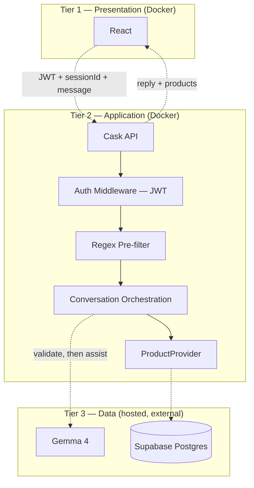

# ShopPilot

**ShopPilot** is an AI shopping assistant. Users create an account, chat in plain language (e.g. *"waterproof hiking shoes under $120"*), and the app finds matching products and explains why they fit — remembering the conversation across follow-up messages and across sessions.

**Stack:** React (frontend) · Scala / Cask (backend) · Gemma 4 via Google AI Studio · Supabase Postgres (hosted) · JWT auth

**Goal:** A working, demoable MVP — not a production system.

---

## How it works (short version)

1. A user registers/logs in; the backend issues a JWT.
2. Starting a chat creates a durable `conversation` plus a `chat_session` (the `sessionId` the frontend holds).
3. Each message passes a regex pre-filter, then a Gemma **validation** call, before it's trusted — rejected messages are never saved.
4. Once validated, a second Gemma call extracts/updates structured filters and drafts a reply, using recent history + current filters (not the full transcript).
5. The backend's `ProductProvider` searches Supabase (full-text + filters → top 30 → rerank → top 5); Gemma explains the matches; the UI shows the reply plus product cards.
6. Users can list, resume, rename, and delete past conversations — all ownership-checked against the JWT.

Full design, including the security pipeline and every table's reasoning: [`docs/ARCHITECTURE.md`](docs/ARCHITECTURE.md).

---

## How to setup?

### Infrastructure at a glance

- **Docker** containerizes the **frontend** and **backend** only, via Docker Compose.
- **PostgreSQL is hosted on Supabase** — it does not run in Docker, and there is no per-developer local database. Every environment (every developer, CI, the deployed demo) connects to the **same shared Supabase project**.
- A new developer only needs: install Docker, clone the repo, fill in `.env`, run `docker compose up`. Supabase requires no local setup.

### First-time setup

```bash
cp .env.example .env
```

Fill in `.env` (get these from whoever manages the team's Supabase project, plus your own Gemma key):

```
SUPABASE_URL=
SUPABASE_KEY=
SUPABASE_DB_URL=      # only needed if you'll run migrations yourself
GEMMA_API_KEY=
JWT_SECRET=
```

If the shared Supabase database isn't already migrated/seeded, do that once (see [Database: migrations & seeding](#database-migrations--seeding) below) — this is a one-time step per environment, not something `docker compose up` does for you.

```bash
docker compose up
```

This starts the Scala backend and the React frontend in matching, pre-configured containers. No need to install Scala, sbt, Node, or Postgres locally.

- Backend: http://localhost:8080
- Frontend: http://localhost:5173
- Database: your team's hosted Supabase project (not local)

### Daily use

```bash
docker compose up
```

Edit code as normal — both backend (`sbt ~run`) and frontend (Vite dev server) auto-reload on save.

Stop with `Ctrl+C`, or in another terminal:

```bash
docker compose down
```

### Added a new library? (Cask, uPickle, an npm package, etc.)

1. Add it to `backend/build.sbt` (Scala) or run `npm install <package>` inside `frontend/` (React).
2. Rebuild once: `docker compose up --build`.
3. Commit and push the changed file (`build.sbt` or `package.json` + `package-lock.json`).

If you pulled someone else's changes and they added a dependency, run `docker compose up --build` once after `git pull`, then go back to plain `docker compose up`.

**Rule of thumb:** `build.sbt` / `package.json` changed → `--build`. Otherwise → plain `up`.

### Database: migrations & seeding

Because the database is shared and hosted, there is **no `docker compose down -v` to reset it**. Schema changes and data loading are explicit, separate, manual steps:

```bash
# 1. Apply any new schema migrations (structure only) — do this whenever
#    you pull a new migration file, or right after writing your own.
pip install psycopg2-binary
export SUPABASE_DB_URL=postgresql://postgres:[password]@[host]:5432/postgres
python data/scripts/apply_migrations.py

# 2. Seed the product catalog — one time per environment, safe to re-run
#    (idempotent upsert on id), not something you run on every startup.
pip install supabase
export SUPABASE_URL=...
export SUPABASE_KEY=...
python data/seed/seed_products.py
```

Rules for the shared dev database (see [`docs/database-schema.md`](docs/database-schema.md#migrations) for the full reasoning):

- Migrations are numbered, structure-only, and forward-only. Whoever writes one applies it to shared dev immediately and posts in the team channel — don't leave it for someone else to guess should run.
- If a migration breaks shared dev, write a corrective migration (e.g. `005_fix_004.sql`). Never hand-edit the schema via the Supabase dashboard — that causes undetectable schema drift.

### Useful commands

| Command | What it does |
|---|---|
| `docker compose up` | Start frontend + backend (build only if no image exists yet) |
| `docker compose up --build` | Force rebuild — use after dependency changes |
| `docker compose down` | Stop and remove containers |
| `docker compose logs backend` | See backend logs only |
| `docker compose ps` | See what's running |
| `python data/scripts/apply_migrations.py` | Apply any unapplied schema migrations to Supabase |
| `python data/seed/seed_products.py` | Seed/refresh the product catalog (idempotent) |

### Why this setup

- Everyone gets the same JDK/Scala/sbt/Node versions — no "works on my machine," for the parts Docker owns.
- One shared Supabase database means everyone sees the same catalog and, eventually, the same test accounts — no schema drift between four separate local Postgres instances.
- Dependencies (Cask, uPickle, npm packages) are declared once in `build.sbt` / `package.json`, shared via git.
- Migrations are explicit and tracked (`schema_migrations`), so "what schema is shared dev actually running" is always answerable by reading `data/migrations/`, not by asking around.

---

## Repository structure

```
scala-shopping-assistant/
├── backend/                              # Scala API (Cask + uPickle)
│   ├── project/                          # sbt project settings
│   ├── logs/                             # runtime logs — gitignored, created at runtime
│   └── src/
│       ├── main/scala/assistant/
│       │   ├── http/                     # routes / controllers
│       │   ├── domain/                   # case classes (User, Conversation, Message, Product, ...)
│       │   ├── auth/                     # registration, login, password hashing, JWT
│       │   ├── services/                 # conversation orchestration, LLM calls, reranker
│       │   │   └── providers/            # ProductProvider interface + SupabaseProductProvider
│       │   ├── repo/                     # low-level Supabase access used by providers/auth
│       │   ├── logging/                  # shared logging utility/middleware
│       │   └── config/                   # env var loading
│       └── test/scala/assistant/         # backend tests
├── frontend/                             # React + TypeScript UI
│   └── src/
│       ├── components/ChatWidget/        # chat UI
│       ├── components/ProductCard/       # product cards
│       └── api/                          # calls to the Scala backend
├── data/
│   ├── migrations/                       # numbered, structure-only SQL, applied to Supabase
│   ├── seed/                             # seed_products.py — data only, idempotent
│   ├── raw/                               # source CSV, gitignored
│   └── scripts/
│       └── apply_migrations.py           # migration runner (checks schema_migrations)
├── docs/
│   ├── ARCHITECTURE.md                   # full architecture: infra, auth, security pipeline, logging
│   ├── API_CONTRACT.md                   # frontend-facing request/response shapes (mockable)
│   ├── database-schema.md                # every table, columns, migrations, seeding
│   └── project-plan.md                   # sprint plan & decisions
└── README.md
```

| Folder | Who owns it | What lives here |
| --- | --- | --- |
| `backend/` | Backend interns + lead | Routes, auth, conversation/LLM services, `ProductProvider`, logging |
| `frontend/` | Frontend intern | Chat widget, product cards, API client |
| `data/` | Catalog owner | Migrations, seed script, raw CSV |
| `docs/` | Whole team | Architecture, API contract, database schema, project plan |

---

## Architecture

Full write-up (infra, auth, six conversation actions, `ProductProvider`, the two-stage security pipeline, logging): [`docs/ARCHITECTURE.md`](docs/ARCHITECTURE.md). Full table-by-table schema: [`docs/database-schema.md`](docs/database-schema.md).

Three tiers. React talks only to the Scala API; the Scala API is the only thing that talks to Gemma 4 and Supabase. Docker's boundary covers only the first two tiers — Supabase and Gemma are external, hosted services.



### One validated turn, step by step

1. **React** sends the JWT, `sessionId`, and the new message.
2. **Auth middleware** verifies the JWT and resolves `user_id`; every route touching a conversation checks this `user_id` against the resource's owner **before** anything else runs (IDOR protection).
3. **Regex pre-filter** rejects obvious prompt-injection patterns outright — no LLM call, nothing saved, reject-on-match (never "strip and continue").
4. **Gemma Call #1 (validation only)** classifies the message as safe or not. Fail-closed: anything that isn't a clean `{"safe": true}` is treated as unsafe.
5. Only now is the user's message written to `messages` (with a `filters_snapshot` and `safe: true`).
6. **Gemma Call #2 (assistant)** extracts/updates filters and drafts a response, using `conversation_state.filters` + the last ~6–10 messages.
7. **`ProductProvider`** (interface) → **`SupabaseProductProvider`** (impl) runs full-text search + SQL filters on Supabase → top 30 → reranker → top 5. Gemma never writes SQL.
8. The assistant's turn is saved to `messages`; `conversation_state.filters` is overwritten with the latest values.
9. React renders the reply and product cards.

This costs roughly 2x LLM latency/tokens per legitimate turn (two sequential Gemma calls) — a deliberate trade-off for defense-in-depth, not a guaranteed defense. See `ARCHITECTURE.md` §6 for the full reasoning and the exact rejection/fail-closed rules.

---

## Tech choices (quick reference)

| Layer | Choice |
| --- | --- |
| Frontend | React + TypeScript |
| Backend HTTP | Cask |
| JSON | uPickle |
| Auth | JWT, Argon2/bcrypt password hashing |
| Conversation state | Supabase Postgres — durable `conversations`/`messages`, hot-path `conversation_state`, ephemeral `chat_sessions` |
| Database | Supabase Postgres — hosted, shared across all environments (not Docker) |
| Product retrieval | `ProductProvider` interface → `SupabaseProductProvider` |
| LLM | Gemma 4 via Google AI Studio — two-stage calls: validation, then assistant |
| Catalog | Kaggle e-commerce dataset → seeded into Supabase via `data/seed/seed_products.py` |
| Logging | Shared logging middleware — `app.log`, `error.log`, `llm.jsonl` (dev only, gitignored) |

## Environment variables

```
SUPABASE_URL=
SUPABASE_KEY=
SUPABASE_DB_URL=
GEMMA_API_KEY=
JWT_SECRET=
FRONTEND_URL=
BACKEND_URL=
LOG_LEVEL=INFO
LLM_LOGGING=true
```

Never hardcode secrets. `.env.example` documents the shape; `.env` is gitignored.

## See also

- [`docs/ARCHITECTURE.md`](docs/ARCHITECTURE.md) — full architecture, infra, auth, security pipeline, logging.
- [`docs/API_CONTRACT.md`](docs/API_CONTRACT.md) — frontend API request/response shapes (build/mock against these).
- [`docs/database-schema.md`](docs/database-schema.md) — every table, migrations, seeding.
- [`docs/project-plan.md`](docs/project-plan.md) — sprint plan, scope, risks, tech stack.
- [`docs/workflow.md`](docs/workflow.md) — horizontal, seam-based task breakdown for parallel team execution (supersedes team roles/timeline in `project-plan.md`).
