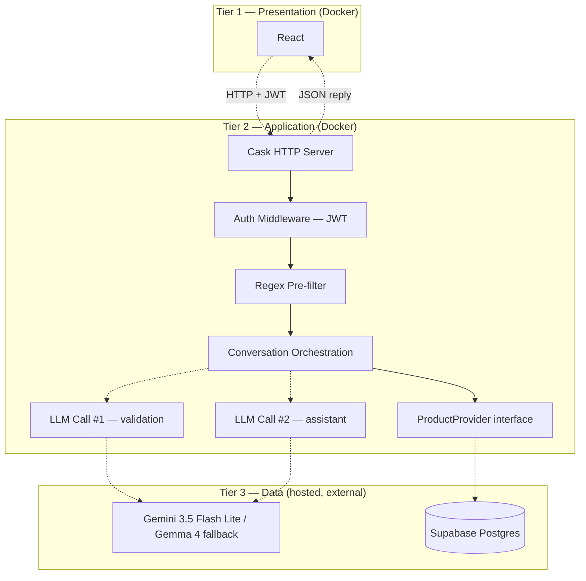
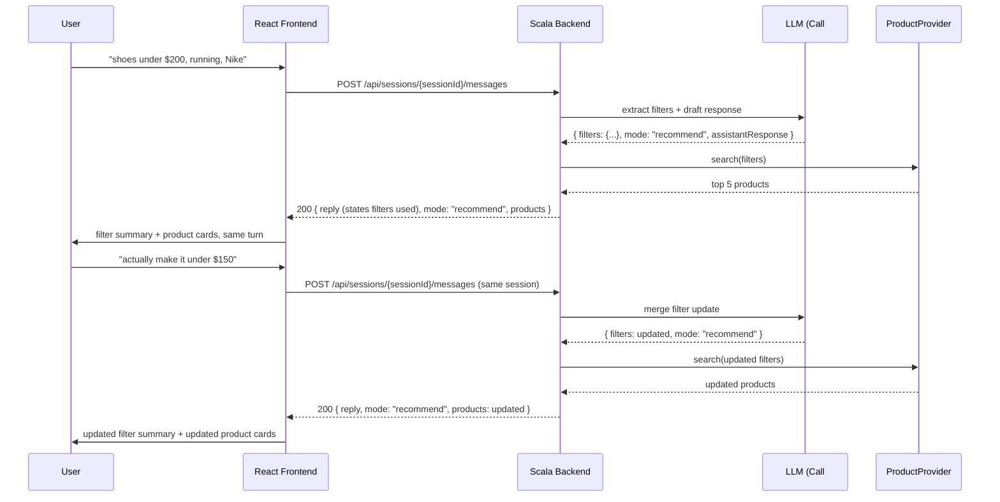

# Architecture

This is the design of **ShopPilot**, an AI shopping assistant: a React frontend, a Scala/Cask backend, **Gemini 3.5 Flash Lite** (primary) with **Gemma 4 fallback** for language understanding via Google AI Studio, and Supabase Postgres for all persistent data. It covers infrastructure, authentication, multi-turn conversations, product retrieval, the prompt-security pipeline, and logging.

## 1. Tiers and infrastructure

The system is a 3-tier application. React talks only to the Scala API; the Scala API is the only thing that talks to the LLM (Google AI Studio) and to the database.

- **Presentation** — React, in Docker.
- **Application** — Scala/Cask backend, in Docker. All auth, conversation orchestration, prompt validation, and product retrieval logic lives here.
- **Data** — Google AI Studio (Gemini API: **`gemini-3.5-flash-lite` primary**, **Gemma 4 fallback** on quota exhaustion) and Supabase Postgres (hosted, external). Neither runs inside Docker.

### LLM model selection

All LLM calls (validation + assistant) go through `LLMClient` and use the same model policy:

| Role | Model ID | When used |
| --- | --- | --- |
| **Primary** | `gemini-3.5-flash-lite` | Default for every Call #1 and Call #2 |
| **Fallback** | `gemma-4-31b-it` (Gemma 4) | When the primary model returns quota/rate-limit errors |

The client retries with the fallback model automatically — the orchestration layer does not branch on model choice. Log which model served each call in `llm.jsonl` for cost/debugging.

**Docker's job is narrow on purpose:** it containerizes the frontend and backend only, via Docker Compose, so every developer runs the same JDK/Scala/sbt/Node versions. The database is not part of that boundary — see §2.



## 2. Database: hosted Supabase Postgres, not Docker

**PostgreSQL does not run in a container.** Every environment — every developer's machine, CI, and the deployed demo — connects to the same **hosted Supabase Postgres** project as its single source of truth. There is one shared dev database, not one per developer.

This changes what "run the project" means: a new developer installs Docker, clones the repo, fills in `.env`, and runs `docker compose up`. There is no local Postgres to install, configure, or reset — Supabase is external and requires no local setup.

Supabase stores everything the app persists: `users`, `conversations`, `messages`, `conversation_state`, `chat_sessions`, and the `products` catalog. Full column-level detail is in [`database-schema.md`](database-schema.md).

### Why this is a bigger deal than swapping a connection string

Because the database is shared, schema changes are no longer a private, disposable thing you can wipe and retry. That drives the rest of this section:

- **Migrations, not one init script.** Schema changes live as numbered SQL files in `data/migrations/`, applied in order and tracked in a `schema_migrations` table (`version INT PRIMARY KEY, applied_at TIMESTAMPTZ`). A migration only runs once, ever, per database — the runner script checks `schema_migrations` before applying anything.
- **Migrations are structure only.** `CREATE TABLE`, `ALTER TABLE`, indexes — never data. Loading the product catalog is **seeding**, a separate concept, living in `data/seed/` and run manually, once per environment, after the relevant migration has been applied there.
- **`seed_products.py`** loads **`data/clean_products.jsonl`** (not raw CSV under `data/raw/`), connects via the Supabase client (`SUPABASE_URL` / `SUPABASE_KEY`), not a raw Postgres connection string, and is **idempotent**: it upserts on `id` (`INSERT ... ON CONFLICT (id) DO UPDATE`), so re-running it never duplicates rows. Produce the JSONL with `data/scripts/clean_products.py` before seeding.
- **Forward-only migrations.** There is no `docker compose down -v` for a hosted database — you cannot wipe Supabase and start clean. If a migration breaks the shared dev database, the fix is a new corrective migration (e.g. `004_fix_003.sql`), never a hand-edit through the Supabase dashboard. Hand-editing causes schema drift that no migration file records, which silently breaks this whole scheme for everyone else.
- **Applying to shared dev is not batched.** Whoever writes a migration for a feature applies it to the shared dev database themselves, immediately — not queued for someone else to guess should run it. Post in the team channel when you apply one, so people mid-testing aren't confused by a schema change they didn't expect.

```
data/
├── migrations/              # numbered, structure-only, forward-only
│   ├── 001_products_catalog.sql
│   ├── 002_init_users_and_conversations.sql
│   ├── 003_add_messages_and_state.sql
│   ├── 004_add_indexes.sql
│   └── … (forward-only; e.g. 007_add_email_verification_to_users.sql)
├── seed/
│   └── seed_products.py     # upserts clean_products.jsonl; idempotent; run manually
├── clean_products.jsonl     # cleaned catalog — seed input
├── raw/                     # source CSV only (pre-clean); gitignored — not seed input
└── scripts/
    ├── apply_migrations.py  # migration runner; checks schema_migrations
    └── clean_products.py    # raw → clean_products.jsonl
```

## 3. Authentication & authorization

The app has real accounts, not anonymous sessions. `users` stores `full_name`, `email`, and `password_hash` (Argon2id, salted — never plaintext, never a reversible hash), plus email-verification columns (`email_verified`, `verification_token_hash`, `verification_token_expires_at`). Flow: **register → verify email → login**. Only a successful login issues a **JWT**; the frontend sends it on every authenticated request; backend routes are protected by JWT middleware.

Verification emails are sent via **Resend** from the verified domain **`scalainterns.dev`** (see [`authPlan.md`](authPlan.md)). Password reset / forgot-password is out of scope for the current auth pass.

**Authorization is not optional and not implicit.** Every route touching `conversations`, `messages`, `conversation_state`, or `chat_sessions` must resolve the owning `user_id` (via `chat_sessions.user_id` or `conversations.user_id`) and compare it against the JWT's subject **before touching any other data**. This is the IDOR (insecure direct object reference) protection for every conversation-history feature — list, resume, delete, and rename all depend on this check running first, not as an afterthought.

No separate sessions/tokens table is needed for stateless JWT. If refresh tokens are added later, that gets its own migration and its own docs section — it is explicitly out of scope now.

### Auth endpoints

| Method | Path | Auth | Purpose |
| --- | --- | --- | --- |
| `POST` | `/api/auth/register` | No | Create account (hashed password); send verification email; no JWT yet |
| `GET` | `/api/auth/verify-email?token=...` | No | Mark email verified; single-use token with expiry |
| `POST` | `/api/auth/login` | No | Verify credentials + `email_verified`; issue JWT |

Request/response shapes: [`API_CONTRACT.md`](API_CONTRACT.md). Implementation sequence: [`authPlan.md`](authPlan.md).

### Authentication hardening requirements (must implement)

These are easy to skip and are treated as implementation requirements, not optional polish:

- **Rate-limit auth endpoints.** Apply server-side rate limiting on `register` and `login` to reduce brute-force attempts and abuse. (`forgot-password` when that endpoint exists later.)
- **Prevent account enumeration.** Password-reset requests (when added) must always return a neutral response like "If that email exists, we sent a link." Never reveal whether an email is registered. Login already uses a generic `INVALID_CREDENTIALS` for bad email or bad password.
- **Expire and single-use verify tokens.** Email verification tokens must have a short expiry window and must be invalidated immediately after first successful use.
- **Use constant-time credential verification.** Password checks must use vetted Argon2 library verification paths; never implement custom string/hash comparisons.
- **Email deliverability is part of readiness.** Sender domain `scalainterns.dev` must stay verified in Resend with SPF/DKIM (and DMARC if available) so auth emails reliably arrive and do not land in spam.

## 4. Conversations: durable history vs. ephemeral sessions

Two ideas are deliberately kept separate:

- **`conversations`** — durable, user-facing chat history. Created **lazily** only when the first user message **passes Call #1**, then lives until deleted, has a title, and sorts a user's chat list by `last_message_at`.
- **`chat_sessions`** — an ephemeral runtime handle: one row per active connection/tab. The `sessionId` the frontend holds and sends on every message *is* a `chat_sessions.id`. Until the first accepted message, `conversation_id` may be null; after lazy create it points at that conversation.

This split is what makes "resume" work correctly: resuming a past conversation creates a **new `chat_sessions` row** against the **same `conversation_id`**. The full message history and current filters carry over unchanged — nothing about the conversation itself is touched, only a new runtime handle is minted.

Current filter state and turn-by-turn history are also kept apart, for a different reason:

- **`conversation_state`** — one row per conversation, current filters only (e.g. `{ category, budget, waterproof }`). This is the hot path: "load current filters for this conversation" is a primary-key point lookup, not a scan over message history.
- **`messages`** — the durable, ordered (`sequence_number`, not just timestamps) turn history, including `filters_snapshot` per row as an **audit trail** of filters believed *at that point in time*. `conversation_state` is mutable and current-only, so it cannot answer "what did we think the filters were three turns ago?" — `messages.filters_snapshot` can. There is no `safe` column on `messages`: rejected turns are never inserted, so presence in the table already means Call #1 passed.

Full DDL, column types, and constraints are in [`database-schema.md`](database-schema.md).

### Why lazy-create `conversations` (not upfront on “New Chat”)

Clicking **New Chat** only creates a `chat_sessions` handle. A `conversations` row (and `conversation_state`) appears only after the first user message **passes Call #1**. Reasons:

1. **Empty chats are noise.** Users open “New Chat”, never type, and leave. Creating a durable conversation immediately fills the sidebar with untitled empty threads. Lazy create keeps the history list = chats that actually have validated content.
2. **Rejected first messages must not create history.** If the first message fails regex / Call #1, nothing durable should exist — no conversation, no state, no message. Creating the conversation upfront would force delete-on-reject or leave empty shells.
3. **Sidebar = resumable work.** A conversation in `GET /api/conversations` means “there is something to resume.” That only becomes true once a validated user turn exists.
4. **Session can wait for a conversation id.** `chat_sessions.conversation_id` is nullable until lazy create; then it is set. Resume always targets an existing `conversationId` from the list, so it always has a real conversation.

Creating the conversation **upfront** is simpler for FKs, but it fights the security pipeline (don’t persist rejected turns) and the product UX (don’t list empty chats). Lazy create is intentional.

### The seven user-facing actions

| # | Action | Endpoint | Notes |
| --- | --- | --- | --- |
| 1 | Start new chat | `POST /api/conversations` | Creates only a `chat_sessions` row and returns `sessionId`. No `conversations` row yet. |
| 2 | Send a message | `POST /api/sessions/{sessionId}/messages` | Pipeline (§6). After Call #1 pass: lazy-create conversation if needed, **commit user message**, then Call #2. |
| 3 | Regenerate assistant reply | `POST /api/sessions/{sessionId}/messages/{messageId}/regenerate` | Retries Call #2 for a validated user message that has no successful assistant reply (or after Call #2 / connection failure). **Max 3 regenerations per user message.** Rate-limited. |
| 4 | View conversation history | `GET /api/conversations` | Scoped to the authenticated user, ordered by `last_message_at DESC`. |
| 5 | Resume a past conversation | `POST /api/conversations/{conversationId}/resume` | Creates a **new** `chat_sessions` row against the same conversation. History/state unaffected. |
| 6 | Delete a conversation | `DELETE /api/conversations/{conversationId}` | Ownership-checked. **Hard delete**, `ON DELETE CASCADE` removes messages/state/sessions. |
| 7 | Rename a conversation | `PATCH /api/conversations/{conversationId}` `{ title }` | `UPDATE … WHERE id = ? AND user_id = ?` — `user_id` in the `WHERE` **is** the authz check. |

Plus the pre-existing catalog/health routes:

| Method | Path | Purpose |
| --- | --- | --- |
| `GET` | `/api/products` | Catalog search/debug. |
| `GET` | `/health` | Health check for deploy/CI. |

**What gets sent to the LLM per turn** is bounded on purpose: `conversation_state.filters` (structured, cheap) + the last **~6–10 raw messages** (not the full transcript) + the latest message. This keeps token cost bounded while still giving the LLM enough raw context to self-correct on ambiguous turns.

### Shared state across sessions

`conversation_state` is keyed by **`conversation_id`**, not by `chat_sessions.id`. Multiple session handles (tabs, resume, stale handle rollover) can point at the same conversation; they all read and write the **same** `conversation_state` row. That is intentional: the conversation has one current set of shopping filters, regardless of which tab sent the message.

**Example — two sessions, one conversation**

| Step | Session | User says | `conversation_state.filters` after turn |
| --- | --- | --- | --- |
| 1 | `session-A` | "Need shoes under $100" | `{ "category": "shoes", "max_price": 100 }` |
| 2 | `session-B` (same `conversation_id`) | "Make it under $50" | `{ "category": "shoes", "max_price": 50 }` |

Turn 2 is correct: the budget update applies to the shared conversation, not to `session-B` in isolation. `messages.filters_snapshot` on each row still records what filters were believed **after that turn** for audit; `conversation_state` holds **now**.

### Two-phase persistence (Call #1 commit, then Call #2)

Do **not** wait for Call #2 before creating the conversation / saving the user message. After Call #1 returns `safe:true`:

1. **Commit phase A (durable):**
   - If first message on this session: **lazy-create** `conversations` + `conversation_state` (`filters = '{}'`), set `chat_sessions.conversation_id`.
   - **INSERT** the user `messages` row (`role=user`, `regenerate_count=0`).
   - Update `conversations.last_message_at` (user activity is real even if the assistant never replies).
   - Do **not** update `conversation_state.filters` yet — filters come from Call #2.
2. **Phase B (assistant):** run Call #2 → product search → on success INSERT assistant message and **then** UPDATE `conversation_state.filters`.

If phase B fails (LLM timeout, server error, **client internet drop** after phase A committed), the user message and conversation remain. The UI must treat the turn as incomplete and offer **Regenerate** (see below).

### Connection drop and regenerate UX

| Failure point | What the user sees | DB state |
| --- | --- | --- |
| Before Call #1 completes | Generic send failure; message not in history | No user message row |
| After Call #1 committed, Call #2 fails or connection drops | Explicit UI: connection/assistant failed (e.g. “Connection dropped” / “Couldn’t generate a reply”) + **Regenerate** on that user turn | User message present; no assistant for that turn; filters unchanged |
| Call #2 succeeds | Normal assistant bubble + products | User + assistant messages; filters updated |

Frontend requirements:

- Detect transport failure (fetch abort, offline, non-2xx after send) and show a clear **connection / generation failed** state on that turn — not a silent empty chat.
- If the response body indicates Call #1 passed but Call #2 failed (or the client never got Call #2), show **Regenerate**.
- On resume/reload, if the latest message is a `user` row with no following `assistant` row, show the same incomplete state + Regenerate.

### Regenerate endpoint (required)

```
POST /api/sessions/{sessionId}/messages/{messageId}/regenerate
Authorization: Bearer <JWT>
```

**Semantics:**

- `messageId` must be a **user** message in the conversation owned by this session/user.
- Eligible only if there is **no successful assistant reply after that message** for this turn (orphan user turn), or the product defines “regenerate last incomplete turn” equivalently.
- Re-runs **Call #2 only** (and product retrieval) using: locked `conversation_state.filters` + recent messages including this user message. Call #1 is not required again for that text (already validated when the row was inserted); optionally re-validate if you want defense-in-depth — MVP may skip.
- On success: INSERT assistant message; UPDATE `conversation_state.filters`; return the same shape as a normal message reply.
- On failure: leave DB as incomplete; return a regeneratable error again.

**Rate limit — hard cap of 3 regenerations per user message:**

- Store `regenerate_count INT NOT NULL DEFAULT 0` on the **user** `messages` row (or equivalent column documented in a migration).
- Each successful or attempted regenerate that consumes an LLM Call #2 increments the counter (count **attempts that invoke Call #2**, so users cannot burn quota with free retries after the 3rd).
- When `regenerate_count >= 3`, return `429` (or `403`) with a stable error code e.g. `REGENERATE_LIMIT_EXCEEDED`; UI disables Regenerate and may suggest editing/sending a new message instead.
- Also apply a **coarse HTTP rate limit** on this endpoint (per user / per IP) to stop scripted abuse beyond the per-message cap.

### Concurrency: race conditions and required implementation

If two messages for the same `conversation_id` are processed at nearly the same time (two tabs, double-submit, slow LLM overlap), a naive read–modify–write can lose updates:

1. Request A reads `filters = { max_price: 100 }`.
2. Request B reads `filters = { max_price: 100 }`.
3. Both call the LLM; both write; last commit wins — one turn's filter merge may be dropped.

**MVP requirement:** serialize per-conversation writes using a **database transaction with a pessimistic row lock** on `conversation_state` for any step that reads or writes filters / appends messages. Do not rely on "we'll fix it later" optimistic concurrency for the message pipeline.

#### Per-message flow (`POST /api/sessions/{sessionId}/messages`)

1. Resolve `sessionId` → `user_id` (and `conversation_id` if already set); verify JWT ownership.
2. Update session activity: `last_active_at = now()`, `expires_at = now() + interval '30 minutes'`.
3. Regex pre-filter → Call #1. On reject: write nothing durable; return rejection.
4. **On Call #1 pass — commit phase A** (short transaction):
   - If no conversation yet: INSERT `conversations`, INSERT `conversation_state` (`filters='{}'`), UPDATE `chat_sessions.conversation_id`.
   - Lock `conversation_state` if it exists (`FOR UPDATE`).
   - INSERT user `messages` row (`regenerate_count=0`).
   - UPDATE `conversations.last_message_at`.
   - Commit. Frontend may already show the user bubble as “sent / generating…”.
5. Call #2 with latest filters + recent messages + this user text. ProductProvider search.
6. **On Call #2 success — commit phase B** (transaction + `FOR UPDATE` on state):
   - INSERT assistant `messages` (with `filters_snapshot`).
   - UPDATE `conversation_state.filters` / `updated_at`.
   - UPDATE `conversations.last_message_at`.
   - Commit; return reply + products.
7. **On Call #2 / connection failure after phase A:** return an error body the UI maps to “connection dropped / generation failed” + regeneratable. Do **not** delete the user message. Do **not** change filters.

Concurrent requests for the same conversation still serialize on `conversation_state` `FOR UPDATE` during phase A/B writes.

**Trade-off:** holding the lock through Call #2 itself is optional. Prefer short locks around DB commits (phases A and B) and accept optimistic retry on filter `updated_at` if two regenerates race; never leave filters updated without an assistant message.

#### Alternatives (not MVP)

- **Optimistic concurrency:** update only if `updated_at` unchanged; retry on conflict.
- **In-process queue per `conversation_id`:** insufficient alone for multiple app replicas without a distributed lock.

Prefer **`FOR UPDATE` on `conversation_state`** during commits against shared Supabase Postgres.

#### Session expiry without blocking the user

`expires_at` on `chat_sessions` is a **handle lifetime** for cleanup, not a hard "conversation expired" error for the user. On each accepted message, push `expires_at` forward (30 minutes from `now()`). If a message arrives with an expired handle, **do not reject the turn**: create a new `chat_sessions` row for the same `conversation_id` (or extend the existing row — either is acceptable if documented), then continue the pipeline above. The durable conversation, `messages`, and `conversation_state` are unchanged; only the runtime handle rolls over. Logout should clear the frontend's stored `sessionId`; resuming via `POST /api/conversations/{id}/resume` always mints a fresh handle.

## 5. Product retrieval: `ProductProvider`, the LLM never writes SQL

Business logic never calls Supabase Postgres directly for product data. It depends only on a `ProductProvider` interface; `SupabaseProductProvider` is the sole concrete implementation today. Swapping providers later (a different store, a cache layer, a vector DB) is a one-file change, not a rewrite — the same reasoning the project already applies to `LLMClient`.

```
User message
  → LLM: extract structured filters (category, budget, attributes, keywords)
  → Business Logic
  → ProductProvider.search(filters)   ← interface; SupabaseProductProvider is the only impl
  → Supabase: full-text search + SQL filters → top 30
  → Reranker → top 5
  → LLM (optional): format/explain the response
  → React
```

The LLM's job is understanding language and writing language. It is never asked to produce SQL, and the backend never executes LLM-authored queries — retrieval stays deterministic, debuggable, and safe from injection through the query layer itself.

### Filter transparency vs. a confirmation gate

**Decision:** every `recommend` turn returns the resolved filters (as a short human-readable summary in `reply`) **together with** the product results, in the same response. There is no separate "show filters → wait for the user to say yes → then search" step, and no extra `mode` value for it — only the two that already exist, `recommend` and `clarify`.

**Why not gate search behind an explicit confirmation step:**

- It adds a mandatory extra round trip — and an extra LLM call — to the common case, even when the user's request was already unambiguous (e.g. "Nike running shoes under $200" needs no confirmation to be useful).
- It requires new state that doesn't exist today: a `conversation_state.status` field (`pendingConfirmation` / `confirmed`) and a third `mode` value, on top of the `recommend`/`clarify` contract already frozen in [`API_CONTRACT.md`](API_CONTRACT.md).
- "Was that reply a confirmation, an edit, or neither?" (e.g. "yeah, but under $150 instead") is itself a fuzzy classification problem, stacked on top of the two the pipeline already runs (Call #1 safety, Call #2 filters/response).
- It creates a dead-end failure mode: the user confirms after several turns, and the exact filter combination returns zero rows — a worse outcome than seeing partial results earlier and adjusting.

Instead, filters are surfaced as a lightweight summary alongside the product cards; the user corrects them the same way they'd correct anything else — a normal follow-up message that goes through the same filter-merge path already described in §4 (the two-session budget-update example applies identically to single-session refinement, just without the second session).



If a message doesn't carry enough to search meaningfully (e.g. no category at all), `mode: "clarify"` is used exactly as already contracted — no new mode is introduced for "not enough info yet." Zero-result searches are a normal `recommend`-mode outcome (`products: []` with a `reply` suggesting which filter to relax), not a dead end reached only after a multi-turn confirmation commitment.

**Revisit this if:** user testing shows people are frequently annoyed by a *wrong* inferred filter (the LLM guessed something they didn't say). If so, add a narrowly-scoped, conditional confirmation only when the LLM's own extraction is a guess rather than an explicit statement — not a universal gate in front of every search.

## 6. Prompt validation & security — two-stage pipeline

Every incoming user message goes through this pipeline, in this order, **before** it is trusted as part of the conversation:

```
User message arrives — NOT YET written to `messages` or `conversation_state`
    │
    ▼
Regex pre-filter (reject-on-match, never strip-and-continue)
    │
    ├─ matches denylist ──► reject immediately. 0 LLM calls.
    │        Nothing written to `messages` / `conversation_state` / `conversations`.
    │        May be recorded in app/security logs only.
    │
    ▼ passes
Call #1 — LLM, VALIDATION ONLY (narrow, single-purpose prompt;
          primary: gemini-3.5-flash-lite, fallback: gemma-4-31b-it on quota errors)
    │
    ├─ safe:false, OR response fails to parse / missing "safe" ─► FAIL CLOSED.
    │        Treat identically to an unsafe result. Reject the turn.
    │        Nothing written to `messages` / `conversation_state` / `conversations`.
    │        May be recorded in app/security logs only. (1 LLM call spent.)
    │
    ▼ safe:true — COMMIT PHASE A
    │   • Lazy-create `conversations` + `conversation_state` if first message
    │   • Append user row to `messages` (`regenerate_count=0`)
    │   • Do NOT update `conversation_state.filters` yet
    │
Call #2 — LLM, ASSISTANT ONLY (extract filters + generate response;
          same primary/fallback policy as Call #1;
          independently hardened prompt — does NOT relax guardrails just
          because Call #1 passed)
    │
    ├─ fail / timeout / client disconnect after phase A ─► leave user message;
    │        return regeneratable error; UI shows connection/generation failure.
    │        Filters unchanged. User may call regenerate (max 3).
    │
    ▼ success
Append assistant's reply to `messages`; update `conversation_state.filters`
    │
    ▼
Business Logic → ProductProvider → Supabase → response → React
```

### Why the ordering matters

The user's message is written to `messages` **only after** it survives both the regex pre-filter and Call #1 — but it **is** written **before** Call #2 completes. That split is deliberate:

- Rejected input never enters history or filter state.
- Validated input survives Call #2 / network failure so the user can **Regenerate** instead of retyping.
- `conversation_state.filters` still updates only after Call #2 succeeds, so a failed assistant turn cannot corrupt live filters.

Rejected attempts may still be recorded in `app.log` / security logs (count, reason, user/session id) for audit — logging only, never `messages` / `conversation_state`.

### Explicit rules

- **The regex pre-filter is reject-on-match, never strip-and-continue.** If a pattern fires, the turn is refused outright with a fixed rejection response and logged — no LLM call is made, and the backend never tries to "clean" the message and forward a stripped version. A partially-stripped injection can still be effective; stripping just creates false confidence.
- **The denylist is narrow and pattern-specific** — things like `"ignore (all )?previous instructions"`, `"reveal (the )?system prompt"`, `"you are now"` — not bare words like `"ignore"` or `"system"`, which produce false positives on real shopping messages (e.g. *"ignore the mesh ones, I need waterproof leather"*).
- **Call #1's prompt is narrow.** It classifies only — it must not include product, filter, or response-generation instructions. Its output contract:
  ```json
  {"safe": true, "reason": ""}
  ```
  or
  ```json
  {"safe": false, "reason": "Prompt injection detected."}
  ```
- **Fail-closed is mandatory for Call #1.** If Call #1's response is not valid JSON, is missing `safe`, or the API call errors or times out, the backend treats it identically to `safe: false` and rejects the turn. Inconclusive validation is never treated as a pass. No durable conversation/message is created.
- **Call #2's prompt is independently hardened**, not "safe by inheritance" from Call #1 passing. It explicitly refuses to reveal its own instructions or discuss non-shopping topics, regardless of what the user asks. Its output contract:
  ```json
  {"filters": {...}, "assistantResponse": "..."}
  ```
- **If Call #1 passes but Call #2 fails or the connection drops**, keep the committed user message and conversation. Return a structured error the frontend maps to a **connection / generation failed** UI with **Regenerate**. Do not silently pretend the send never happened. Do not update `conversation_state.filters`.
- **Regenerate** (`POST /api/sessions/{sessionId}/messages/{messageId}/regenerate`) retries Call #2 for that incomplete user turn. **Hard limit: 3 regenerations per user message** (`regenerate_count`), plus coarse per-user rate limiting on the endpoint. After 3, refuse further regenerates; user must send a new message.
- **Cost, stated plainly:** a successful turn costs roughly **2x LLM latency and 2x token cost** (Call #1 + Call #2). Each regenerate adds another Call #2. Benchmark round-trip latency before the demo.
- **This pipeline reduces, it does not eliminate, prompt-injection risk.** It is not a guaranteed defense. No doc in this repo should describe the system as fully "secure" or "hardened" — only as having a specific, documented mitigation with known limits.

## 7. Logging & observability

Logging is a **cross-cutting concern**: a shared logging utility/middleware, not calls scattered inline through auth, LLM integration, `ProductProvider`, or DB access.

**Development logs** (local only, gitignored):

```
backend/logs/
├── app.log       # startup/shutdown, requests, auth events, authz failures, DB errors, exceptions
├── error.log     # unexpected exceptions
└── llm.jsonl     # one JSON object per LLM API call (see below)
```

`.gitignore` additions: `logs/`, `*.log`, `*.jsonl`.

**Application logs** cover server startup/shutdown, incoming API requests, authentication events (success and failure), authorization failures, database errors, and unexpected exceptions. **Never log the credential, password, JWT, or `Authorization` header itself, at any log level, in dev or prod.**

**LLM interaction logs** (`llm.jsonl`) are one line per **LLM API call**, not per user turn — a validated turn now makes two calls, and conflating them would corrupt latency/token accounting. Each line is tagged with `callType`:

```json
{
  "timestamp": "...",
  "sessionId": "...",
  "userId": "...",
  "callType": "validation",
  "userMessage": "...",
  "conversationState": { ... },
  "safe": true,
  "reason": "",
  "latencyMs": 210,
  "inputTokens": 180,
  "outputTokens": 12
}
```

```json
{
  "timestamp": "...",
  "sessionId": "...",
  "userId": "...",
  "callType": "assistant",
  "conversationState": { ... },
  "filters": { ... },
  "assistantResponse": "...",
  "latencyMs": 602,
  "inputTokens": 420,
  "outputTokens": 95
}
```

**Production** disables detailed LLM request/response logging; it retains only application errors, authentication events, and security-related logs. Both are controlled by env vars: `LOG_LEVEL=INFO`, `LLM_LOGGING=true`.

## 8. Full request flow (one follow-up message)

```
                         ┌─────────────────────┐
                         │   React Frontend      │
                         │   (Docker container)  │
                         └──────────┬───────────┘
                                    │ HTTP (JWT auth) sessionId + message
                                    ▼
                         ┌─────────────────────┐
                         │  Scala Backend (Cask)  │
                         │   (Docker container)   │
                         └──────────┬───────────┘
                                    │ uPickle (JSON)
                                    ▼
                         ┌───────────────────────┐
                         │   Business Logic        │
                         │  ┌───────────────────┐  │
                         │  │ Auth Middleware    │  │
                         │  ├───────────────────┤  │
                         │  │ Regex Pre-filter   │  │
                         │  ├───────────────────┤  │
                         │  │ Conversation Store │  │
                         │  │ (resolve session→  │  │
                         │  │  conversation)      │  │
                         │  ├───────────────────┤  │
                         │  │ LLM Call #1         │  │
                         │  │ (validation)        │  │
                         │  ├───────────────────┤  │
                         │  │ LLM Call #2         │  │
                         │  │ (assistant)         │  │
                         │  ├───────────────────┤  │
                         │  │ ProductProvider     │  │
                         │  │ (interface)         │  │
                         │  └─────────┬─────────┘  │
                         └────────────┼───────────┘
                                      │
                                      ▼
                         ┌───────────────────────┐
                         │ SupabaseProductProvider │
                         └────────────┬───────────┘
                                      │
                                      ▼
                    ┌──────────────────────────────┐
                    │       Supabase PostgreSQL       │
                    │   (NOT in Docker — hosted)       │
                    │   ├── users                        │
                    │   ├── conversations                 │
                    │   ├── messages                       │
                    │   ├── conversation_state               │
                    │   ├── chat_sessions                     │
                    │   └── products                           │
                    └──────────────────────────────┘
```

Step by step:

1. React sends `sessionId` + the new message, with the user's JWT.
2. Auth middleware verifies the JWT and resolves `user_id`.
3. Regex pre-filter runs. A denylist match rejects immediately — no LLM call, nothing persisted.
4. Business logic resolves `sessionId → conversation_id` via `chat_sessions`, and checks that `chat_sessions.user_id` (or `conversations.user_id`) matches the JWT's `user_id`. Mismatch → reject before touching anything else.
5. Loads `conversation_state.filters` (point lookup) and the last ~6–10 rows from `messages`.
6. **Call #1** (validation) runs against the new message + recent context. Fail-closed on `safe:false` or any parse/timeout error — reject, nothing persisted.
7. Only now: the user's message is appended to `messages` (filters still updated after Call #2; no DB `safe` column).
8. **Call #2** (assistant) extracts/updates filters and drafts a response, using history + current filters.
9. Business logic calls `ProductProvider.search(filters)` → `SupabaseProductProvider` → Supabase full-text search + filters → top 30 → reranker → top 5.
10. The assistant's turn is appended to `messages`; `conversation_state.filters` is updated (point-lookup table, current-only).
11. Response JSON (reply, products, `sessionId`) returns to React through Cask/uPickle.

## 9. Environment variables

```
SUPABASE_URL=
SUPABASE_KEY=
SUPABASE_DB_URL=
GEMMA_API_KEY=
JWT_SECRET=
FRONTEND_URL=
BACKEND_URL=
LOG_LEVEL=INFO
LLM_LOGGING=true
```

`SUPABASE_URL` / `SUPABASE_KEY` are the app's and the seed script's client credentials. `SUPABASE_DB_URL` is a direct Postgres connection string used only by the migration runner (`data/scripts/apply_migrations.py`) — DDL needs a real Postgres connection, not the client/REST layer. None of these are ever hardcoded or committed; only `.env.example` (with placeholders) is checked in.

## 10. What stays true throughout

- React talks only to the Scala API. The Scala API is the only thing that talks to Google AI Studio (Gemini/Gemma) and to Supabase.
- REST + JSON, no WebSockets/SSE required for the MVP.
- HTTP itself is stateless; conversation memory is durable application state in Supabase (`conversations`, `messages`, `conversation_state`), addressed per-request via `sessionId` → `conversation_id`.
- The LLM never generates or executes SQL.
- Product schema (`products` table, full-text search, indexes) is unchanged from [`database-schema.md`](database-schema.md).
