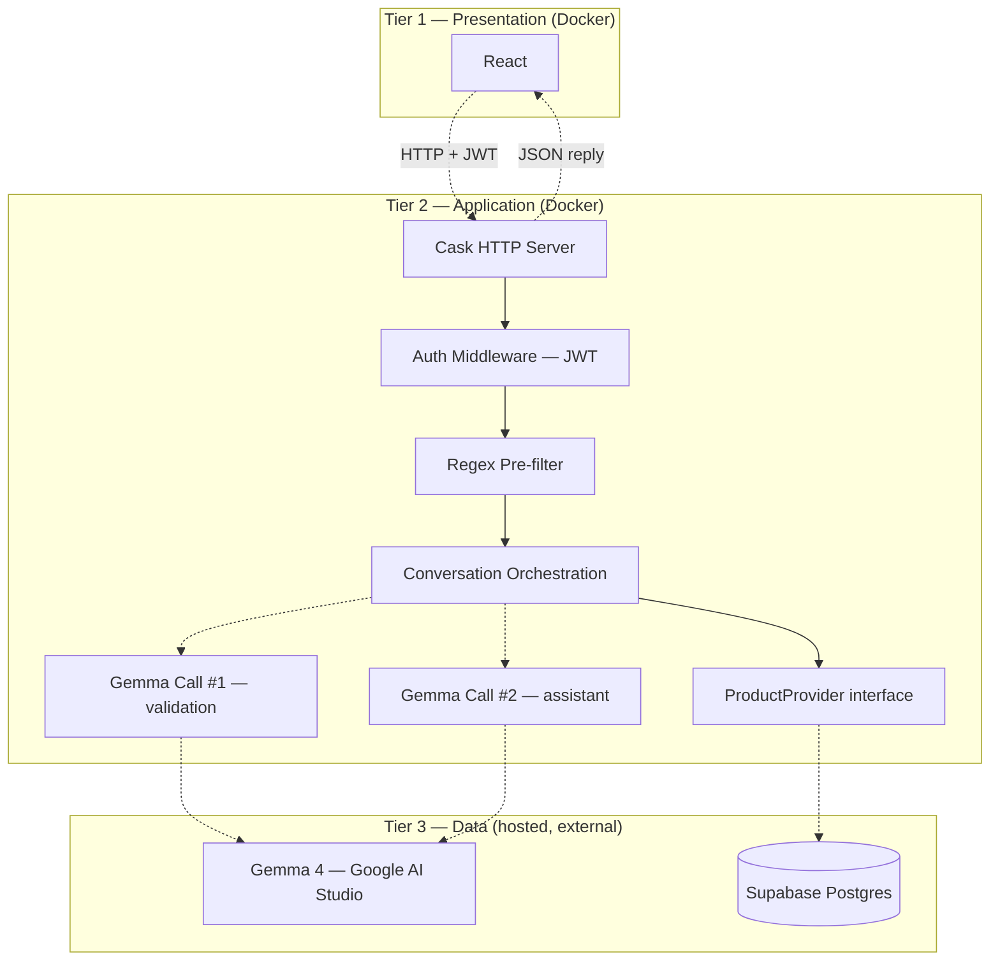

# Architecture

This is the design of the Scala AI Shopping Assistant: a React frontend, a Scala/Cask backend, Gemma 4 for language understanding, and Supabase Postgres for all persistent data. It covers infrastructure, authentication, multi-turn conversations, product retrieval, the prompt-security pipeline, and logging.

## 1. Tiers and infrastructure

The system is a 3-tier application. React talks only to the Scala API; the Scala API is the only thing that talks to Gemma 4 and to the database.

- **Presentation** — React, in Docker.
- **Application** — Scala/Cask backend, in Docker. All auth, conversation orchestration, prompt validation, and product retrieval logic lives here.
- **Data** — Gemma 4 (Google AI Studio, external API) and Supabase Postgres (hosted, external). Neither runs inside Docker.

**Docker's job is narrow on purpose:** it containerizes the frontend and backend only, via Docker Compose, so every developer runs the same JDK/Scala/sbt/Node versions. The database is not part of that boundary — see §2.



## 2. Database: hosted Supabase Postgres, not Docker

**PostgreSQL does not run in a container.** Every environment — every developer's machine, CI, and the deployed demo — connects to the same **hosted Supabase Postgres** project as its single source of truth. There is one shared dev database, not one per developer.

This changes what "run the project" means: a new developer installs Docker, clones the repo, fills in `.env`, and runs `docker compose up`. There is no local Postgres to install, configure, or reset — Supabase is external and requires no local setup.

Supabase stores everything the app persists: `users`, `conversations`, `messages`, `conversation_state`, `chat_sessions`, and the `products` catalog. Full column-level detail is in [`database-schema.md`](database-schema.md).

### Why this is a bigger deal than swapping a connection string

Because the database is shared, schema changes are no longer a private, disposable thing you can wipe and retry. That drives the rest of this section:

- **Migrations, not one init script.** Schema changes live as numbered SQL files in `data/migrations/`, applied in order and tracked in a `schema_migrations` table (`version INT PRIMARY KEY, applied_at TIMESTAMPTZ`). A migration only runs once, ever, per database — the runner script checks `schema_migrations` before applying anything.
- **Migrations are structure only.** `CREATE TABLE`, `ALTER TABLE`, indexes — never data. Loading the product catalog is **seeding**, a separate concept, living in `data/seed/` and run manually, once per environment, after the relevant migration has been applied there.
- **`seed_products.py`** connects via the Supabase client (`SUPABASE_URL` / `SUPABASE_KEY`), not a raw Postgres connection string, and is **idempotent**: it upserts on `id` (`INSERT ... ON CONFLICT (id) DO UPDATE`), so re-running it never duplicates rows.
- **Forward-only migrations.** There is no `docker compose down -v` for a hosted database — you cannot wipe Supabase and start clean. If a migration breaks the shared dev database, the fix is a new corrective migration (e.g. `004_fix_003.sql`), never a hand-edit through the Supabase dashboard. Hand-editing causes schema drift that no migration file records, which silently breaks this whole scheme for everyone else.
- **Applying to shared dev is not batched.** Whoever writes a migration for a feature applies it to the shared dev database themselves, immediately — not queued for someone else to guess should run it. Post in the team channel when you apply one, so people mid-testing aren't confused by a schema change they didn't expect.

```
data/
├── migrations/              # numbered, structure-only, forward-only
│   ├── 001_products_catalog.sql
│   ├── 002_init_users_and_conversations.sql
│   ├── 003_add_messages_and_state.sql
│   └── 004_add_indexes.sql
├── seed/
│   └── seed_products.py     # data seeding, idempotent, run manually
├── raw/                     # source CSV, gitignored
└── scripts/
    └── apply_migrations.py  # migration runner; checks schema_migrations
```

## 3. Authentication & authorization

The app has real accounts, not anonymous sessions. `users` stores `full_name`, `email`, and `password_hash` (Argon2 or bcrypt, salted — never plaintext, never a reversible hash). Login issues a **JWT**; the frontend sends it on every authenticated request; backend routes are protected by JWT middleware.

**Authorization is not optional and not implicit.** Every route touching `conversations`, `messages`, `conversation_state`, or `chat_sessions` must resolve the owning `user_id` (via `chat_sessions.user_id` or `conversations.user_id`) and compare it against the JWT's subject **before touching any other data**. This is the IDOR (insecure direct object reference) protection for every conversation-history feature — list, resume, delete, and rename all depend on this check running first, not as an afterthought.

No separate sessions/tokens table is needed for stateless JWT. If refresh tokens are added later, that gets its own migration and its own docs section — it is explicitly out of scope now.

## 4. Conversations: durable history vs. ephemeral sessions

Two ideas are deliberately kept separate:

- **`conversations`** — durable, user-facing chat history. Created once, lives forever (until deleted), has a title, and sorts a user's chat list by `last_message_at`.
- **`chat_sessions`** — an ephemeral runtime handle: one row per active connection/tab, pointing at a `conversation_id`. The `sessionId` the frontend holds and sends on every message *is* a `chat_sessions.id`.

This split is what makes "resume" work correctly: resuming a past conversation creates a **new `chat_sessions` row** against the **same `conversation_id`**. The full message history and current filters carry over unchanged — nothing about the conversation itself is touched, only a new runtime handle is minted.

Current filter state and turn-by-turn history are also kept apart, for a different reason:

- **`conversation_state`** — one row per conversation, current filters only (e.g. `{ category, budget, waterproof }`). This is the hot path: "load current filters for this conversation" is a primary-key point lookup, not a scan over message history.
- **`messages`** — the durable, ordered (`sequence_number`, not just timestamps) turn history, including `filters_snapshot` and `safe` per row. These two columns conceptually duplicate information available elsewhere, but they exist as an **audit trail**: they record what the system believed *at that point in time*. `conversation_state` is mutable and current-only, so it cannot answer "what did we think the filters were three turns ago?" — `messages.filters_snapshot` can.

Full DDL, column types, and constraints are in [`database-schema.md`](database-schema.md).

### The six user-facing actions

| # | Action | Endpoint | Notes |
| --- | --- | --- | --- |
| 1 | Start new chat | `POST /api/conversations` | Creates a `conversations` row + a `chat_sessions` row; returns `sessionId`. |
| 2 | Send a follow-up message | `POST /api/sessions/{sessionId}/messages` | Resolves `sessionId → conversation_id`, checks ownership, loads state + recent messages, runs the pipeline (§6), persists results. |
| 3 | View conversation history | `GET /api/conversations` | Scoped to the authenticated user, ordered by `last_message_at DESC`. |
| 4 | Resume a past conversation | `POST /api/conversations/{conversationId}/resume` | Creates a **new** `chat_sessions` row against the same conversation. History/state unaffected. |
| 5 | Delete a conversation | `DELETE /api/conversations/{conversationId}` | Ownership-checked. **Hard delete**, `ON DELETE CASCADE` removes messages/state/sessions. No soft-delete/trash — that's deliberate MVP scope, not an oversight. |
| 6 | Rename a conversation | `PATCH /api/conversations/{conversationId}` `{ title }` | `UPDATE conversations SET title = ?, updated_at = now() WHERE id = ? AND user_id = ?` — the `user_id` check in the `WHERE` clause **is** the authorization check, not optional decoration. |

Plus the pre-existing catalog/health routes:

| Method | Path | Purpose |
| --- | --- | --- |
| `GET` | `/api/products` | Catalog search/debug. |
| `GET` | `/health` | Health check for deploy/CI. |

**What gets sent to the LLM per turn** is bounded on purpose: `conversation_state.filters` (structured, cheap) + the last **~6–10 raw messages** (not the full transcript) + the latest message. This keeps token cost bounded while still giving the LLM enough raw context to self-correct on ambiguous turns.

## 5. Product retrieval: `ProductProvider`, Gemma never writes SQL

Business logic never calls Supabase Postgres directly for product data. It depends only on a `ProductProvider` interface; `SupabaseProductProvider` is the sole concrete implementation today. Swapping providers later (a different store, a cache layer, a vector DB) is a one-file change, not a rewrite — the same reasoning the project already applies to `LLMClient`.

```
User message
  → Gemma: extract structured filters (category, budget, attributes, keywords)
  → Business Logic
  → ProductProvider.search(filters)   ← interface; SupabaseProductProvider is the only impl
  → Supabase: full-text search + SQL filters → top 30
  → Reranker → top 5
  → Gemma (optional): format/explain the response
  → React
```

Gemma's job is understanding language and writing language. It is never asked to produce SQL, and the backend never executes LLM-authored queries — retrieval stays deterministic, debuggable, and safe from injection through the query layer itself.

## 6. Prompt validation & security — two-stage pipeline

Every incoming user message goes through this pipeline, in this order, **before** it is trusted as part of the conversation:

```
User message arrives — NOT YET written to `messages` or `conversation_state`
    │
    ▼
Regex pre-filter (reject-on-match, never strip-and-continue)
    │
    ├─ matches denylist ──► reject immediately. 0 LLM calls.
    │        Nothing written to `messages` / `conversation_state`.
    │        May be recorded in app/security logs only.
    │
    ▼ passes
Call #1 — Gemma, VALIDATION ONLY (narrow, single-purpose prompt)
    │
    ├─ safe:false, OR response fails to parse / missing "safe" ─► FAIL CLOSED.
    │        Treat identically to an unsafe result. Reject the turn.
    │        Nothing written to `messages` / `conversation_state`.
    │        May be recorded in app/security logs only. (1 LLM call spent.)
    │
    ▼ safe:true — ONLY NOW append the user's message to `messages`
    │
Call #2 — Gemma, ASSISTANT ONLY (extract filters + generate response;
          independently hardened prompt — does NOT relax guardrails just
          because Call #1 passed)
    │
    ▼
Append assistant's reply to `messages`; update `conversation_state.filters`
    │
    ▼
Business Logic → ProductProvider → Supabase → response → React
```

### Why the ordering matters

The user's message is written to `messages` **only after** it survives both the regex pre-filter and Call #1. A rejected message — whether caught by the regex or by Call #1 — never entered the conversation: it must never be appended to `messages` and must never update `conversation_state`. This keeps malicious or rejected input out of the history that future turns' Call #2 sees, and out of the filter state entirely. Rejected attempts may still be recorded in `app.log` / security logs (count, reason, user/session id) for audit purposes — that's a logging concern, not a conversation-history concern, and it never touches `messages` or `conversation_state`.

### Explicit rules

- **The regex pre-filter is reject-on-match, never strip-and-continue.** If a pattern fires, the turn is refused outright with a fixed rejection response and logged — no LLM call is made, and the backend never tries to "clean" the message and forward a stripped version. A partially-stripped injection can still be effective; stripping just creates false confidence.
- **The denylist is narrow and pattern-specific** — things like `"ignore (all )?previous instructions"`, `"reveal (the )?system prompt"`, `"you are now"` — not bare words like `"ignore"` or `"system"`, which produce false positives on real shopping messages (e.g. *"ignore the mesh ones, I need waterproof leather"*).
- **Call #1's prompt is narrow.** It classifies only — it must not include product, filter, or response-generation instructions. Its output contract:
  ```json
  {"safe": true, "reason": ""}
  ```
  or
  ```json
  {"safe": false, "reason": "Prompt injection detected."}
  ```
- **Fail-closed is mandatory.** If Call #1's response is not valid JSON, is missing `safe`, or the API call errors or times out, the backend treats it identically to `safe: false` and rejects the turn. Inconclusive validation is never treated as a pass.
- **Call #2's prompt is independently hardened**, not "safe by inheritance" from Call #1 passing. It explicitly refuses to reveal its own instructions or discuss non-shopping topics, regardless of what the user asks. Its output contract:
  ```json
  {"filters": {...}, "assistantResponse": "..."}
  ```
- **If Call #1 passes but Call #2 fails or times out**, the backend returns a generic "something went wrong, please try again" response. It never silently returns stale state or a partial response.
- **Cost, stated plainly:** this design costs roughly **2x LLM latency and 2x token cost on every turn**, including fully legitimate ones — the two calls are sequential, not parallel, since Call #2 only runs after Call #1 passes. Benchmark real round-trip latency on realistic conversation lengths before the demo to confirm the UX doesn't feel sluggish.
- **This pipeline reduces, it does not eliminate, prompt-injection risk.** It is not a guaranteed defense. No doc in this repo should describe the system as fully "secure" or "hardened" — only as having a specific, documented mitigation with known limits.

## 7. Logging & observability

Logging is a **cross-cutting concern**: a shared logging utility/middleware, not calls scattered inline through auth, LLM integration, `ProductProvider`, or DB access.

**Development logs** (local only, gitignored):

```
backend/logs/
├── app.log       # startup/shutdown, requests, auth events, authz failures, DB errors, exceptions
├── error.log     # unexpected exceptions
└── llm.jsonl     # one JSON object per LLM API call (see below)
```

`.gitignore` additions: `logs/`, `*.log`, `*.jsonl`.

**Application logs** cover server startup/shutdown, incoming API requests, authentication events (success and failure), authorization failures, database errors, and unexpected exceptions. **Never log the credential, password, JWT, or `Authorization` header itself, at any log level, in dev or prod.**

**LLM interaction logs** (`llm.jsonl`) are one line per **LLM API call**, not per user turn — a validated turn now makes two calls, and conflating them would corrupt latency/token accounting. Each line is tagged with `callType`:

```json
{
  "timestamp": "...",
  "sessionId": "...",
  "userId": "...",
  "callType": "validation",
  "userMessage": "...",
  "conversationState": { ... },
  "safe": true,
  "reason": "",
  "latencyMs": 210,
  "inputTokens": 180,
  "outputTokens": 12
}
```

```json
{
  "timestamp": "...",
  "sessionId": "...",
  "userId": "...",
  "callType": "assistant",
  "conversationState": { ... },
  "filters": { ... },
  "assistantResponse": "...",
  "latencyMs": 602,
  "inputTokens": 420,
  "outputTokens": 95
}
```

**Production** disables detailed LLM request/response logging; it retains only application errors, authentication events, and security-related logs. Both are controlled by env vars: `LOG_LEVEL=INFO`, `LLM_LOGGING=true`.

## 8. Full request flow (one follow-up message)

```
                         ┌─────────────────────┐
                         │   React Frontend      │
                         │   (Docker container)  │
                         └──────────┬───────────┘
                                    │ HTTP (JWT auth) sessionId + message
                                    ▼
                         ┌─────────────────────┐
                         │  Scala Backend (Cask)  │
                         │   (Docker container)   │
                         └──────────┬───────────┘
                                    │ uPickle (JSON)
                                    ▼
                         ┌───────────────────────┐
                         │   Business Logic        │
                         │  ┌───────────────────┐  │
                         │  │ Auth Middleware    │  │
                         │  ├───────────────────┤  │
                         │  │ Regex Pre-filter   │  │
                         │  ├───────────────────┤  │
                         │  │ Conversation Store │  │
                         │  │ (resolve session→  │  │
                         │  │  conversation)      │  │
                         │  ├───────────────────┤  │
                         │  │ Gemma Call #1       │  │
                         │  │ (validation)        │  │
                         │  ├───────────────────┤  │
                         │  │ Gemma Call #2       │  │
                         │  │ (assistant)         │  │
                         │  ├───────────────────┤  │
                         │  │ ProductProvider     │  │
                         │  │ (interface)         │  │
                         │  └─────────┬─────────┘  │
                         └────────────┼───────────┘
                                      │
                                      ▼
                         ┌───────────────────────┐
                         │ SupabaseProductProvider │
                         └────────────┬───────────┘
                                      │
                                      ▼
                    ┌──────────────────────────────┐
                    │       Supabase PostgreSQL       │
                    │   (NOT in Docker — hosted)       │
                    │   ├── users                        │
                    │   ├── conversations                 │
                    │   ├── messages                       │
                    │   ├── conversation_state               │
                    │   ├── chat_sessions                     │
                    │   └── products                           │
                    └──────────────────────────────┘
```

Step by step:

1. React sends `sessionId` + the new message, with the user's JWT.
2. Auth middleware verifies the JWT and resolves `user_id`.
3. Regex pre-filter runs. A denylist match rejects immediately — no LLM call, nothing persisted.
4. Business logic resolves `sessionId → conversation_id` via `chat_sessions`, and checks that `chat_sessions.user_id` (or `conversations.user_id`) matches the JWT's `user_id`. Mismatch → reject before touching anything else.
5. Loads `conversation_state.filters` (point lookup) and the last ~6–10 rows from `messages`.
6. **Call #1** (validation) runs against the new message + recent context. Fail-closed on `safe:false` or any parse/timeout error — reject, nothing persisted.
7. Only now: the user's message is appended to `messages` (with a `filters_snapshot` and `safe: true`).
8. **Call #2** (assistant) extracts/updates filters and drafts a response, using history + current filters.
9. Business logic calls `ProductProvider.search(filters)` → `SupabaseProductProvider` → Supabase full-text search + filters → top 30 → reranker → top 5.
10. The assistant's turn is appended to `messages`; `conversation_state.filters` is updated (point-lookup table, current-only).
11. Response JSON (reply, products, `sessionId`) returns to React through Cask/uPickle.

## 9. Environment variables

```
SUPABASE_URL=
SUPABASE_KEY=
SUPABASE_DB_URL=
GEMMA_API_KEY=
JWT_SECRET=
FRONTEND_URL=
BACKEND_URL=
LOG_LEVEL=INFO
LLM_LOGGING=true
```

`SUPABASE_URL` / `SUPABASE_KEY` are the app's and the seed script's client credentials. `SUPABASE_DB_URL` is a direct Postgres connection string used only by the migration runner (`data/scripts/apply_migrations.py`) — DDL needs a real Postgres connection, not the client/REST layer. None of these are ever hardcoded or committed; only `.env.example` (with placeholders) is checked in.

## 10. What stays true throughout

- React talks only to the Scala API. The Scala API is the only thing that talks to Gemma 4 and to Supabase.
- REST + JSON, no WebSockets/SSE required for the MVP.
- HTTP itself is stateless; conversation memory is durable application state in Supabase (`conversations`, `messages`, `conversation_state`), addressed per-request via `sessionId` → `conversation_id`.
- Gemma never generates or executes SQL.
- Product schema (`products` table, full-text search, indexes) is unchanged from [`database-schema.md`](database-schema.md).
