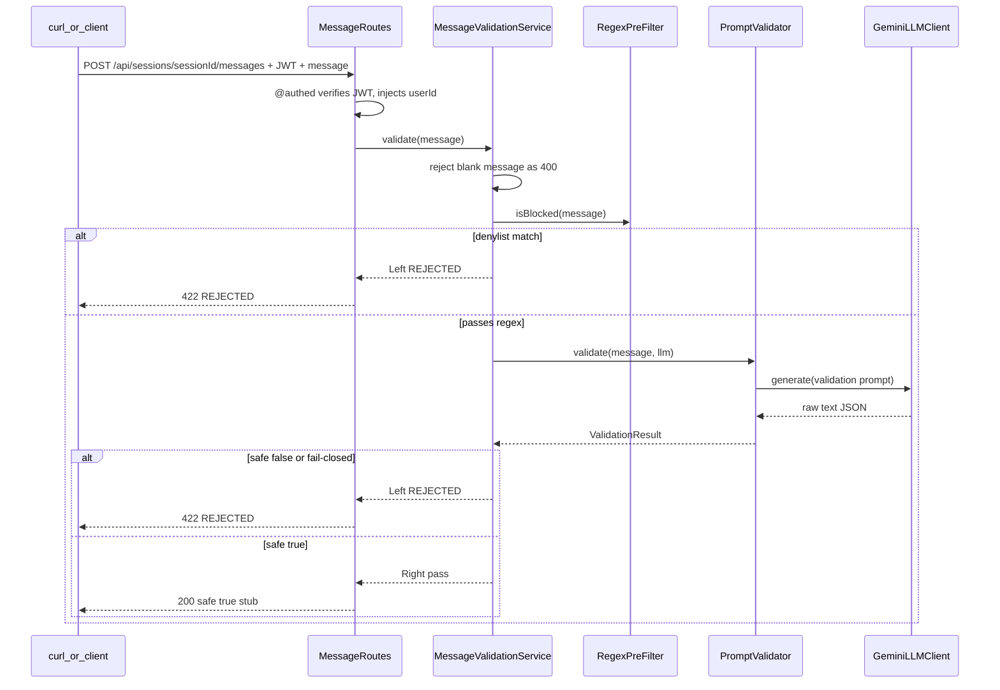

# Call #1 Validation Endpoint Plan — ShopPilot

This is the implementation plan for wiring the **prompt-injection validation** path onto a real HTTP endpoint: receive a user message, run the regex pre-filter, run LLM Call #1 (`PromptValidator`), and return a safe / REJECTED verdict.

It builds on work that already exists:

- `assistant.services.LLMClient` / `GeminiLLMClient`
- `assistant.services.PromptValidator` (Call #1) + fail-closed / live fixture tests
- `assistant.domain.ValidationResult`
- Auth (`@authed`, JWT, `AuthRoutes`) — the message route **requires** a valid Bearer token

Build this **one task at a time, in the order listed in [§7](#7-sequenced-task-list-build-in-this-order)** — each step depends on the ones before it (config before client wiring, service before routes, routes before curl smoke).

**Quality bar:** Same as auth — solid but simple. Fail-closed validation is mandatory. Prefer a thin orchestrator + thin routes over stuffing LLM logic into Cask handlers. Defer Call #2 / persistence / ownership explicitly (§1 / §8); do not invent soft stubs for those as if they were done.

---

## 1. Scope

**In scope for this pass (Milestone A):**

- Authenticated message intake on the real contract path:
  `POST /api/sessions/{sessionId}/messages`
- Pipeline: **regex pre-filter → Call #1 (`PromptValidator.validate`)** → JSON verdict
- On reject (regex match **or** `safe: false` **or** fail-closed): `422` with `code: "REJECTED"` — nothing durable is written (nothing durable exists yet for messages anyway)
- On pass: temporary `200` stub body (not the full assistant reply — that needs Call #2):
  ```json
  { "safe": true, "sessionId": "<path>", "message": "<echo>" }
  ```
- Wire `GeminiLLMClient` through `AppConfig` + `Main` (today the API key is only read ad hoc in tests / `GeminiLLMClient.main`)
- Unit tests for `RegexPreFilter`; reuse existing `PromptValidator*` specs

**Explicitly out of scope for this pass** (confirmed — revisit in §8):

- Call #2 (assistant / filter extraction / explanation)
- Product retrieval, reranker, `ProductProvider`
- Database: `chat_sessions`, `conversations`, `messages`, `conversation_state`, lazy-create, regenerate
- Session ownership / IDOR (`sessionId` → `user_id` check) — no `ConversationRepo` yet; this pass only requires a valid JWT. `sessionId` is accepted in the path and echoed back; it is **not** looked up
- Frontend: leave `frontend/src/api/chat.ts` on `USE_MOCK_API = true` until Call #2 returns the real `SendMessageResponse` shape
- Full assistant reply shape (`mode`, `reply`, `products`, `userMessage`, `assistantMessage`) — documented as the **target** contract; not returned yet

**Contract note vs. the long-term** `docs/API_CONTRACT.md` **Messages section:** the permanent `200` shape (recommend / clarify + products) stays the target. This pass adds a **temporary validation-pass** `200` documented in API_CONTRACT and replaced when Call #2 lands. The `422 REJECTED` shape is already final and does not change.

**Overlap with intern issues:** GitHub [#24](https://github.com/magnificentthrush/scala-shopping-assisstant/issues/24) (RegexPreFilter) is the same security seam. Lead implements it here so the endpoint is not blocked. If #24 is still open when this merges, comment that it shipped in this pass and close or re-scope. [#25](https://github.com/magnificentthrush/scala-shopping-assisstant/issues/25) (`Product` / `ExtractedFilters`) stays with interns — not required for Call #1.

---

## 2. Key technical decisions

| Decision | Choice | Why |
| --- | --- | --- |
| Path | Real contract path `POST /api/sessions/{sessionId}/messages` | Avoid a throwaway `/api/validate`; same URL Call #2 will extend |
| Pass response | Temporary `{ safe, sessionId, message }` | Full `recommend` / `clarify` reply needs Call #2 + products; stub proves wiring without lying about assistant behavior |
| Reject response | `422 { error, code: "REJECTED" }` | Already frozen in `API_CONTRACT.md`; regex and Call #1 share the same client-facing outcome |
| Regex | `RegexPreFilter` object, reject-on-match, never strip-and-continue | `ARCHITECTURE.md` §6; narrow phrase denylist, not bare words like `"ignore"` |
| Orchestration | `MessageValidationService` (regex + Call #1) | Same pattern as `AuthService` — routes stay thin (`project-plan.md` §9) |
| LLM wiring | `gemmaApiKey` on `AppConfig`; one `GeminiLLMClient` in `Main` | Matches auth's "config once, inject everywhere"; tests can still construct clients by hand |
| `sessionId` | Path param; echoed; **not** looked up this pass | No persistence yet; ownership is an explicit follow-up (§8) |
| Empty / whitespace-only message | `400` with a clear error (no LLM call) | Don't burn quota on blank input |
| Auth | Existing `@authed(jwt)` decorator | Injects `userId`; same decorator future ownership checks will use |
| Fail-closed | Unchanged — already implemented in `PromptValidator` | Malformed JSON, missing `safe`, timeout, API error → treat as unsafe → `422 REJECTED` |

---

## 3. Database change

**None for this pass.**

No new migrations. No writes to `messages`, `conversations`, `conversation_state`, or `chat_sessions`. Rejected and accepted turns are equally non-durable until Call #2 / persistence work lands.

---

## 4. Request / response contract (this pass)

### Request

```http
POST /api/sessions/{sessionId}/messages
Authorization: Bearer <jwt>
Content-Type: application/json
```

```json
{ "message": "Under $120 and waterproof" }
```

`sessionId` may be any non-empty string this pass (e.g. a client-generated UUID). It is **not** validated against the DB.

### Response `200` — Call #1 passed (temporary)

```json
{
  "safe": true,
  "sessionId": "uuid-session",
  "message": "Under $120 and waterproof"
}
```

### Response `422` — regex or Call #1 rejected

```json
{
  "error": "I can't help with that request. Please ask about shopping or products.",
  "code": "REJECTED"
}
```

### Other errors

| Status | `code` | When |
| --- | --- | --- |
| `400` | (optional / message text) | Missing/blank `message`, invalid JSON |
| `401` | `UNAUTHORIZED` | Missing/invalid JWT (`@authed`) |

`403` / `404` for session ownership / missing session are **not** returned this pass (no session lookup).

---

## 5. Pipeline design

Order is mandatory (`ARCHITECTURE.md` §6):

```
User message arrives — NOT written to DB
    │
    ▼
@authed — valid JWT required
    │
    ▼
Blank message? ──► 400 (0 LLM calls)
    │
    ▼
RegexPreFilter.isBlocked ──► 422 REJECTED (0 LLM calls)
    │ passes
    ▼
PromptValidator.validate (Call #1, fail-closed)
    │
    ├─ safe:false / fail-closed ──► 422 REJECTED
    │
    ▼ safe:true
Temporary 200 { safe, sessionId, message }
```

**Rules:**

- Regex is **reject-on-match**, never strip-and-continue.
- Denylist is **phrase-specific** (e.g. `ignore (all )?previous instructions`, `reveal (the )?system prompt`, `you are now`) — not bare `"ignore"` / `"system"`.
- Call #1 prompt stays narrow (already in `PromptValidator`) — no filter extraction, no shopping reply.
- Call #2 is **not** invoked in this pass, even when `safe: true`.

---

## 6. Sequence diagram



---

## 7. Sequenced task list (build in this order)

Each task assumes the ones before it are done — don't skip ahead. Mark items **Done** in this file as they land (same habit as `authPlan.md`).

1. **[This document]** `docs/call1Plan.md` — **Done** (this file).
2. Update `docs/API_CONTRACT.md` Messages section — document the temporary `200 { safe, sessionId, message }` pass body and state that the full assistant shape arrives with Call #2. Keep `422 REJECTED` as-is. — **Done**.
3. Extend `assistant/config/AppConfig.scala` with required `gemmaApiKey` from `GEMMA_API_KEY` (fail fast if unset, same style as `JWT_SECRET`). Confirm `.env.example` already documents `GEMMA_API_KEY`. — **Done**: `AppConfig.gemmaApiKey` added (required, fail-fast); `AuthServiceSpec` / `JwtServiceSpec` fixtures updated for the new field; `.env.example` already had `GEMMA_API_KEY`; `sbt compile` clean.
4. `assistant/domain/` — `SendMessageRequest`, temporary pass response case class (e.g. `ValidationPassResponse`), with upickle `ReadWriter`s. Reuse `ErrorBody` for errors. — **Done**: `assistant/domain/MessageValidation.scala` adds `SendMessageRequest(message)` and `ValidationPassResponse(safe, sessionId, message)`, each with a `macroRW` `ReadWriter` matching `docs/API_CONTRACT.md`; errors reuse the existing `ErrorBody`; `sbt compile` clean.
5. `assistant/services/RegexPreFilter.scala` + `RegexPreFilterSpec` — narrow phrase denylist; ≥3 true positives and ≥3 false positives per `ARCHITECTURE.md` §6. — **Done**: `RegexPreFilter.isBlocked(message)` — case-insensitive, reject-on-match, never strip; phrase-specific denylist (override/discard instructions, reveal system prompt, persona adoption, jailbreak modes) with no bare `"ignore"` / `"system"`. `RegexPreFilterSpec` has 11 true positives + 7 false positives (18 tests, all green); full `sbt test` 62 succeeded / 0 failed.
6. `assistant/services/MessageValidationService.scala` — orchestrates blank check → regex → `PromptValidator.validate`; returns `Either[ValidationFailure, …]`; never throws. Routes only map status + JSON.
7. `assistant/http/MessageRoutes.scala` — `@authed(jwt)` + `POST /api/sessions/:sessionId/messages` + `OPTIONS` preflight; parse body; call service; map to status/JSON (same style as `AuthRoutes`).
8. Wire `Main.scala` — construct `GeminiLLMClient(config.gemmaApiKey)`, mount `MessageRoutes`, print the new path in the startup banner.
9. Manual `curl` smoke: login → JWT → POST shopping message → `200 { safe: true, … }` → POST injection / blocked phrase → `422 REJECTED`. Record exact curls / outcomes here when done.
10. Unit tests green: `RegexPreFilterSpec`; existing `PromptValidatorFailClosedSpec` still passes. Optional thin service test with a fake `LLMClient`.

---

## 8. Follow-ups (implement after §7 is done)

Do **not** start these until steps 1–10 above are complete and Call #1 is proven over HTTP.

### 8.1 Call #2 — assistant / filters

Independently hardened prompt; extract `ExtractedFilters` + draft reply; then `ProductProvider` + reranker. Replace the temporary `200 { safe, … }` with the full `API_CONTRACT.md` assistant body (`mode`, `reply`, `products`, messages).

### 8.2 Persistence + ownership

- Migrations / repos for `chat_sessions`, `conversations`, `messages`, `conversation_state`
- Lazy-create conversation only after Call #1 passes
- Resolve `sessionId` → `user_id`, compare to JWT `sub` before anything else (`403` / `404` as contracted)
- Two-phase commit (phase A user message after Call #1; phase B assistant after Call #2)
- Regenerate endpoint + `regenerate_count`

### 8.3 Frontend

Flip `USE_MOCK_API` off in `frontend/src/api/chat.ts` only when the real `SendMessageResponse` shape is returned (after Call #2). Do not point the UI at the temporary `{ safe: true }` stub as if it were a chat reply.

### 8.4 Intern issue cleanup

If [#24](https://github.com/magnificentthrush/scala-shopping-assisstant/issues/24) is still open after `RegexPreFilter` lands here, comment + close or re-scope. Leave [#25](https://github.com/magnificentthrush/scala-shopping-assisstant/issues/25) alone.

---

## 9. Files touched (reference)

**Backend — new files:**

- `backend/src/main/scala/assistant/services/RegexPreFilter.scala`
- `backend/src/main/scala/assistant/services/MessageValidationService.scala`
- `backend/src/main/scala/assistant/http/MessageRoutes.scala`
- `backend/src/main/scala/assistant/domain/MessageValidation.scala` (or equivalent name)
- `backend/src/test/scala/assistant/services/RegexPreFilterSpec.scala`

**Backend — edited:**

- `backend/src/main/scala/assistant/config/AppConfig.scala`
- `backend/src/main/scala/assistant/Main.scala`

**Docs:**

- `docs/call1Plan.md` (this file)
- `docs/API_CONTRACT.md` (temporary pass response note under Messages)

**Already exist (do not rewrite; call from the new service):**

- `PromptValidator.scala`, `LLMClient.scala`, `GeminiLLMClient.scala`, `ValidationResult.scala`
- `auth/AuthedRoute.scala`, `auth/JwtService.scala`

**Not touched this pass:**

- Frontend chat / conversations mocks
- Migrations, `UserRepo`, auth routes
- Product / ExtractedFilters domain (intern #25)

---

## 10. Done when

- [ ] Tasks 1–10 in §7 are marked Done
- [ ] Authenticated curl: legit shopping message → `200 { "safe": true, ... }`
- [ ] Authenticated curl: obvious injection / denylist hit → `422 REJECTED` (regex path, 0 LLM ideally)
- [ ] Call #1 fail-closed still covered by existing unit tests
- [ ] No durable message/conversation writes
- [ ] Call #2 / persistence / frontend unmock listed only under §8
