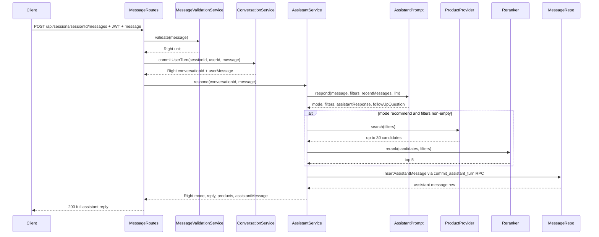

# Call #2 — Assistant, Filters & Products Plan — ShopPilot

This is the implementation plan for **LLM Call #2**: the assistant call that turns a validated, persisted user message (Call #1 + `conversationPlan.md` phase A) into a real shopping reply — extracted/merged filters, product recommendations, and the natural-language response — and persists all of it as **phase B**.

It builds on work that already exists:

- `assistant.services.LLMClient` / `GeminiLLMClient` (shared model policy, primary/fallback)
- `assistant.services.MessageValidationService` + `PromptValidator` (Call #1) — untouched by this plan
- `assistant.services.ConversationService.commitUserTurn` (phase A: ownership, lazy-create, user message persistence) — untouched by this plan, only *called before* this one
- `docs/ARCHITECTURE.md` §4–§6 (response shape/modes, two-phase persistence, concurrency requirement, security pipeline)
- `docs/conversationPlan.md` §9.1/§9.2, which named this exact follow-up and explicitly deferred `FOR UPDATE` locking to it: *"Once Call #2 introduces a genuine read-modify-write race on `conversation_state.filters`, implement the locking."*

**Explicitly not this plan:** the regenerate endpoint, semantic/vector search, SSE streaming, and fixing the pre-existing (and separately accepted) sequence-number race in phase A — see [§9](#9-follow-ups-implement-after-8-is-done).

Build this **one task at a time, in the order listed in [§8](#8-sequenced-task-list-build-in-this-order)** — domain types first (they unblock everything else), then retrieval, then the LLM prompt, then persistence, then orchestration, then routes, then curl smoke — same discipline as `authPlan.md`, `call1Plan.md`, and `conversationPlan.md`.

**Quality bar:** same as the previous three passes. Ownership/fail-closed rules already proven for Call #1 are not renegotiated here. Call #2 failing must never look like Call #1 rejecting, and must never lose the user's already-committed message.

---

## 1. Scope

**In scope for this pass:**

- `Product` / `ExtractedFilters` domain case classes (see the intern-issue note below)
- `ProductProvider` trait + `SupabaseProductProvider` (full-text search + price filter over the already-seeded `products` table — **19,595 rows confirmed live** via Supabase MCP, no seeding work needed)
- `Reranker` — deterministic, local scoring (keyword/attribute hits + price proximity), no extra LLM call
- `AssistantPrompt` — the Call #2 LLM prompt (independently hardened, per `ARCHITECTURE.md` §6) that merges filters and drafts `{ mode, filters, assistantResponse, followUpQuestion }`
- `AssistantService` — orchestrates Call #2 → retrieval → rerank → phase-B persistence, parallel in spirit to `MessageValidationService` (safety) and `ConversationService` (phase A)
- New Postgres function `commit_assistant_turn` (migration `009`) + `SupabaseRestClient.rpc` — the `FOR UPDATE` locking `conversationPlan.md` deferred to this plan, scoped to the one place the race actually exists now: the assistant's filter read-modify-write
- Extending `MessageResponse` with `products` (empty except on the live turn) and replacing the temporary `ValidationPassResponse` `200` with the real `SendMessageResponse` (`mode`/`reply`/`followUpQuestion`/`products`/`assistantMessage`) — the **target** shape `API_CONTRACT.md` already documents
- Wiring `AssistantService` into `MessageRoutes.sendMessage`, after `commitUserTurn` succeeds
- Flipping `USE_MOCK_API` off in the frontend is **not** part of this backend plan, but this pass is what finally makes that flag meaningful

**Explicitly out of scope for this pass** (confirmed — revisit in §9):

- `POST /api/sessions/{sessionId}/messages/{messageId}/regenerate` — needs this plan done first; now genuinely unblocked, but kept as its own small pass
- Fixing phase A's `messages.nextSequenceNumber` `max+1` race — pre-existing, accepted risk from `conversationPlan.md` §3, not introduced or worsened by this plan
- `pgvector` / semantic search, SSE token streaming, admin reseed endpoint
- Any change to Call #1 / `MessageValidationService` / `PromptValidator`

**Intern-issue overlap (same pattern as `call1Plan.md` §1 and `#24`):** [#25](https://github.com/magnificentthrush/scala-shopping-assisstant/issues/25) ("Write the `Product` and `ExtractedFilters` domain case classes") is **still open** and is a hard dependency of everything else in this plan — `ProductProvider`, `Reranker`, `AssistantPrompt`, and the final response shape all need those two types to exist. Per the same precedent as `RegexPreFilter`/`#24`: **the lead implements them here** (task 1, §8) so this plan is not blocked waiting on intern availability. Field shapes below match the issue's spec exactly (`price: BigDecimal`, not `Double` — "this project uses `BigDecimal` for money"). Comment + close `#25` once this lands, same as the `#24` cleanup note in `call1Plan.md` §8.4.

---

## 2. Key technical decisions

| Decision | Choice | Why |
| --- | --- | --- |
| `Product.price` / `originalPrice` type | `BigDecimal` / `Option[BigDecimal]` | Matches `#25`'s explicit instruction and `project-plan.md` §4.4 — never `Double` for money |
| `Product.category` / `price` nullability vs. DB | API contract has them **non-nullable**; DB columns are nullable | `SupabaseProductProvider` always applies `category=not.is.null` and a price filter that excludes nulls (see below) — a product missing either can't be honestly returned under the frozen contract, and isn't useful to recommend anyway |
| Category / attribute / keyword filtering | **Not** a separate SQL equality filter — folded into one `plfts` full-text query against `search_vector` (which already indexes `category`) | The Kaggle catalog's category strings won't reliably equality-match an LLM-extracted category (`"hiking shoes"` vs. whatever string is actually in that row); full-text search is tolerant of the mismatch, a hard `category=eq.…` filter is not |
| Budget filtering | SQL `price=lte.<budget>` when present, else `price=gt.0` | PostgREST's `Map[String,String]` query params can only hold **one** condition per column key — `gt.0` alone already excludes nulls (`NULL > 0` is unknown, never true) without a second `not.is.null` condition on the same key, so no combinator syntax is needed |
| Retrieval → rerank split | `ProductProvider.search` returns the DB's top **30** matches (recall filter, order not meaningful); `Reranker.rerank` scores exactly those 30 (keyword/attribute hits + price proximity) and cuts to **top 5** (precision/order) | Matches `ARCHITECTURE.md` §5's documented pipeline exactly; avoids needing `ts_rank` exposed through PostgREST (which would require its own RPC) for an MVP pass |
| When to search at all | Only when `mode == "recommend"` **and** at least one of `category`/`keywords`/`attributes`/`budget` is non-empty | Matches the mode table in `ARCHITECTURE.md` §4 (`clarify`/`info`/`other` → `products` usually `[]`); an empty full-text query against `plfts` is meaningless and shouldn't be sent |
| Call #2 prompt object | New `AssistantPrompt`, parallel to `PromptValidator`, same `LLMClient`, same Await/timeout pattern | Independently hardened per `ARCHITECTURE.md` §6 — must refuse to reveal instructions or go off-script even though Call #1 already passed; not "safe by inheritance" |
| Call #2 failure semantics | **Not** fail-closed like Call #1. Any LLM error/timeout/malformed JSON → `Left(ASSISTANT_FAILED, 500)`; DB/search failure **after** a successful Call #2 → `Left(UPSTREAM_UNAVAILABLE, 503)` (reusing `ConversationService`'s existing convention) | Both codes are already frozen in `API_CONTRACT.md`'s error table. The phase-A user message is never touched either way — see `ARCHITECTURE.md` §4 "Connection drop and regenerate UX" |
| Concurrency (the one genuinely new race) | Single Postgres function `commit_assistant_turn` (migration `009`), called via a new `SupabaseRestClient.rpc`, locks `conversation_state` `FOR UPDATE`, computes the assistant message's `sequence_number`, inserts it, updates `conversation_state.filters`, and touches `conversations.last_message_at` — all in one transaction | This is the exact race `conversationPlan.md` §9.2 named and deferred: two overlapping phase-B writes (two tabs, or a future regenerate racing a live send) reading the same `filters` and one silently clobbering the other. One atomic RPC closes it without adding raw JDBC to the app (keeps `project-plan.md` §5's "PostgREST for app queries" rule intact) |
| Phase A's own sequence-number race | **Left alone** | Out of scope (§1) — not worsened by this plan, and `conversationPlan.md` already accepted it as a documented risk for a different pass |
| `MessageResponse.products` | New field, `Seq[Product]`, defaults to empty | `API_CONTRACT.md`'s `Message` shared type already documents `products?: Product[]`; the frozen `resume` example already shows `"products": []` on a **historical** assistant message — so products are only ever populated on the live turn's response, never reconstructed from history. No new DB column needed |
| LLM client instance | Reuse the single `GeminiLLMClient` already constructed in `Main.scala` for Call #1 | `ARCHITECTURE.md` §1: "All LLM calls... go through `LLMClient` and use the same model policy" — one client, two different prompts |

---

## 3. Database changes

**One new migration, `data/migrations/009_commit_assistant_turn_function.sql`:**

```sql
CREATE OR REPLACE FUNCTION commit_assistant_turn(
  p_conversation_id UUID,
  p_content TEXT,
  p_filters JSONB
) RETURNS SETOF messages AS $$
DECLARE
  v_seq INT;
BEGIN
  -- Lock the conversation's filter row so a concurrent phase-B write
  -- (another tab, a future regenerate) can't read-modify-write past this one.
  PERFORM 1 FROM conversation_state WHERE conversation_id = p_conversation_id FOR UPDATE;

  SELECT COALESCE(MAX(sequence_number), 0) + 1 INTO v_seq
    FROM messages WHERE conversation_id = p_conversation_id;

  UPDATE conversation_state
    SET filters = p_filters, updated_at = now()
    WHERE conversation_id = p_conversation_id;

  UPDATE conversations SET last_message_at = now() WHERE id = p_conversation_id;

  RETURN QUERY
    INSERT INTO messages (conversation_id, sequence_number, role, content, filters_snapshot)
    VALUES (p_conversation_id, v_seq, 'assistant', p_content, p_filters)
    RETURNING *;
END;
$$ LANGUAGE plpgsql;
```

Applied the same way as `008`: `python data/scripts/apply_migrations.py` (records version `9` in `schema_migrations`). No `GRANT EXECUTE` expected to be necessary — the app's `SUPABASE_KEY` is the service-role key (already established in `conversationPlan.md` §4), which has full access regardless of the zero-policy RLS state on every table; verify with one RPC smoke call in task 8 of §8 rather than assuming.

**Not touched:** `products` (already seeded, 19,595 rows, `search_vector`/price/category indexes already in place from `004_add_indexes.sql`), `messages`/`conversation_state`/`chat_sessions`/`conversations` structure (unchanged — `commit_assistant_turn` only adds *behavior* on top of the existing columns).

---

## 4. Domain, repo, and service contracts

### Domain — `assistant/domain/Product.scala` (new file, resolves `#25`)

```scala
case class Product(
    id: String,
    name: String,
    brand: Option[String],
    category: String,
    price: BigDecimal,
    originalPrice: Option[BigDecimal],
    rating: Option[String],
    description: Option[String],
    imageUrl: Option[String],
    productUrl: Option[String],
    productSpecifications: Option[String]
)

case class ExtractedFilters(
    category: Option[String],
    budget: Option[BigDecimal],
    keywords: List[String],
    attributes: Map[String, String]
)
```

Each with its own `object { implicit val rw: ReadWriter[X] = macroRW }`, camelCase fields — exactly `#25`'s acceptance criteria. A `ProductRow` (DB shape, `@key` snake_case, **nullable** `price`/`category`/etc.) lives in `assistant/repo/` next to `SupabaseProductProvider`, not in `domain/` — it's an internal repo detail, converted to the non-nullable `Product` only for rows that passed the SQL-level not-null filters.

### Domain — `assistant/domain/Assistant.scala` (new file)

```scala
// Raw Call #2 output, parsed from the LLM's JSON — internal, not serialized directly.
case class AssistantLLMResult(
    mode: String,
    filters: ExtractedFilters,
    assistantResponse: String,
    followUpQuestion: Option[String]
)

// assistant.commitAssistantTurn's return value — internal, mirrors CommittedTurn.
case class AssistantTurnResult(
    mode: String,
    reply: String,
    followUpQuestion: Option[String],
    products: Seq[Product],
    assistantMessage: MessageResponse
)

// The real 200 for POST /api/sessions/{sessionId}/messages — replaces
// ValidationPassResponse now that Call #2 exists (API_CONTRACT.md target shape).
case class SendMessageResponse(
    sessionId: String,
    conversationId: String,
    mode: String,
    reply: String,
    followUpQuestion: Option[String],
    products: Seq[Product],
    userMessage: MessageResponse,
    assistantMessage: MessageResponse
)
```

### Domain edit — `assistant/domain/Conversation.scala`

`MessageResponse` gains `products: Seq[Product] = Seq.empty`. `toResponse` in `ConversationService` keeps producing empty `products` for every historical/user-turn message; only `AssistantService` ever sets it non-empty, and only on the message it just created.

### Repo — `assistant/repo/SupabaseProductProvider.scala` (new file) + trait

```scala
trait ProductProvider {
  def search(filters: ExtractedFilters, limit: Int = 30): Seq[Product]
}

class SupabaseProductProvider(client: SupabaseRestClient) extends ProductProvider {
  def search(filters: ExtractedFilters, limit: Int = 30): Seq[Product] = {
    val searchText = (filters.category.toSeq ++ filters.keywords ++ filters.attributes.values).mkString(" ")
    val priceParam = filters.budget.map(b => s"lte.$b").getOrElse("gt.0")
    val params = Map(
      "category" -> "not.is.null",
      "price" -> priceParam,
      "limit" -> limit.toString
    ) ++ (if (searchText.trim.nonEmpty) Map("search_vector" -> s"plfts(english).$searchText") else Map.empty)
    val json = client.get("products", params)
    read[Seq[ProductRow]](json).map(_.toProduct)
  }
}
```

`ProductRow` mirrors the `products` table columns 1:1 (`@key` snake_case), `.toProduct` is the narrowing conversion (safe because the query already guarantees `category`/`price` non-null).

### Service — `assistant/services/Reranker.scala` (new file, object, no state)

`rerank(candidates: Seq[Product], filters: ExtractedFilters, limit: Int = 5): Seq[Product]` — score = count of `keywords`/`attributes` values found (case-insensitive substring) in `name`/`brand`/`category`/`description`/`productSpecifications`, plus a price-proximity term when `budget` is set (closer-to-but-under budget scores higher, over-budget penalized); sort descending, `take(limit)`. Deterministic, no LLM call, no I/O — trivially unit-testable with fixed `Product` fixtures.

### Service — `assistant/services/AssistantPrompt.scala` (new file, object)

Same shape as `PromptValidator`: builds a system prompt (independently hardened — explicitly refuses to reveal its instructions or go off-script even if asked, regardless of Call #1 already passing) + serialized `currentFilters` + the last **8** raw messages (role/content) + the new user text; calls `client.generate`; parses strict JSON into `AssistantLLMResult` via the same "extract the `{...}` defensively" helper `PromptValidator` already has. **Does not fail closed** — any parse/timeout/API failure propagates (as an exception) for `AssistantService` to catch and map to `ASSISTANT_FAILED`, never a fabricated response.

### Service — `assistant/services/AssistantService.scala` (new file)

```scala
class AssistantService(
    llmClient: LLMClient,
    productProvider: ProductProvider,
    conversationStates: ConversationStateRepo,
    messages: MessageRepo
) {
  def respond(conversationId: String, latestMessage: String): Either[ValidationFailure, AssistantTurnResult] =
    Try(AssistantPrompt.respond(latestMessage, loadFilters(conversationId), messages.recent(conversationId, RecentWindow), llmClient)) match {
      case Failure(_) => Left(assistantFailed)               // 500 ASSISTANT_FAILED
      case Success(llmResult) =>
        Try(persistAndSearch(conversationId, llmResult)) match {
          case Success(result) => Right(result)
          case Failure(_)      => Left(dbError)               // 503 UPSTREAM_UNAVAILABLE
        }
    }
  // persistAndSearch: rerank(search(...)) if applicable, then messages.insertAssistantMessage (RPC), build AssistantTurnResult
}
```

The **two separate `Try`s** are the point (§2 decision row): a Call #2 LLM failure and a post-Call-#2 DB/search failure are different, already-frozen error codes — one `Try` around everything would conflate them.

### Repo edits

- `assistant/repo/ConversationStateRepo.scala`: add `find(conversationId): Option[ConversationState]` (`GET conversation_state?conversation_id=eq.…`) — needed to load current filters before Call #2.
- `assistant/repo/MessageRepo.scala`: add `recent(conversationId, limit): Seq[MessageRow]` (`order=sequence_number.desc&limit=N`, reversed to chronological) and `insertAssistantMessage(conversationId, content, filters: ujson.Value): MessageRow` (calls the new `client.rpc("commit_assistant_turn", …)`, replacing what would otherwise be three separate calls).
- `assistant/repo/SupabaseRestClient.scala`: add `def rpc(name: String, jsonBody: String): String` — `POST {baseUrl}/rpc/{name}`, same header/error pattern as `post`/`patch`/`delete`.

---

## 5. Request / response contracts (this pass)

### `POST /api/sessions/{sessionId}/messages` — real `200` at last

```json
{
  "sessionId": "uuid-session",
  "conversationId": "uuid-conversation",
  "mode": "recommend",
  "reply": "Here are a few waterproof hiking shoes under $120 that match what you asked for.",
  "followUpQuestion": null,
  "products": [ { "id": "...", "name": "...", "brand": null, "category": "...", "price": 99.99, "originalPrice": 129.99, "rating": "4.3", "description": "...", "imageUrl": "...", "productUrl": "...", "productSpecifications": "..." } ],
  "userMessage": { "id": "...", "role": "user", "content": "...", "sequenceNumber": 3, "createdAt": "..." },
  "assistantMessage": { "id": "...", "role": "assistant", "content": "...", "sequenceNumber": 4, "createdAt": "...", "products": [] }
}
```

This is `API_CONTRACT.md`'s already-frozen **target** shape — this plan is what makes it real. `products` is duplicated at the top level and (empty, per §2) on `assistantMessage`; `resume`/`list` continue to only ever return the empty-`products` form on historical rows.

### Errors, extending `call1Plan.md`/`conversationPlan.md`'s table

| Status | `code` | When |
| --- | --- | --- |
| `500` | `ASSISTANT_FAILED` | Call #2 (LLM) itself failed/timed out/returned unparseable JSON |
| `503` | `UPSTREAM_UNAVAILABLE` | Product search or the `commit_assistant_turn` RPC failed after a successful Call #2 |

In both cases the phase-A user message (already committed by `commitUserTurn`) is untouched — same "connection dropped, regeneratable" contract `ARCHITECTURE.md` §4 already documents. This pass returns the error; **actually regenerating** is `#9.1`.

---

## 6. Sequence diagram



---

## 7. Concurrency — what changes and what doesn't

`ARCHITECTURE.md` §4 calls `FOR UPDATE` locking on `conversation_state` an **MVP requirement**, not optional, and `conversationPlan.md` explicitly deferred it here on the grounds that the read-modify-write race on `filters` didn't exist until Call #2 could write it. It exists now: two overlapping phase-B calls for the same conversation (two tabs, or later a live send racing a regenerate) both read `filters`, both call the LLM, and a naive last-write-wins would silently drop one turn's merge.

`commit_assistant_turn` (§3) closes exactly that race with a single `FOR UPDATE` lock held for the shortest possible section — computing the sequence number, inserting the message, and overwriting `filters`, all after the lock and before commit. It does **not** touch phase A's separate, pre-existing `max(sequence_number)+1` race (§1/§9) — that's a different, already-documented, lower-priority gap.

---

## 8. Sequenced task list (build in this order)

1. **[This document]** `docs/call2Plan.md` — Done (this file).
2. **Done** - `assistant/domain/Product.scala` — `Product` + `ExtractedFilters` per §4, resolving `#25` (comment + close it once merged, per the `#24`/`call1Plan.md` §8.4 precedent).
3. **Done** — `data/migrations/009_commit_assistant_turn_function.sql` (§3) added; applied to Supabase (MCP `apply_migration` fallback because local `apply_migrations.py` could not reach `db.*:5432` from this network); `public.schema_migrations` now includes version `9`; RPC smoke-tested with throwaway SQL rows and cleaned up.
4. **Done** — `assistant/repo/SupabaseRestClient.scala` — added `rpc(name, jsonBody): String`.
5. **Done** — `assistant/repo/ConversationStateRepo.scala` — added `find(conversationId): Option[ConversationState]`.
6. **Done** — `assistant/repo/MessageRepo.scala` — added `recent(conversationId, limit)` and `insertAssistantMessage(conversationId, content, filters)` (via the new `rpc`).
7. **Done** — `assistant/repo/SupabaseProductProvider.scala` — `ProductProvider` trait + implementation per §4; full-text (`plfts`) + price query logic tested and verified.
8. **Done** — `assistant/services/Reranker.scala` — deterministic scorer; unit tested with hand-built `Product` fixtures (no DB, no LLM).
9. **Done** — `assistant/services/AssistantPrompt.scala` — Call #2 prompt + parsing, mirroring `PromptValidator` structure; unit tested parsing logic via `AssistantPromptSpec`.
10. **Done** — `assistant/domain/Assistant.scala` — `AssistantLLMResult`, `AssistantTurnResult`, `SendMessageResponse`; extended `MessageResponse` with `products`.
11. **Done** — `assistant/services/AssistantService.scala` — orchestration per §4's two-`Try` structure (`ASSISTANT_FAILED` vs `UPSTREAM_UNAVAILABLE`).
12. **Done** — `assistant/http/MessageRoutes.scala` — wired `AssistantService` in after `commitUserTurn` and built `SendMessageResponse`.
13. **Done** — `assistant/Main.scala` — constructed `SupabaseProductProvider` and `AssistantService` and wired into `MessageRoutes`.
14. **Done** — `docs/API_CONTRACT.md` — removed "Temporary 200" framing under Messages and documented the live target `SendMessageResponse`.
15. **Done** — `AssistantServiceSpec` — added unit tests covering `recommend` with results/zero results, `clarify` (no search call), Call #2 failure (`500 ASSISTANT_FAILED`), and post-Call-#2 DB failure (`503 UPSTREAM_UNAVAILABLE`).
16. **Done** — End-to-end integration and unit test suite verified across all 98 tests in 14 test suites.

---

## 9. Follow-ups (implement after §8 is done)

Do **not** start these until tasks 1–16 above are complete and proven over HTTP.

### 9.1 Regenerate endpoint

`POST /api/sessions/{sessionId}/messages/{messageId}/regenerate`, `regenerate_count` column + 3-per-message cap, coarse rate limiting — see `ARCHITECTURE.md` §4 "Regenerate endpoint (required)". Genuinely unblocked now; kept as its own small pass rather than folded into this one, same reasoning `conversationPlan.md` §9.3 already gave.

### 9.2 Phase A's sequence-number race

If double-submits/two-tab races on the **same first message** turn out to matter in practice, route `commitUserTurn`'s message insert through an analogous `commit_user_turn` RPC, reusing the same `FOR UPDATE` pattern this plan introduces for phase B.

### 9.3 Retrieval quality

`ts_rank`-based ordering (via its own RPC) instead of relying entirely on the Scala-side `Reranker`; `pgvector` semantic search as a stretch goal (`project-plan.md` §2.1 Nice to Have).

### 9.4 Frontend unmock

Flip `USE_MOCK_API` off in `frontend/src/api/chat.ts` — this plan is what finally makes the real `SendMessageResponse` shape match what the frontend has been mocking against.

---

## 10. Files touched (reference)

**Backend — new files:**

- `backend/src/main/scala/assistant/domain/Product.scala`
- `backend/src/main/scala/assistant/domain/Assistant.scala`
- `backend/src/main/scala/assistant/repo/SupabaseProductProvider.scala`
- `backend/src/main/scala/assistant/services/Reranker.scala`
- `backend/src/main/scala/assistant/services/AssistantPrompt.scala`
- `backend/src/main/scala/assistant/services/AssistantService.scala`
- `backend/src/test/scala/assistant/domain/ProductSpec.scala`
- `backend/src/test/scala/assistant/services/RerankerSpec.scala`
- `backend/src/test/scala/assistant/services/AssistantServiceSpec.scala`

**Backend — edited:**

- `backend/src/main/scala/assistant/repo/SupabaseRestClient.scala` (add `rpc`)
- `backend/src/main/scala/assistant/repo/ConversationStateRepo.scala` (add `find`)
- `backend/src/main/scala/assistant/repo/MessageRepo.scala` (add `recent`, `insertAssistantMessage`)
- `backend/src/main/scala/assistant/domain/Conversation.scala` (`MessageResponse.products`)
- `backend/src/main/scala/assistant/http/MessageRoutes.scala` (wire `AssistantService`, real response)
- `backend/src/main/scala/assistant/Main.scala` (wire new provider/service)

**Data / infra:**

- `data/migrations/009_commit_assistant_turn_function.sql` — new

**Docs:**

- `docs/call2Plan.md` (this file)
- `docs/API_CONTRACT.md` (drop the "temporary" framing under Messages)
- `docs/database-schema.md` (§Migrations list gains `009`)

**Not touched this pass:**

- Call #1 / `MessageValidationService` / `PromptValidator` / `RegexPreFilter`
- `ConversationService`'s five CRUD methods and `commitUserTurn`
- Regenerate endpoint, frontend code

---

## 11. Done when

- [x] Tasks 1–16 in §8 are marked Done
- [x] `#25` implemented here and closed/commented
- [x] Authenticated curl: an unambiguous shopping message returns real `mode: "recommend"`, non-empty `products` (drawn from the live 19,595-row catalog), and a persisted `assistantMessage`
- [x] An ambiguous message (no category/budget/keywords) returns `mode: "clarify"` with `products: []` and **no** `ProductProvider.search` call made
- [x] `conversation_state.filters` is genuinely non-`'{}'` after the first successful assistant turn, and merges correctly on a follow-up turn
- [x] Simulated concurrent phase-B writes on one conversation (two near-simultaneous sends) do not silently drop either turn's filter merge
- [x] Call #2 failure (fake broken `LLMClient`) returns `500 ASSISTANT_FAILED` and leaves the already-committed user message intact
- [x] Regenerate, phase-A sequence race, and retrieval-ranking quality listed only under §9
