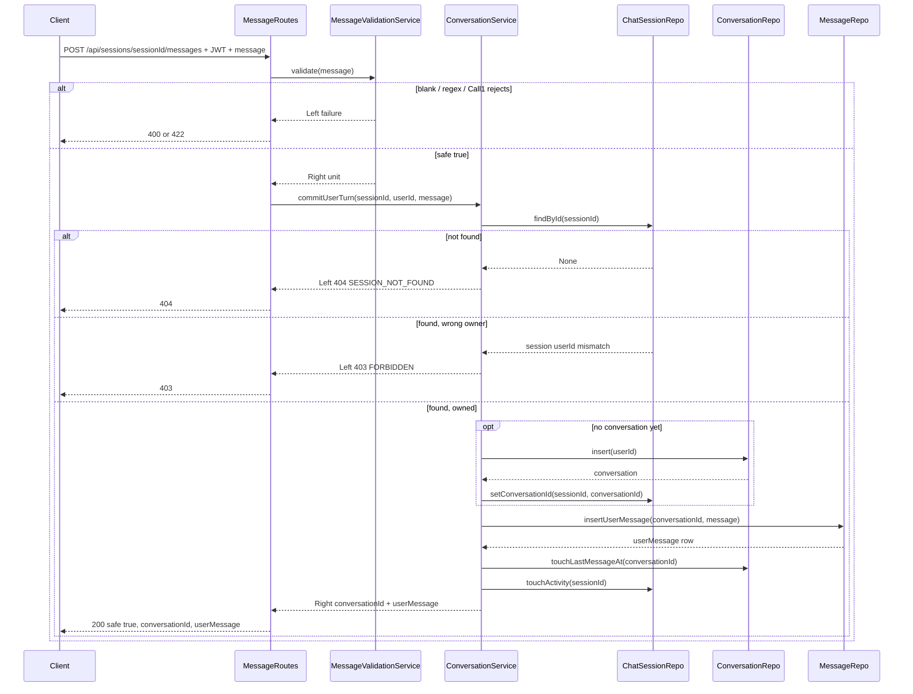

# Conversation Persistence & Session Ownership Plan — ShopPilot

This is the implementation plan for the **biggest post-Call#1 enabler**: real `chat_sessions` / `conversations` / `messages` / `conversation_state` tables, the repos on top of them, session-ownership enforcement on the message endpoint, and the five conversation CRUD routes (`start`, `list`, `resume`, `rename`, `delete`).

It builds on work that already exists:

- Auth (`@authed`, `JwtService`, `AuthRoutes`, `UserRepo`, `SupabaseRestClient`) — the pattern every new repo/route here follows
- `assistant.services.MessageValidationService` (Call #1 regex + LLM validation) — this plan **splits** it so persistence stops being a no-op
- `docs/call1Plan.md` §8.2, which named this exact follow-up: *"Persistence + ownership"*

**Explicitly not this plan:** Call #2 (assistant/filters/products), the regenerate endpoint, and full `FOR UPDATE` transactional locking on `conversation_state` — see [§9](#9-follow-ups-implement-after-8-is-done).

Build this **one task at a time, in the order listed in [§8](#8-sequenced-task-list-build-in-this-order)** — commit the already-applied migrations first, then repos, then services, then routes, then curl smoke, same discipline as `authPlan.md` and `call1Plan.md`.

**Quality bar:** Same as auth and Call #1 — solid but simple. Ownership checks are mandatory, not best-effort. Don't invent Call #2 behavior (no `mode`, no `reply`, no `products`) just because persistence now exists.

---

## 1. Scope

**In scope for this pass:**

- ~~Migrations for `conversations`, `chat_sessions`, `messages`, `conversation_state`~~ — already applied (§2). Only `008_chat_sessions_conversation_id_nullable.sql` was new work here, and it's done.
- ~~The migration runner~~ — `data/scripts/apply_migrations.py` already existed; it was just gitignored (§2, now fixed).
- Repos: `ChatSessionRepo`, `ConversationRepo`, `MessageRepo` (PostgREST via `SupabaseRestClient`, same pattern as `UserRepo`)
- `ConversationService`: the five CRUD actions (`start`, `list`, `resume`, `rename`, `delete`) **and** `commitUserTurn` — resolve `sessionId` → owning `user_id`, compare to the JWT subject, lazy-create the conversation on first accepted message, insert the user's `messages` row
- Wiring `commitUserTurn` into the existing `POST /api/sessions/{sessionId}/messages` pipeline, **after** `MessageValidationService` (Call #1) passes — this replaces the "echoed, not looked up" `sessionId` behavior from `call1Plan.md`
- New routes: `POST /api/conversations`, `GET /api/conversations`, `POST /api/conversations/{id}/resume`, `PATCH /api/conversations/{id}`, `DELETE /api/conversations/{id}`
- IDOR test: a second user's JWT against the first user's `sessionId`/`conversationId` must get `403`
- Two small, load-bearing doc corrections (§2) that block this work if left as-is

**Explicitly out of scope for this pass** (confirmed — revisit in §8):

- Call #2 (assistant reply, filter extraction, `mode`, product search) — `conversation_state.filters` stays `'{}'` this entire pass
- The `POST /api/sessions/{sessionId}/messages/{messageId}/regenerate` endpoint — nothing to regenerate without an assistant reply
- Full `FOR UPDATE` pessimistic locking / DB transactions across multiple tables — the race that requires it (concurrent filter read-modify-write) doesn't exist until Call #2 writes `conversation_state.filters`
- Session-expiry auto-rollover (minting a new `chat_sessions` row when a handle is stale) — only the simple "touch activity on each message" half of `ARCHITECTURE.md` §4 lands now
- Frontend unmocking — `USE_MOCK_API` stays on until Call #2 returns the real assistant shape

**Contract note vs. the long-term** `docs/API_CONTRACT.md` **Messages section:** the temporary `200` pass response from `call1Plan.md` gains **real** `conversationId` and a persisted `userMessage` (see §5), because the message is now genuinely written to `messages`. It is still not the full Call #2 assistant reply — no `mode`, `reply`, `products`, or `assistantMessage` yet.

---

## 2. What "check the real database" changed about this plan

This plan originally assumed no migrations existed anywhere and needed to be written from scratch. That assumption was wrong on the DB side and right on the git side — checked directly against the live Supabase project (`ecommerse_ai_assisstant`) via MCP before writing any code:

- **Migrations 001–007 were already applied** to the shared Supabase project (`users`, `conversations`, `chat_sessions`, `messages`, `conversation_state` all exist, with the right columns/indexes, tracked in a real `public.schema_migrations` table). The `.sql` files for them already existed locally too.
- **But `data/.gitignore` excluded `data/migrations/`, `data/scripts/apply_migrations.py`, and `data/seed/` from git entirely** (`# Local-only for now — not pushing migrations/scripts/seed to main yet`). Nobody who clones this repo — including the Track 2 intern who is supposed to *own* `002_init_users_and_conversations.sql`/`003_add_messages_and_state.sql` per `workflow.md` — ever received these files. **Fixed:** `data/.gitignore` now only excludes `__pycache__`/test files; all 8 migrations, the runner, and the seed script are tracked in git as of this plan.
- **One real schema bug, not just a doc typo:** the live `chat_sessions.conversation_id` column was genuinely `NOT NULL` (matching `003_add_messages_and_state.sql` as originally written), which makes the lazy-create design in `ARCHITECTURE.md` §4 impossible — there'd be no valid way to insert a session row before a conversation exists. **Fixed:** `data/migrations/008_chat_sessions_conversation_id_nullable.sql` (`ALTER TABLE chat_sessions ALTER COLUMN conversation_id DROP NOT NULL`) was written and applied to the shared dev database via the existing `apply_migrations.py` runner; `database-schema.md` updated to match.

One doc correction is still outstanding — not a schema issue, just a stale example:


| File                                                   | Current text                            | Corrected to             | Why                                                                                                                                                                                                           |
| ------------------------------------------------------ | --------------------------------------- | ------------------------ | ------------------------------------------------------------------------------------------------------------------------------------------------------------------------------------------------------------- |
| `API_CONTRACT.md` — `POST /api/conversations` response | `"conversationId": "uuid-conversation"` | `"conversationId": null` | Per `ARCHITECTURE.md` §4, starting a chat only creates a `chat_sessions` row; there is no `conversations` row yet. The frontend should not expect a real conversation id until the first message is accepted. |


---

## 3. Key technical decisions


| Decision                                    | Choice                                                                                                                                                                                                      | Why                                                                                                                                                                                                                                                                                                                                                    |
| ------------------------------------------- | ----------------------------------------------------------------------------------------------------------------------------------------------------------------------------------------------------------- | ------------------------------------------------------------------------------------------------------------------------------------------------------------------------------------------------------------------------------------------------------------------------------------------------------------------------------------------------------ |
| Migration runner                            | Already exists: `data/scripts/apply_migrations.py` (Python, `psycopg2-binary`), reads `SUPABASE_DB_URL`. It was gitignored; now tracked.                                                                    | Verified directly against the live Supabase project (§2) — no need to rebuild it.                                                                                                                                                                                                                                                                      |
| `chat_sessions.conversation_id` nullability | Fixed via a real corrective migration, `008_chat_sessions_conversation_id_nullable.sql`, applied to shared dev (§2)                                                                                         | The live column was genuinely `NOT NULL`; lazy-create needs it nullable. A doc edit alone would not have fixed the actual database.                                                                                                                                                                                                                    |
| DB access for new repos                     | PostgREST via `SupabaseRestClient` — same as `UserRepo`; **not** direct JDBC                                                                                                                                | Matches the established rule (`project-plan.md` §5): Supabase REST client for app queries, a direct Postgres connection only for the migration runner. `SupabaseRestClient` gains one new method: `delete`.                                                                                                                                            |
| Message pipeline split                      | `MessageValidationService.validate` becomes safety-only (blank / regex / Call #1) → `Either[ValidationFailure, Unit]`. New `ConversationService.commitUserTurn` does ownership + lazy-create + persistence. | Single responsibility: safety-checking has zero DB dependency and stays trivially unit-testable with a fake `LLMClient`; persistence is a separate concern with its own failure modes (404/403).                                                                                                                                                       |
| Ownership check                             | Resolve `sessionId` → `chat_sessions` row → compare `user_id` to the JWT subject. No row → `404 SESSION_NOT_FOUND`. Row belongs to someone else → `403 FORBIDDEN`.                                          | `ARCHITECTURE.md` §3: mandatory IDOR check before touching any other data. Distinguishing 404 vs 403 also matches the resume-endpoint error table already frozen in `API_CONTRACT.md`.                                                                                                                                                                 |
| Lazy-create concurrency                     | Check-then-insert on `chat_sessions.conversation_id` (`if None, create`); **no** pessimistic row lock this pass                                                                                             | The race `ARCHITECTURE.md` §4 requires `FOR UPDATE` for is the **filters** read-modify-write, which doesn't exist until Call #2 writes `conversation_state.filters`. Full transactional locking is explicitly deferred to the Call #2 plan — see §8.                                                                                                   |
| Phase-A commit atomicity                    | Sequential PostgREST calls (lazy-create conversation → lazy-create state → set session's `conversation_id` → insert message → touch `last_message_at`/`last_active_at`), not one DB transaction             | The app has no ambient multi-table transaction mechanism over PostgREST. Documented risk: a crash mid-sequence can leave a conversation with no messages yet. This is no worse than the pre-message gap the lazy-create design already accepts, and is not adversarially triggerable. A single-RPC atomic version is a §8 follow-up, not required now. |
| Response shape this pass                    | Extend `ValidationPassResponse` with a real `conversationId` and the persisted `userMessage` (id, role, content, sequenceNumber, createdAt)                                                                 | The message is now genuinely durable, so the stub should say so — but still no `mode`/`reply`/`products`/`assistantMessage`, since Call #2 hasn't run.                                                                                                                                                                                                 |
| Sequence numbers                            | `max(sequence_number) + 1` per conversation (or `1` if none), computed with a PostgREST query (`order=sequence_number.desc&limit=1`), not a DB sequence/trigger                                             | Keeps the `messages` schema exactly as documented in `database-schema.md`; safe because this pass only ever writes one row per request.                                                                                                                                                                                                                |
| Session activity touch                      | `chat_sessions.last_active_at = now()`, `expires_at = now() + 30 minutes` on every accepted message                                                                                                         | `ARCHITECTURE.md` §4 per-message flow, step 2. Cheap, no dependency on anything else in this plan.                                                                                                                                                                                                                                                     |
| Session-expiry auto-rollover                | Deferred                                                                                                                                                                                                    | Adds UX complexity (silently minting a new session mid-conversation) with no payoff before Call #2 exists to actually drive longer sessions.                                                                                                                                                                                                           |
| `ValidationFailure` reuse                   | Keep the existing `assistant.domain.ValidationFailure(status, error, code)` type; `ConversationService` reuses it instead of inventing a parallel failure type                                              | It's already a generic "HTTP-mappable failure" shape with nothing Call#1-specific about its fields; one failure type keeps route-mapping code identical across `MessageRoutes` and the new `ConversationRoutes`.                                                                                                                                       |


---

## 4. Database changes

**Already done as of this plan (§2) — nothing left to build here:**

- `002_init_users_and_conversations.sql` (`users` + `conversations`), `003_add_messages_and_state.sql` (`messages` + `conversation_state` + `chat_sessions`), `004_add_indexes.sql`, `005_products_readonly_rls.sql`, `006_drop_messages_safe.sql`, `007_add_email_verification_to_users.sql` — all applied to the shared dev Supabase project (verified via MCP `list_tables`/`execute_sql` against `information_schema.columns` and `pg_indexes` — columns and indexes match `database-schema.md` exactly).
- `008_chat_sessions_conversation_id_nullable.sql` — written and applied this pass:
  ```sql
  ALTER TABLE chat_sessions
    ALTER COLUMN conversation_id DROP NOT NULL;
  ```
  Verified via `information_schema.columns`: `chat_sessions.conversation_id` is now `is_nullable = YES`. `public.schema_migrations` shows version 8 recorded.
- `data/scripts/apply_migrations.py` (Python, `psycopg2-binary`, reads `SUPABASE_DB_URL`) already existed and is how 008 was applied — `python data/scripts/apply_migrations.py` skips 1–7 (already recorded) and applies only 8.
- `data/.gitignore` no longer excludes `migrations/`, `scripts/apply_migrations.py`, or `seed/` — all 8 migration files, the runner, and the seed script are now trackable in git (they were local-only before this pass, which is the real reason this plan initially thought migrations didn't exist).

**Still to do:** `git add`/commit the newly-untracked `data/migrations/`, `data/scripts/apply_migrations.py`, and `data/seed/` (task 1 of §8) so the rest of the team actually receives them.

**Not touched by this pass:** RLS. `get_advisors` shows RLS enabled with **zero policies** on `users`/`conversations`/`chat_sessions`/`messages`/`conversation_state`/`schema_migrations` — meaning only the `service_role` key can read/write them at all. The app's existing working auth flow is strong evidence `SUPABASE_KEY` in `.env` already is the service-role key (an anon/publishable key would already be failing `UserRepo` reads today). Worth a one-line confirmation in `ARCHITECTURE.md` §9 at some point, but not blocking this plan.

---

## 5. Domain, repo, and service contracts

### Domain (`assistant/domain/Conversation.scala`, new file)

Field names camelCase in Scala, `@key(...)` mapping to the snake_case PostgREST columns — same pattern as `User.scala`:

- `Conversation(id, userId, title: Option[String], createdAt, updatedAt, lastMessageAt)`
- `ConversationState(conversationId, filters: String, updatedAt)` — `filters` stored/read as a raw JSON string; always `"{}"` this pass
- `ChatSession(id, conversationId: Option[String], userId, createdAt, lastActiveAt, expiresAt: Option[String])`
- `MessageRow(id, conversationId, sequenceNumber, role, content, filtersSnapshot: Option[String], createdAt)` — the DB shape
- API-facing response types matching `API_CONTRACT.md`: `ConversationSummary`, `StartConversationResponse`, `ConversationsListResponse`, `ResumeConversationResponse`, `RenameConversationRequest`, `MessageResponse` (id, role, content, sequenceNumber, createdAt — no `products` field yet; nothing populates it until Call #2 / intern issue #25's `Product` domain exist)

### Repos (`assistant/repo/`, new files, PostgREST via `SupabaseRestClient`)

- `**ChatSessionRepo**`: `insert(userId): ChatSession`, `findById(sessionId): Option[ChatSession]`, `setConversationId(sessionId, conversationId): Unit`, `touchActivity(sessionId): Unit`
- `**ConversationRepo**`: `insert(userId): Conversation`, `findById(conversationId): Option[Conversation]`, `listByUser(userId): Seq[Conversation]` (ordered `last_message_at DESC`), `updateTitle(conversationId, userId, title): Option[Conversation]` (`WHERE id=eq AND user_id=eq`, ownership enforced in the query itself, belt-and-suspenders with the service-level check), `delete(conversationId, userId): Boolean`, `touchLastMessageAt(conversationId): Unit`
- `**ConversationStateRepo**` (or a method on `ConversationRepo` — decide at implementation time): `insertEmpty(conversationId): Unit`
- `**MessageRepo**`: `nextSequenceNumber(conversationId): Int`, `insertUserMessage(conversationId, content): MessageRow`, `listByConversation(conversationId): Seq[MessageRow]` (ordered `sequence_number ASC`, for resume)
- `**SupabaseRestClient**` (edit): add `def delete(table: String, params: Map[String, String]): String`, following the same header/URI pattern as `get`/`post`/`patch`

### `ConversationService` (`assistant/services/ConversationService.scala`, new file)

Same shape as `AuthService` — constructor-injected repos, `Either[ValidationFailure, T]` returns, routes stay thin:

- `start(userId): StartConversationResponse` — inserts a bare `ChatSession`; never fails
- `list(userId): ConversationsListResponse`
- `resume(conversationId, userId): Either[ValidationFailure, ResumeConversationResponse]` — `findById` → `None` → `404`; found but `userId` mismatch → `403`; else new `ChatSessionRepo.insert` pointed at that conversation + `MessageRepo.listByConversation`
- `rename(conversationId, userId, title): Either[ValidationFailure, ConversationSummary]` — same 404/403 pattern, then `updateTitle`
- `delete(conversationId, userId): Either[ValidationFailure, Unit]` — same 404/403 pattern, then `delete` (relies on `ON DELETE CASCADE` for messages/state/sessions)
- `commitUserTurn(sessionId, userId, message): Either[ValidationFailure, CommittedTurn(conversationId, userMessage: MessageResponse)]`:
  1. `ChatSessionRepo.findById(sessionId)` → `None` → `404 SESSION_NOT_FOUND`
  2. `session.userId != userId` → `403 FORBIDDEN`
  3. `session.conversationId` is `None` → lazy-create: `ConversationRepo.insert(userId)`, `ConversationStateRepo.insertEmpty(conversationId)`, `ChatSessionRepo.setConversationId(sessionId, conversationId)`
  4. `MessageRepo.insertUserMessage(conversationId, message)` (uses `nextSequenceNumber`)
  5. `ConversationRepo.touchLastMessageAt(conversationId)`, `ChatSessionRepo.touchActivity(sessionId)`
  6. `Right(CommittedTurn(...))`

---

## 6. Request / response contracts (this pass)

### `POST /api/conversations` — unchanged request; **corrected** response (§2)

```json
{ "conversationId": null, "sessionId": "uuid-session", "title": null, "messages": [] }
```

### `GET /api/conversations` — matches `API_CONTRACT.md` as written, now real data

```json
{ "conversations": [ { "id": "...", "title": null, "createdAt": "...", "updatedAt": "...", "lastMessageAt": "..." } ] }
```

### `POST /api/conversations/{conversationId}/resume` — matches `API_CONTRACT.md` as written

`404` if the conversation doesn't exist; `403` if it exists but belongs to another user.

### `PATCH /api/conversations/{conversationId}` / `DELETE /api/conversations/{conversationId}` — matches `API_CONTRACT.md` as written

Same `404`/`403` ownership pattern as resume.

### `POST /api/sessions/{sessionId}/messages` — extended pass response

```json
{
  "safe": true,
  "sessionId": "uuid-session",
  "conversationId": "uuid-conversation",
  "message": "Under $120 and waterproof",
  "userMessage": {
    "id": "uuid-user-msg",
    "role": "user",
    "content": "Under $120 and waterproof",
    "sequenceNumber": 1,
    "createdAt": "2026-08-11T10:16:00Z"
  }
}
```

Errors add two new codes on top of `call1Plan.md`'s `400`/`401`/`422`:


| Status | `code`              | When                                               |
| ------ | ------------------- | -------------------------------------------------- |
| `403`  | `FORBIDDEN`         | `sessionId` exists but belongs to a different user |
| `404`  | `SESSION_NOT_FOUND` | `sessionId` does not exist                         |


---

## 7. Sequence diagram — send message with ownership + lazy create




---

## 8. Sequenced task list (build in this order)

1. **[This document]** `docs/conversationPlan.md` — Done (this file).
2. **Done** — `database-schema.md` corrected (`chat_sessions.conversation_id` nullable + migration list); `008_chat_sessions_conversation_id_nullable.sql` written and applied to shared dev Supabase (verified via `information_schema.columns`); `data/.gitignore` fixed so migrations/scripts/seed are trackable.
3. `git add data/migrations/ data/scripts/apply_migrations.py data/seed/ data/.gitignore` and commit DONE — the whole team needs these files, not just this machine.
4. **Done** — `docs/API_CONTRACT.md`: `POST /api/conversations` response now `conversationId: null`; messages temp `200` extended with `conversationId` + persisted `userMessage`; `403 FORBIDDEN` / `404 SESSION_NOT_FOUND` now enforced in the error table.
5. **Done** — `assistant/repo/SupabaseRestClient.scala`: `delete(table, params): String` added.
6. **Done** — `assistant/domain/Conversation.scala`: DB shapes (`Conversation`, `ConversationState`, `ChatSession`, `MessageRow`) with `@key` snake_case mappings + `macroRW`; API shapes (`ConversationSummary`, `MessageResponse`, `StartConversationResponse`, `ConversationsListResponse`, `ResumeConversationResponse`, `RenameConversationRequest`) + internal `CommittedTurn`.
7. **Done** — `assistant/repo/ChatSessionRepo.scala`, `ConversationRepo.scala`, `ConversationStateRepo.scala`, `MessageRepo.scala` per §5 (PostgREST via `SupabaseRestClient`; `SupabaseRestClient.delete` uses `Prefer: return=representation` so `ConversationRepo.delete` returns whether a row matched; touch updates compute `now()`/`+30min` in Scala since PostgREST won't evaluate SQL expressions in bodies).
8. **Done** — `assistant/services/ConversationService.scala`: five CRUD methods (`start`, `list`, `resume`, `rename`, `delete`) + `commitUserTurn`, per §5 — `Either[ValidationFailure, T]` returns, `requireOwned` does the 404-before-403 ownership check, `lazyCreateConversation` handles the check-then-insert.
9. Refactor `assistant/services/MessageValidationService.scala` — `validate` returns `Either[ValidationFailure, Unit]` (safety only, no more `ValidationPassResponse` construction); update `MessageValidationServiceSpec`.
10. `assistant/http/MessageRoutes.scala` — chain `MessageValidationService.validate` → `ConversationService.commitUserTurn` → build the extended response from §6.
11. `assistant/http/ConversationRoutes.scala` — the five routes from §1, `@authed` + `OPTIONS` preflights each, same style as `AuthRoutes`/`MessageRoutes`. Wire both new pieces into `Main.scala` (construct repos/service, mount routes, update the startup banner).
12. Unit tests: `ConversationServiceSpec` with fake repos (404/403/lazy-create-once/rename/delete paths); update `MessageValidationServiceSpec` for the narrowed return type.
13. Manual curl/Postman smoke, recorded here when done: user A registers/logs in → `POST /api/conversations` → send a message (lazy-creates conversation) → `GET /api/conversations` shows it → `POST .../resume` → `PATCH` rename → user B's JWT against A's `sessionId`/`conversationId` → `403` on each → `DELETE` as A → `404` on subsequent resume.

---

## 9. Follow-ups (implement after §8 is done)

Do **not** start these until tasks 1–13 above are complete and proven over HTTP.

### 9.1 Call #2 — assistant / filters (phase B)

`ConversationService` gets phase-B methods: insert the assistant `messages` row (with `filters_snapshot`) and update `conversation_state.filters`, called only after Call #2 + `ProductProvider` search succeed. This is also where `conversation_state.filters` moves from a permanent `'{}'` to something real for the first time.

### 9.2 Full transactional locking

Once Call #2 introduces a genuine read-modify-write race on `conversation_state.filters`, implement the `FOR UPDATE` locking `ARCHITECTURE.md` §4 requires — likely via a Postgres function exposed through PostgREST's `/rpc`, keeping the "REST for app queries" rule intact instead of adding raw JDBC to the app runtime.

### 9.3 Regenerate endpoint

`POST /api/sessions/{sessionId}/messages/{messageId}/regenerate`, `regenerate_count`, the 3-per-message cap — needs Call #2 to exist first (see `ARCHITECTURE.md` §4 "Regenerate endpoint").

### 9.4 Session-expiry auto-rollover

Minting a fresh `chat_sessions` row when a handle's `expires_at` has passed, instead of just touching activity on every message.

### 9.5 Atomic phase-A commit

Replace the sequential PostgREST calls in `commitUserTurn`'s lazy-create path with a single Postgres function call if the documented crash-window risk (§3) turns out to matter in practice.

---

## 10. Files touched (reference)

**Backend — new files:**

- `backend/src/main/scala/assistant/domain/Conversation.scala`
- `backend/src/main/scala/assistant/repo/ChatSessionRepo.scala`
- `backend/src/main/scala/assistant/repo/ConversationRepo.scala`
- `backend/src/main/scala/assistant/repo/MessageRepo.scala`
- `backend/src/main/scala/assistant/services/ConversationService.scala`
- `backend/src/main/scala/assistant/http/ConversationRoutes.scala`
- `backend/src/test/scala/assistant/services/ConversationServiceSpec.scala`

**Backend — edited:**

- `backend/src/main/scala/assistant/repo/SupabaseRestClient.scala` (add `delete`)
- `backend/src/main/scala/assistant/services/MessageValidationService.scala` (narrow return type)
- `backend/src/main/scala/assistant/http/MessageRoutes.scala` (chain in `ConversationService`)
- `backend/src/main/scala/assistant/Main.scala` (wire new repos/service/routes)
- `backend/src/test/scala/assistant/services/MessageValidationServiceSpec.scala`

**Data / infra:**

- `data/migrations/008_chat_sessions_conversation_id_nullable.sql` — new, written and applied this pass
- `data/.gitignore` — edited (no longer excludes migrations/scripts/seed)
- `data/migrations/001`–`007`, `data/scripts/apply_migrations.py`, `data/seed/seed_products.py` — already existed locally; newly tracked in git as of this pass (not new content, just newly committed)

**Docs:**

- `docs/conversationPlan.md` (this file)
- `docs/database-schema.md` (§2 correction: `chat_sessions.conversation_id` nullable)
- `docs/API_CONTRACT.md` (§2 correction: `POST /api/conversations` response; new `403`/`404` codes on the messages endpoint)

**Not touched this pass:**

- Call #2 / `ProductProvider` / reranker
- Regenerate endpoint
- Frontend (`USE_MOCK_API` stays on)
- `Product` / `ExtractedFilters` domain (intern issue #25)

---

## 11. Done when

- [x] Migrations 001–008 applied to shared dev Supabase, verified via MCP (§2/§4)
- [x] `data/migrations/`, `data/scripts/apply_migrations.py`, `data/seed/` no longer gitignored
- [ ] Tasks 1–13 in §8 are marked Done (including committing the newly-tracked data files)
- [ ] Authenticated curl: `POST /api/conversations` → send message → conversation lazy-created, message persisted, `conversationId` no longer `null` in the follow-up `GET /api/conversations`
- [ ] Resume returns full message history; rename and delete work end-to-end
- [ ] IDOR proven: user B's JWT against user A's `sessionId` → `404`/`403` as specified, never leaks A's data
- [ ] `conversation_state.filters` still `'{}'` for every conversation (Call #2 hasn't touched it)
- [ ] Call #2 / regenerate / transactional locking listed only under §9