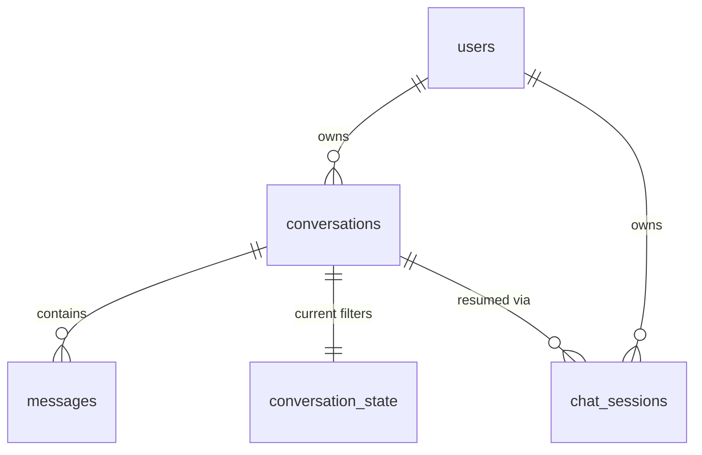

# Database Schema — ShopPilot

The application uses **hosted Supabase Postgres** — a single shared database across all environments (every developer, CI, and the deployed demo point at the same project). There is no local/Dockerized Postgres. See [`ARCHITECTURE.md`](ARCHITECTURE.md) §2 for why, and this file's [Migrations](#migrations) section for how schema changes are made safely against a shared database.

Six tables total: `products` (catalog), and five tables supporting accounts and conversations — `users`, `conversations`, `messages`, `conversation_state`, `chat_sessions`.

## Products table

```sql
CREATE TABLE products (
  id                      TEXT PRIMARY KEY,
  name                    TEXT NOT NULL,
  brand                   TEXT,
  category                TEXT,
  price                   NUMERIC,
  original_price          NUMERIC,
  rating                  TEXT,
  description             TEXT,
  image_url               TEXT,
  product_url             TEXT,
  product_specifications  TEXT
);
```

### Columns

| Column | Type | Required | Purpose |
| --- | --- | --- | --- |
| `id` | `TEXT` | Yes | Unique product ID (from cleaned JSONL `id`). |
| `name` | `TEXT` | Yes | Product name shown to the user. |
| `brand` | `TEXT` | No | Product manufacturer or brand. |
| `category` | `TEXT` | No | Normalized category (already cleaned). |
| `price` | `NUMERIC` | No | Current or discounted product price. |
| `original_price` | `NUMERIC` | No | Original retail price before discount. |
| `rating` | `TEXT` | No | Product rating; may be null. |
| `description` | `TEXT` | No | Product description used for display and search. |
| `image_url` | `TEXT` | No | Product image URL; may be null. |
| `product_url` | `TEXT` | No | Link to the original product page. |
| `product_specifications` | `TEXT` | No | Product attributes as text (JSON string of key/value pairs). |

### Full-text search

```sql
ALTER TABLE products
  ADD COLUMN search_vector tsvector
  GENERATED ALWAYS AS (
    to_tsvector(
      'english',
      coalesce(name, '') || ' ' ||
      coalesce(brand, '') || ' ' ||
      coalesce(category, '') || ' ' ||
      coalesce(description, '') || ' ' ||
      coalesce(product_specifications, '')
    )
  ) STORED;
```

`coalesce` converts missing values to empty strings, preventing a null field from making the complete search document null.

### Indexes

```sql
CREATE INDEX products_search_idx ON products USING GIN (search_vector);
CREATE INDEX products_price_idx ON products (price);
CREATE INDEX products_category_idx ON products (category);
```

- `products_search_idx` speeds up full-text product searches.
- `products_price_idx` speeds up budget and price-range filters.
- `products_category_idx` speeds up category filters.

### Source data mapping

The catalog is **seeded from** `data/clean_products.jsonl` (not the raw Kaggle CSV) by `data/seed/seed_products.py` (see [Seeding](#seeding) below). That JSONL is produced earlier by `data/scripts/clean_products.py` from the raw export under `data/raw/`; cleaning maps and validates fields so each JSONL line already matches the `products` columns.

**Pipeline:** `data/raw/` → `clean_products.py` → `data/clean_products.jsonl` → `seed_products.py` → Supabase `products`.

| JSONL field | Database column | Notes |
| --- | --- | --- |
| `id` | `id` | Already cleaned / validated (32-char hex). |
| `name` | `name` | Use as-is. |
| `brand` | `brand` | May be null. |
| `category` | `category` | Use as-is. |
| `price` | `price` | Numeric or null. |
| `original_price` | `original_price` | Numeric or null. |
| `rating` | `rating` | Float or null in JSONL; store as text (stringify) or null. |
| `description` | `description` | May be null. |
| `image_url` | `image_url` | May be null. |
| `product_url` | `product_url` | May be null. |
| `product_specifications` | `product_specifications` | List of `{key, value}` in JSONL; serialize to a JSON text string on upsert (column is `TEXT`). |

Raw-only fields such as `crawl_timestamp`, `pid`, `is_FK_Advantage_product`, and `overall_rating` are discarded during **cleaning**, not during seeding.

Retrieval flow: Gemma extracts filters → `ProductProvider` runs full-text search + SQL filters against this table → top 30 → reranker → top 5 (see [`ARCHITECTURE.md`](ARCHITECTURE.md) §5).

---

## Users and conversations

These five tables support accounts, durable chat history, and the runtime session handle. The full reasoning behind the design is in [`ARCHITECTURE.md`](ARCHITECTURE.md) §3–§4 — this section is the column-level reference.

### `users`

```sql
CREATE TABLE users (
  id            UUID PRIMARY KEY DEFAULT gen_random_uuid(),
  full_name     TEXT NOT NULL,
  email         TEXT NOT NULL UNIQUE,
  password_hash TEXT NOT NULL,
  created_at    TIMESTAMPTZ NOT NULL DEFAULT now(),
  updated_at    TIMESTAMPTZ NOT NULL DEFAULT now()
);
```

`password_hash` is an Argon2 or bcrypt hash, salted — the plaintext password is never stored or logged. No separate sessions/tokens table exists; auth is stateless JWT (see `ARCHITECTURE.md` §3).

### `conversations`

```sql
CREATE TABLE conversations (
  id              UUID PRIMARY KEY DEFAULT gen_random_uuid(),
  user_id         UUID NOT NULL REFERENCES users(id) ON DELETE CASCADE,
  title           TEXT,
  created_at      TIMESTAMPTZ NOT NULL DEFAULT now(),
  updated_at      TIMESTAMPTZ NOT NULL DEFAULT now(),
  last_message_at TIMESTAMPTZ NOT NULL DEFAULT now()
);
```

The durable, user-facing chat history. `last_message_at` drives the sort order of `GET /api/conversations` (most recently active first). `title` is nullable — an untitled chat is valid.

**Delete is a hard delete.** `ON DELETE CASCADE` on `user_id` (and on every table below that references `conversations.id`) means deleting a conversation removes its messages, state, and sessions in the same operation. There is deliberately no `deleted_at` / soft-delete column for MVP — do not add one unless explicitly requested later.

**Rename** is a plain update, but the `WHERE` clause is the authorization check, not optional:

```sql
UPDATE conversations
SET title = $1, updated_at = now()
WHERE id = $2 AND user_id = $3;
```

### `messages`

```sql
CREATE TABLE messages (
  id               UUID PRIMARY KEY DEFAULT gen_random_uuid(),
  conversation_id  UUID NOT NULL REFERENCES conversations(id) ON DELETE CASCADE,
  sequence_number  INT NOT NULL,
  role             TEXT NOT NULL CHECK (role IN ('user', 'assistant')),
  content          TEXT NOT NULL,
  filters_snapshot JSONB,
  safe             BOOLEAN,
  created_at       TIMESTAMPTZ NOT NULL DEFAULT now(),
  UNIQUE (conversation_id, sequence_number)
);
```

| Column | Purpose |
| --- | --- |
| `sequence_number` | Explicit per-conversation ordering. Turn order is never inferred from `created_at` alone. |
| `role` | `"user"` or `"assistant"`. |
| `filters_snapshot` | The filters believed to be true **after this turn** — an audit trail, not the live value (see `conversation_state` below). |
| `safe` | The validation result for this turn (`true`/`false`); `null` for assistant rows, which are never validated by the pre-filter/Call #1 pipeline. |

`messages` is the durable turn-by-turn record. It intentionally duplicates information that also lives (in current form) in `conversation_state` — that duplication is the point: `conversation_state` only ever tells you *now*, while `messages.filters_snapshot`/`safe` tell you what the system believed *at that point in time*. Rejected/unsafe user input is never written here — see the [security pipeline](ARCHITECTURE.md#6-prompt-validation--security--two-stage-pipeline) for the exact ordering.

### `conversation_state`

```sql
CREATE TABLE conversation_state (
  conversation_id UUID PRIMARY KEY REFERENCES conversations(id) ON DELETE CASCADE,
  filters         JSONB NOT NULL DEFAULT '{}'::jsonb,
  updated_at      TIMESTAMPTZ NOT NULL DEFAULT now()
);
```

One row per conversation — current filters only (e.g. `{"category": "hiking shoes", "budget": 120, "waterproof": true}`). `conversation_id` is the primary key, so "load current filters for this conversation" is a point lookup, not a scan over `messages`. This table is overwritten every turn; it is not an audit trail (that's what `messages.filters_snapshot` is for).

### `chat_sessions`

```sql
CREATE TABLE chat_sessions (
  id              UUID PRIMARY KEY DEFAULT gen_random_uuid(),
  conversation_id UUID NOT NULL REFERENCES conversations(id) ON DELETE CASCADE,
  user_id         UUID NOT NULL REFERENCES users(id) ON DELETE CASCADE,
  created_at      TIMESTAMPTZ NOT NULL DEFAULT now(),
  last_active_at  TIMESTAMPTZ NOT NULL DEFAULT now(),
  expires_at      TIMESTAMPTZ
);
```

The ephemeral runtime handle — one row per active connection/tab. The `sessionId` the frontend sends on `POST /api/sessions/{sessionId}/messages` is a `chat_sessions.id`. Resuming a past conversation (`POST /api/conversations/{conversationId}/resume`) creates a **new** row here pointing at the **same** `conversation_id`; it never creates a new conversation and never touches `messages` or `conversation_state`. `expires_at` is nullable and reserved for a future cleanup job — nothing reads it yet.

### Indexes

```sql
CREATE INDEX conversations_user_id_idx ON conversations (user_id);
CREATE INDEX conversations_last_message_at_idx ON conversations (last_message_at DESC);
CREATE INDEX messages_conversation_id_idx ON messages (conversation_id);
CREATE INDEX chat_sessions_conversation_id_idx ON chat_sessions (conversation_id);
CREATE INDEX chat_sessions_user_id_idx ON chat_sessions (user_id);
```

`conversations_last_message_at_idx` exists specifically to serve `GET /api/conversations` without a sort-heavy query as history grows.

### Entity relationships



---

## Migrations

Because the database is shared, schema changes are applied as **numbered, structure-only, forward-only SQL migrations** in `data/migrations/`, tracked in a `schema_migrations` table (`version INT PRIMARY KEY, applied_at TIMESTAMPTZ`) so a migration never runs twice against the same database:

```
data/migrations/
├── 001_products_catalog.sql
├── 002_init_users_and_conversations.sql
├── 003_add_messages_and_state.sql
└── 004_add_indexes.sql
```

Applied with `data/scripts/apply_migrations.py` (requires `SUPABASE_DB_URL`, a direct Postgres connection string — different from the `SUPABASE_URL`/`SUPABASE_KEY` client credentials the app uses). The runner reads each file, checks whether its version is already in `schema_migrations`, and if not, runs it and records the version — all in one transaction per file.

Rules that keep a shared dev database usable by four people at once:

- Migrations only ever add or alter structure (`CREATE TABLE IF NOT EXISTS`, `ADD COLUMN IF NOT EXISTS`, indexes) — never data.
- Whoever writes a migration applies it to shared dev themselves, immediately, and announces it in the team channel.
- If a migration breaks shared dev, write a corrective migration (e.g. `005_fix_004.sql`). Never hand-edit the schema through the Supabase dashboard — that creates schema drift no migration file records.
- There is no `docker compose down -v` for a hosted database. Migrations must be safe by construction, not "fix by wiping."

## Seeding

Seeding is **not** a migration — it moves data, not structure, and it is a one-time-per-environment operation, not something that runs on every `docker compose up`.

`data/seed/seed_products.py` loads `data/clean_products.jsonl` (one product object per line; columns already match the table above) and upserts into `products` via the Supabase client (`SUPABASE_URL` / `SUPABASE_KEY`). It is idempotent (`upsert` on `id`), so re-running it after `001_products_catalog.sql` has been applied never duplicates rows. Run it manually once per environment. Do **not** seed from raw files under `data/raw/` — clean first, then seed from the JSONL.
