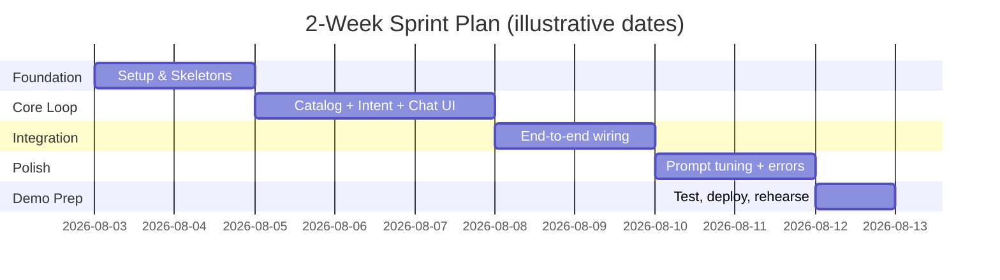
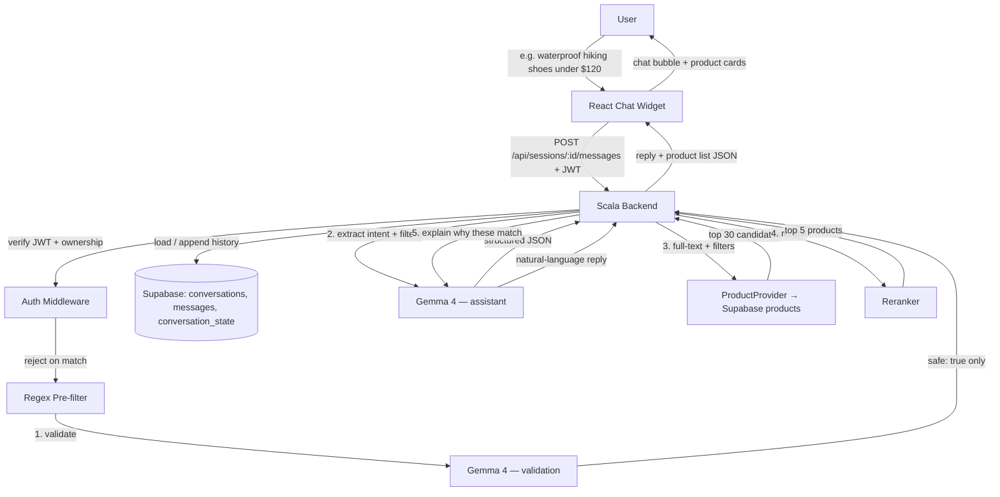

# ShopPilot — Project Plan

**Product:** ShopPilot (AI shopping assistant)
**Team:** 4 interns (1 lead + 3 interns)
**Stack:** React (frontend) + Scala (backend) + Gemma 4 (Google AI Studio) + Supabase Postgres (hosted, shared)
**Duration:** 10 working days
**Goal:** A working, beyond MVP — not a production system.

---

## 0. TL;DR — Key Decisions Up Front


| Decision               | Recommendation                                                                             | Why                                                                    |
| ---------------------- | ------------------------------------------------------------------------------------------ | ---------------------------------------------------------------------- |
| Scala HTTP framework   | **cask** (fallback: Play)                                                                  | Minimal ceremony, near-zero learning curve for beginners               |
| JSON library           | **upickle** (or Play JSON if using Play)                                                   | Pairs naturally with cask, simple case-class codecs                    |
| Database               | **Supabase Postgres (hosted)** — one shared project for every environment                  | No local Postgres to install/reset per person; same schema for everyone, incl. CI and the demo |
| Containerization       | **Docker Compose for frontend + backend only** — Supabase and Gemma are external            | The database boundary doesn't belong in Docker once it's a shared, hosted service |
| Schema changes         | **Numbered SQL migrations** in `data/migrations/`, tracked via `schema_migrations`          | Safe, ordered, auditable changes against a database four people share    |
| Retrieval              | **Postgres full-text search + filters** → top 30 → **reranker** → top 5                    | Clear, demoable pipeline without a vector DB for MVP                   |
| Vector search          | **Skip for MVP**, stretch goal via `pgvector`                                              | Full vector DB infra is not worth the setup cost in 2 weeks            |
| LLM provider           | **Gemma 4 via Google AI Studio / Google Cloud API**, abstracted behind a `LLMClient` trait | Fixed provider for the internship; trait still allows mocking/swaps    |
| Prompt security        | **Two-stage pipeline**: regex pre-filter → Gemma validation call → Gemma assistant call     | Reduces (does not eliminate) prompt-injection risk; fail-closed by design |
| Auth                   | **JWT + Argon2/bcrypt password hashing**; every conversation route checks resource ownership | Real accounts are in scope; conversation history is per-user, not per-browser |
| Communication protocol | **REST (JSON over HTTPS)**                                                                 | WebSockets/SSE add complexity with no MVP payoff                       |
| Product catalog        | **Kaggle e-commerce product dataset** → seeded into Supabase (see §10)                     | Realistic catalog; drop unused cols and map into our `products` schema |
| Git workflow           | Trunk-based, short-lived branches, PR + lead review                                        | Small team, avoid long-lived branch drift                              |


---

## 1. Project Strategy & Workflow

### 1.1 Five phases over 10 days




### 1.2 Workflow rhythm

- **Daily 15-min standup** — what's done, what's next, what's blocked. Non-negotiable.
- **Day 1 kickoff workshop** — everyone gets the environment running and understands the architecture before writing feature code.
- **Mid-sprint demo (end of Day 6)** — full internal walkthrough, even if rough. This is the single most important checkpoint: it's where you catch "we built the wrong thing" early.
- **PR-based development** — every change goes through a pull request reviewed by the lead. No direct pushes to `main`.
- **API contract frozen by Day 2** — frontend and backend agree on request/response JSON shapes early so they can work in parallel without blocking each other (frontend uses a mock server against the contract until the real backend is ready).
- **Buffer time is built in**, not improvised — Day 6 and Day 10 are explicitly buffer/integration days in the schedule below.

### 1.3 High-level architecture

The full design — durable conversations backed by Supabase, JWT auth with per-resource ownership checks, and the two-stage Gemma security pipeline — is documented in [`ARCHITECTURE.md`](ARCHITECTURE.md). Keep that doc and this plan aligned when the conversation contract changes.




**Core recommendation pipeline (MVP):**

```
User message
  │
  ▼
Regex pre-filter → Gemma Call #1 (validation, fail-closed)
  │  (only messages that pass are saved and proceed)
  ▼
Gemma Call #2 — extract intent + filters
  e.g. { category: hiking shoes, waterproof: true, budget: 120 }
  │
  ▼
Retrieval — ProductProvider → Supabase full-text search + filters
  │
  ▼
Top 30 products
  │
  ▼
Reranker
  │
  ▼
Top 5 products
  │
  ▼
Gemma Call #2 — explain why these match
```

This is intentionally a **3-tier architecture** — nothing exotic. React talks only to your Scala API; your Scala API is the only thing that talks to Gemma 4 and the database (Supabase, hosted — not Docker). That boundary is what lets 4 people work in parallel without stepping on each other.

---

## 2. Scope Definition (MVP)

### 2.1 Must Have / Nice to Have / Future Work


| Priority                                  | Feature                                                                                                           |
| ----------------------------------------- | ----------------------------------------------------------------------------------------------------------------- |
| **Must Have (MVP)**                       | Chat UI with send/receive and visible history                                                                     |
|                                           | User registration/login, JWT auth, ownership checks on every conversation route                                    |
|                                           | Durable conversations in Supabase: start, list, resume, rename, delete (§4 in `ARCHITECTURE.md`)                   |
|                                           | Regex pre-filter + Gemma validation call (fail-closed) before any message is trusted                               |
|                                           | LLM (Gemma 4) extracts intent + structured filters (`category`, `budget`, attributes like `waterproof`, keywords) |
|                                           | Retrieval via `ProductProvider`: Supabase full-text search + SQL filters → top 30 candidates                       |
|                                           | Reranker → top 5 products                                                                                         |
|                                           | Gemma 4 generates a natural-language explanation of why those 5 match, **plus** structured product list (JSON)    |
|                                           | One clarifying follow-up question when the query is ambiguous (e.g. missing budget or category)                   |
|                                           | Conversation memory bounded to current filters + last ~6–10 messages, persisted in Supabase (not in-memory)         |
|                                           | Basic error handling with a graceful fallback message                                                             |
|                                           | Seeded `products` table from the Kaggle e-commerce dataset (§10), mapped to our schema, via `data/seed/seed_products.py` |
|                                           | Runs locally via `docker compose up` (frontend + backend), against the team's shared Supabase project, plus one working deployed demo link |
| **Nice to Have**                          | Semantic/vector search via `pgvector` alongside full-text retrieval                                               |
|                                           | Streaming LLM tokens to the frontend (SSE) for a "typing" effect                                                  |
|                                           | Robust multi-turn slot-filling (remembers budget + category across several turns reliably)                        |
|                                           | Simple admin/reseed endpoint for the catalog                                                                      |
|                                           | Lightweight automated tests for intent extraction, retrieval, and rerank                                          |
|                                           | Refresh tokens (beyond stateless JWT)                                                                             |
|                                           | Scheduled cleanup job for expired `chat_sessions`                                                                  |
| **Future Work (explicitly out of scope)** | Real checkout/payment integration                                                                                 |
|                                           | Multi-language support                                                                                            |
|                                           | Voice interface                                                                                                   |
|                                           | Personalization/learning from user behavior over time                                                             |
|                                           | A/B testing infrastructure                                                                                        |
|                                           | Rate limiting, multi-tenancy, soft-delete/trash for conversations                                                  |
|                                           | Dedicated vector DB infra (Pinecone/Weaviate/etc.)                                                                |
|                                           | Multi-channel integration (WhatsApp, Messenger, phone)                                                            |
|                                           | Analytics dashboards                                                                                              |


### 2.2 The one rule that prevents scope creep

> **If a feature isn't in the "Must Have" row, it does not get built until every Must Have item works end-to-end.** The lead is the only person allowed to move something from Nice-to-Have into active work, and only after Day 6.

---

## 3. Team Planning

### 3.1 Role assignment (based on experience level)


| Person         | Focus                                                                                                                                          | Rationale                                                                               |
| -------------- | ---------------------------------------------------------------------------------------------------------------------------------------------- | --------------------------------------------------------------------------------------- |
| **You (Lead)** | Architecture, Gemma 4 `LLMClient`, both LLM call prompts (validation + assistant), reranker wiring, `ProductProvider`, hardest integration glue, code review, unblocking others | You have the most Scala experience — put it where mistakes are most expensive to unwind |
| **Intern 2**   | Product catalog: Kaggle → schema mapping/seed (`data/seed/seed_products.py`), Supabase full-text + filter retrieval (top 30) via `ProductProvider` | Mostly data + SQL-shaped work — a good on-ramp into Scala                               |
| **Intern 3**   | Auth + conversation/session layer: registration/login/JWT, routes, request/response models, migrations for `users`/`conversations`/`messages`/`conversation_state`/`chat_sessions` | Learns the framework basics through a well-scoped, self-contained slice                 |
| **Intern 4**   | React chat widget, product card UI, login/register screens, API integration, loading/typing states                                             | Frontend-only — no Scala blocker, can start immediately from the frozen API contract    |


Pair interns 2 and 3 with you for the first 2 days specifically to get comfortable with Scala syntax, sbt, and the chosen framework before splitting off into their own modules.

### 3.2 Minimizing merge conflicts & dependencies

- **Vertical ownership, not horizontal.** Each backend person owns a distinct package (`catalog/`, `conversation/`) rather than everyone touching the same files.
- **Freeze the API contract on Day 2** (see `docs/API_CONTRACT.md` in the repo structure below) so frontend and backend can build independently against a shared JSON schema.
- **Small, frequent PRs** (same-day merge, not multi-day branches).
- **The lead is the only person who touches the `LLMClient` trait and the routing/wiring file** — this is the one place conflicts would be expensive, so limit who writes there.

### 3.3 Git workflow

```
main                  ← protected, always deployable, demo-ready
 └─ feature/catalog-search
 └─ feature/conversation-api
 └─ feature/chat-widget-ui
 └─ feature/intent-classifier
```

- **Branching:** trunk-based — short-lived `feature/`* branches off `main`, one per task, merged within 1–2 days.
- **PR process:** every PR needs (a) a one-line description of what changed, (b) a screenshot or curl example if it touches an API/UI, (c) lead approval before merge. Squash-merge to keep history clean.
- **CI (even minimal):** a GitHub Action that runs `sbt compile test` and `npm run build` on every PR. This alone catches "doesn't build" before it hits `main`.
- **Repo structure (monorepo — simpler for a 4-person team over 2 weeks):**

```
scala-shopping-assistant/
├── docker-compose.yml        # containerizes frontend + backend only
├── .env.example
├── backend/
│   ├── build.sbt
│   ├── project/
│   ├── logs/                  # gitignored, created at runtime
│   └── src/
│       ├── main/scala/assistant/
│       │   ├── Main.scala
│       │   ├── http/            # routes / controllers
│       │   ├── domain/          # case classes (User, Conversation, Message, Product, etc.)
│       │   ├── auth/            # registration, login, password hashing, JWT
│       │   ├── services/        # conversation orchestration, GemmaLLMClient, Reranker
│       │   │   └── providers/   # ProductProvider trait + SupabaseProductProvider
│       │   ├── repo/            # low-level Supabase access
│       │   ├── logging/         # shared logging utility/middleware
│       │   └── config/
│       └── test/scala/...
├── frontend/
│   ├── src/
│   │   ├── components/ChatWidget/
│   │   ├── components/ProductCard/
│   │   ├── api/
│   │   └── App.tsx
│   └── package.json
├── data/
│   ├── raw/
│   │   └── products.csv              # original Kaggle CSV; gitignored
│   ├── migrations/                    # numbered, structure-only SQL, applied to Supabase
│   ├── seed/
│   │   └── seed_products.py          # cleans CSV, upserts into Supabase (idempotent)
│   └── scripts/
│       └── apply_migrations.py       # migration runner (checks schema_migrations)
├── docs/
│   ├── ARCHITECTURE.md
│   ├── database-schema.md
│   └── API_CONTRACT.md
└── README.md
```

---

## 4. Technical Architecture

### 4.1 Conversation turn — sequence diagram

Full step-by-step (including the fail-closed rules and what happens on rejection) is in [`ARCHITECTURE.md`](ARCHITECTURE.md) §6 and §8. This is the shape of one successful turn:

```mermaid
sequenceDiagram
    participant U as User
    participant FE as React Frontend
    participant BE as Scala Backend
    participant LLM as Gemma 4 (Google AI Studio)
    participant DB as Supabase Postgres
    participant RR as Reranker

    U->>FE: "I need waterproof shoes for hiking under $120"
    FE->>BE: POST /api/sessions/{sessionId}/messages (JWT)
    BE->>BE: verify JWT, check session→conversation ownership
    BE->>BE: regex pre-filter (reject on match, no LLM call)
    BE->>LLM: Call #1 — validate message (safe: true/false)
    LLM-->>BE: { "safe": true, "reason": "" }
    BE->>DB: append user message; load conversation_state + recent messages
    BE->>LLM: Call #2 — extract intent + filters
    LLM-->>BE: { category: "hiking shoes", waterproof: true, budget: 120 }
    BE->>DB: full-text search + filters (via ProductProvider)
    DB-->>BE: top 30 candidates
    BE->>RR: rerank(candidates, filters)
    RR-->>BE: top 5 products
    BE->>LLM: Call #2 (cont.) — explain why these 5 match
    LLM-->>BE: { "filters": {...}, "assistantResponse": "..." }
    BE->>DB: append assistant message; update conversation_state
    BE-->>FE: JSON response
    FE-->>U: chat bubble + product cards
```


### 4.2 API endpoints


| Method | Path                                       | Purpose                                                          |
| ------ | ------------------------------------------- | ---------------------------------------------------------------- |
| `POST` | `/api/auth/register`                        | Create an account (hashes the password, never stores it plain)   |
| `POST` | `/api/auth/login`                           | Verify credentials, issue a JWT                                  |
| `POST` | `/api/conversations`                        | Start a new conversation + `chat_sessions` row, returns `sessionId` |
| `POST` | `/api/sessions/{sessionId}/messages`        | Send a message, get the assistant's structured reply             |
| `GET`  | `/api/conversations`                        | List the authenticated user's conversations, newest first        |
| `POST` | `/api/conversations/{conversationId}/resume`| Create a new `chat_sessions` row against an existing conversation |
| `DELETE` | `/api/conversations/{conversationId}`     | Hard delete (cascades to messages/state/sessions), ownership-checked |
| `PATCH` | `/api/conversations/{conversationId}`      | Rename (`{ title }`), ownership-checked                           |
| `GET`  | `/api/products`                             | Direct catalog search/list (useful for debugging + admin)        |
| `GET`  | `/health`                                   | Health check for deploy/CI                                       |

Every route above `/api/products` and `/health` requires a valid JWT; every route touching a specific conversation additionally verifies that the JWT's `user_id` owns that resource before doing anything else (see `ARCHITECTURE.md` §3).


### 4.3 Communication protocol: REST, not WebSockets/SSE

- **REST (plain JSON POST/GET) is the right call for the MVP.** Each turn is naturally request/response — the user sends a message, waits, gets a reply. There's no need for a persistent bidirectional connection.
- **WebSockets** would add real connection-state management (reconnects, heartbeats) for zero MVP benefit — skip them.
- **SSE (Server-Sent Events)** for token-by-token streaming is a legitimate **Nice to Have** if you're ahead of schedule (it makes the LLM reply feel faster), but treat it as an enhancement layered on top of a working REST flow, not a Day 1 requirement.

### 4.4 Example contracts (put these in `docs/API_CONTRACT.md` on Day 1–2)

```scala
// Maps to the Supabase `products` table (see §10 / database-schema.md)
final case class Product(
  id: String,
  name: String,
  brand: Option[String],
  category: String,
  price: BigDecimal,                    // discounted_price from source
  originalPrice: Option[BigDecimal],    // retail_price from source
  rating: Option[String],
  description: Option[String],
  imageUrl: Option[String],
  productUrl: Option[String],
  productSpecifications: Option[String]
)

final case class ExtractedFilters(
  category: Option[String],
  budget: Option[BigDecimal],
  keywords: List[String],
  attributes: Map[String, String]       // e.g. waterproof -> true
)

// Maps to `users` (see database-schema.md)
final case class User(id: String, fullName: String, email: String)

// Maps to `conversations`
final case class Conversation(
  id: String,
  userId: String,
  title: Option[String],
  lastMessageAt: java.time.Instant
)

// Maps to `messages` — role: "user" | "assistant"
final case class ConversationTurn(
  role: String,
  content: String,
  filtersSnapshot: Option[ExtractedFilters] = None,
  safe: Option[Boolean] = None
)

final case class AssistantReply(
  mode: String,                       // "recommend" | "info" | "clarify" | "other"
  reply: String,
  products: List[Product],            // top 5 after rerank
  followUpQuestion: Option[String],
  sessionId: String
)
```

```scala
// The one abstraction the whole LLM integration hangs off of.
// Implementation: Gemma 4 via Google AI Studio / Google Cloud API.
// Only the lead should modify this trait once other people depend on it.
// Call #1 (validation) and Call #2 (assistant) both go through this trait,
// with different system prompts — see ARCHITECTURE.md §6.
trait LLMClient {
  def complete(system: String, history: Seq[ConversationTurn]): Future[String]
}

final case class GemmaLLMClient(apiKey: String, model: String = "gemma-4")(implicit ec: ExecutionContext)
    extends LLMClient {
  def complete(system: String, history: Seq[ConversationTurn]): Future[String] = {
    // build request with sttp → Google AI Studio / Gemini API endpoint
    // parse JSON with upickle/circe, return the text content
    ???
  }
}

// Business logic depends only on this interface, never on Supabase directly.
// SupabaseProductProvider is the sole implementation for now — see
// ARCHITECTURE.md §5 and backend/src/main/scala/assistant/services/providers/.
trait ProductProvider {
  def search(filters: ExtractedFilters, limit: Int = 30): Future[List[Product]]
}
```

Keeping `LLMClient` and `ProductProvider` as traits means: if the model endpoint or data store changes, or you want a `FakeLLMClient`/in-memory `ProductProvider` for tests and offline frontend dev, it's a one-file swap — not a rewrite.

---

## 5. Technology Stack


| Layer                       | Recommendation                                                                     | Alternative                                                                     | Notes                                                                                                                                                                                                                       |
| --------------------------- | ---------------------------------------------------------------------------------- | ------------------------------------------------------------------------------- | --------------------------------------------------------------------------------------------------------------------------------------------------------------------------------------------------------------------------- |
| Frontend framework          | React + TypeScript                                                                 | —                                                                               | Given, no decision needed                                                                                                                                                                                                   |
| Frontend styling            | Tailwind CSS                                                                       | CSS Modules                                                                     | Fast to iterate, matches common intern experience                                                                                                                                                                           |
| Frontend icons              | lucide-react                                                                       | react-icons                                                                     | Either works                                                                                                                                                                                                                |
| Scala HTTP framework        | **cask**                                                                           | Play Framework, http4s                                                          | cask has the least ceremony for beginners; Play is a safe fallback if the company wants something closer to their production stack; **avoid http4s for this team** — Cats Effect's learning curve isn't worth it in 2 weeks |
| JSON serialization          | **upickle** (with cask)                                                            | circe (with http4s), Play JSON (with Play)                                      | Match the JSON lib to whichever framework you pick                                                                                                                                                                          |
| HTTP client (for LLM calls) | **sttp**                                                                           | Java 11+ `HttpClient` directly                                                  | Typed, well-documented, works well with Future/async                                                                                                                                                                        |
| Database                    | **Supabase Postgres (hosted)** — one shared project, not Docker                    | Local Postgres per developer                                                    | Same schema/data for every environment; no local install/reset; see `ARCHITECTURE.md` §2                                                                                                                                    |
| Schema changes               | **Numbered SQL migrations** (`data/migrations/`), tracked via `schema_migrations`  | Single init script (fine only for a disposable local DB, not a shared one)      | Forward-only, ordered, auditable; applied via `data/scripts/apply_migrations.py`                                                                                                                                             |
| DB access                   | Supabase client (REST/PostgREST) for app queries; direct Postgres connection only for migrations | doobie / JDBC directly                                                          | Business logic goes through `ProductProvider`, never raw SQL scattered through services                                                                                                                                     |
| Product catalog storage     | Supabase `products` table seeded from **Kaggle e-commerce dataset** (see §10)      | —                                                                               | Drop unused source columns; map into our schema; seed via `data/seed/seed_products.py` (idempotent upsert)                                                                                                                   |
| Product retrieval abstraction | `ProductProvider` trait, `SupabaseProductProvider` as sole impl                  | Direct Supabase calls from business logic                                       | One-file swap if the data store changes later; Gemma never writes SQL                                                                                                                                                        |
| Retrieval                   | **Postgres full-text (`tsvector`/`tsquery`) + SQL filters** → top 30               | Simple `ILIKE` (fallback if FTS is delayed)                                     | Filters from Gemma 4 (category, budget, attributes) applied in SQL                                                                                                                                                          |
| Reranker                    | Lightweight scorer (keyword/attribute match + price proximity) over top 30 → top 5 | Optional second Gemma 4 pass if ahead of schedule                               | Keep MVP reranker deterministic and local so demos don't depend on an extra LLM call                                                                                                                                        |
| Vector search               | **Skip for MVP**; `pgvector` extension as stretch goal                             | Pinecone/Weaviate (overkill for 2 weeks)                                        | Full-text + filters + rerank is enough for a convincing demo                                                                                                                                                                |
| LLM integration             | **Gemma 4 via Google AI Studio / Google Cloud API**, wrapped behind `LLMClient`    | Other REST LLM APIs (swap via trait)                                            | Two calls per validated turn: (1) safety validation, (2) filter extraction + explanation — see `ARCHITECTURE.md` §6                                                                                                          |
| Prompt security              | Regex pre-filter (reject-on-match) → Gemma validation call (fail-closed)          | Single-pass validation, no pre-filter                                           | Reduces but does not eliminate prompt-injection risk; costs ~2x LLM latency/tokens per turn                                                                                                                                  |
| Auth                         | JWT + Argon2/bcrypt password hashing                                              | Session cookies, OAuth-only                                                     | Stateless JWT is enough for MVP; every conversation route checks resource ownership against the JWT's `user_id`                                                                                                              |
| Build tool                  | **sbt**                                                                            | —                                                                               | Standard for Scala                                                                                                                                                                                                          |
| Testing                     | **munit**                                                                          | ScalaTest                                                                       | munit has simpler syntax and less boilerplate for beginners                                                                                                                                                                 |
| Logging                     | Shared logging middleware — `app.log`, `error.log`, `llm.jsonl` (dev only, gitignored) | scala-logging + logback ad hoc calls                                       | One line per LLM API call (tagged `validation`/`assistant`); never log credentials/JWTs; see `ARCHITECTURE.md` §7                                                                                                            |
| Config management           | Typesafe Config (`application.conf`) with env var overrides                        | —                                                                               | Never commit secrets; `.env` for local, real env vars in deploy (`SUPABASE_URL`, `SUPABASE_KEY`, `GEMMA_API_KEY`, `JWT_SECRET`, ...)                                                                                          |
| Deployment                  | Docker Compose (frontend + backend) locally; Railway/Render/Fly.io for a public demo link | Single VM                                                                | Supabase is external to both — same connection in every environment                                                                                                                                                          |


---

## 6. Scala Suitability — an honest assessment

### 6.1 Strengths for this project

- **Strong typing catches contract mismatches early** — very useful when the "other side" is an LLM returning JSON that may not always match your expected shape.
- **Case classes + pattern matching** map cleanly onto the intent-routing logic (`mode match { case "recommend" => ...; case "info" => ...; case _ => ... }`).
- **Mature JSON libraries** (circe, upickle, Play JSON) make parsing/validating LLM output straightforward.
- **JVM ecosystem maturity** — deployment tooling, monitoring, and general production tooling are all well-trodden.
- **Typed HTTP clients** (sttp) make calling external LLM/catalog APIs reasonably pleasant.

### 6.2 Weaknesses / ecosystem limitations

- **Smaller AI/LLM tooling ecosystem than Python or TypeScript.** There is no Scala equivalent of LangChain/LlamaIndex or the official OpenAI/Anthropic SDKs — you're writing thin HTTP wrappers yourself.
- **Fewer beginner-friendly tutorials specifically about "LLM + Scala."** Your team will often need to translate concepts from Python/JS examples.
- **Functional-programming-heavy frameworks (http4s + Cats Effect) have a steep learning curve** — a real risk for interns new to both Scala and software development in general. This is exactly why the recommendation above steers away from http4s.
- **Slower compile times** than dynamic languages, which can slow down rapid prototyping iterations.
- **Smaller community** means less Stack Overflow coverage for obscure errors — budget extra time for debugging weird stack traces.

### 6.3 Common LLM-integration challenges (in any language, but worth flagging for Scala specifically)

- **Non-deterministic/malformed JSON from the LLM.** Always parse defensively (decoder with a fallback/default, one retry on parse failure) — don't assume the LLM always returns valid JSON matching your case class.
- **Blocking HTTP calls to the LLM can starve your server's thread pool** if not run on a separate execution context — isolate LLM calls onto their own `ExecutionContext`.
- **Token/context limits** — you'll need to truncate conversation history (the "last N turns" approach in the MVP scope handles this pragmatically).
- **Rate limiting/backoff** — wrap LLM calls with simple retry-with-backoff logic; don't let a single rate-limit error take down a whole conversation.

### 6.4 Mature vs. custom


| Component                      | Maturity in Scala                                                                                                       |
| ------------------------------ | ----------------------------------------------------------------------------------------------------------------------- |
| HTTP client (sttp)             | Mature                                                                                                                  |
| JSON (circe/upickle/Play JSON) | Mature                                                                                                                  |
| Testing (munit/ScalaTest)      | Mature                                                                                                                  |
| "LLM SDK"                      | **Not mature — expect to write a thin custom wrapper yourself**                                                         |
| Vector search libraries        | **Not mature — lean on Postgres/pgvector via SQL, or an external service via REST, rather than a native Scala library** |


### 6.5 Would another language be easier? Yes — and that's fine.

Honestly: **Python** (with LangChain/LlamaIndex and a huge LLM tooling ecosystem) or **Node/TypeScript** (natural fit alongside your React frontend, official SDKs for major LLM providers) would typically get an MVP like this built faster. That's a fair trade-off to be transparent about.

The company likely still recommends Scala because:

- It matches their existing production stack, so what you build is more likely to be maintainable/extensible by the team after the internship ends.
- JVM interop lets it plug into other internal services more easily than a Python/Node prototype would.
- It's partly an evaluation/training exercise — exposing interns to the company's real tech stack has value independent of raw build speed.

Framed that way, Scala is a reasonable choice **for this company's goals**, even though it isn't the fastest path to an LLM chatbot in the abstract. Setting that expectation with your team early avoids frustration later ("why is this harder than the Python tutorial I found online" — because it is, and that's a known trade-off, not a sign something's wrong).

---

## 7. Risks & Mitigations


| Risk                                                          | Impact                                        | Mitigation                                                                                                                                                                         |
| ------------------------------------------------------------- | --------------------------------------------- | ---------------------------------------------------------------------------------------------------------------------------------------------------------------------------------- |
| Scala learning curve for 3 interns                            | Delayed start on core features                | Pair-program with the lead for the first 2 days; pick the simplest framework (cask); daily 10-min "Scala tip" mini-session                                                         |
| LLM API cost/latency/rate limits (Gemma 4 / Google AI Studio) | Slow or broken demo                           | Use AI Studio free tier quotas carefully; cache repeated queries; set explicit timeouts with fallback replies; mock LLM responses so frontend work isn't blocked on live API calls |
| Scope creep (vector search, auth, multi-language, etc.)       | Nothing finishes                              | Enforce the Must/Nice/Future table in §2; only the lead can pull in Nice-to-Have work, and only after Day 6                                                                        |
| Frontend blocked waiting on backend                           | Wasted days                                   | Freeze the API contract by Day 2; frontend builds against a mock JSON server in parallel                                                                                           |
| Merge conflicts among 4 people in one repo                    | Lost time, frustration                        | Vertical ownership per person/module; small PRs; only the lead edits the shared wiring/`LLMClient` files                                                                           |
| Product catalog data quality / legal risk                     | Wasted time or legal exposure                 | Use the public Kaggle e-commerce dataset (§10), not scraping a live store without permission                                                                                       |
| Live Gemma 4 calls failing during the demo                    | Embarrassing failure in front of stakeholders | Have a recorded backup demo video; test the exact demo script + network beforehand; keep a canned fallback reply path                                                              |
| Conversation-state design changes mid-sprint                  | Rework across both frontend and backend       | Lock the `ConversationTurn`/`AssistantReply` schema on Day 1–2 and treat changes to it as requiring lead sign-off                                                                  |
| Schema drift on the shared Supabase dev database               | Confusing bugs that only reproduce for some teammates | Migrations only, numbered and forward-only; whoever writes one applies it immediately and announces it; never hand-edit via the Supabase dashboard (see `ARCHITECTURE.md` §2)      |
| Prompt injection / jailbreak attempts via chat input           | Off-topic or manipulated assistant behavior, leaked system prompt | Regex pre-filter + fail-closed Gemma validation call before any message is trusted or saved; documented explicitly as risk-reducing, not a guaranteed defense (`ARCHITECTURE.md` §6) |
| Two-call LLM pipeline adds latency to every legitimate turn     | Demo feels sluggish                            | Benchmark real round-trip latency on realistic conversation lengths before the demo; keep both prompts short and low-temperature                                                    |
| IDOR: one user reading/editing another user's conversation      | Privacy breach, embarrassing in a demo         | Every conversation route resolves ownership from the JWT and checks it before touching data — never trust a client-supplied `userId`                                                |


---

## 8. 10-Day Development Timeline


| Day    | Focus                        | Backend                                                                                                                                                                  | Frontend                                                               | Integration Point                                        | Testing/Buffer                                                  |
| ------ | ---------------------------- | ------------------------------------------------------------------------------------------------------------------------------------------------------------------------ | ---------------------------------------------------------------------- | -------------------------------------------------------- | --------------------------------------------------------------- |
| **1**  | Kickoff & environment        | sbt project skeleton, Docker Compose w/ frontend + backend only, Supabase project provisioned, framework decided (cask), `/health` endpoint                              | React app skeleton, chat widget shell (no logic)                       | API contract drafted (`docs/API_CONTRACT.md`)            | —                                                               |
| **2**  | Foundations                  | `data/migrations/001_products_catalog.sql` + `002_init_users_and_conversations.sql` applied; Kaggle seed script (`data/seed/seed_products.py`); `GET /api/products`; Gemma 4 API key tested with one manual call | Static chat UI: message bubbles, input box, send button (stubbed data) | Everyone can run the whole stack via `docker compose up` against shared Supabase | CI pipeline running compile + build                             |
| **3**  | Core services (part 1)       | Registration/login + JWT issuing; Gemma 4 intent+filter extraction via curl/Postman; Supabase full-text + filter retrieval → top 30 via `ProductProvider`                | Chat widget wired to a stubbed `/messages` endpoint                    | —                                                        | Manual smoke test of filter extraction + retrieval              |
| **4**  | Core services (part 2)       | Wire full pipeline: regex pre-filter → Gemma Call #1 (validate) → save message → Gemma Call #2 (extract filters) → retrieve 30 → rerank → top 5 → explain → structured JSON | Product cards render from real API responses                           | First end-to-end message → product card flow working     | —                                                               |
| **5**  | Conversation depth           | `003_add_messages_and_state.sql` applied; conversation history persisted in Supabase (list/resume/rename/delete), ownership checks on every route                        | Conversation history displayed; typing indicator; login/register screens | —                                                        | —                                                               |
| **6**  | **Mid-sprint demo + buffer** | Bug fixing from demo feedback                                                                                                                                            | Bug fixing from demo feedback                                          | **Full internal demo walkthrough**, retro, replan week 2 | First automated tests (munit) for retrieval + filter extraction |
| **7**  | Quality pass                 | Prompt engineering on both Gemma calls (validation + extraction/explanation quality); tune reranker scoring                                                              | Polish product card layout, price/discount display                     | —                                                        | —                                                               |
| **8**  | Hardening / stretch goals    | Error handling for empty results, LLM timeouts, malformed responses, fail-closed validation edge cases; shared logging middleware (`app.log`/`error.log`/`llm.jsonl`); *if ahead of schedule:* pgvector semantic search or SSE streaming | Loading states, empty-state UI, error messages                         | —                                                        | Edge-case testing (empty catalog match, LLM timeout, rejected message)            |
| **9**  | Deploy & docs                | Deploy to Railway/Render/Fly.io (frontend + backend only; Supabase already hosted); write `README.md` + `ARCHITECTURE.md`                                                | Cross-browser check, final UI polish                                   | Full regression pass on deployed demo                    | Regression testing                                              |
| **10** | **Demo day + buffer**        | Final bug bash                                                                                                                                                           | Final bug bash                                                         | Demo dry run, retro, handover doc                        | Backup demo video recorded                                      |


---

## 9. Best Practices

**Prompt engineering**

- Define the exact output JSON schema in the system prompt and give 1–2 worked examples (few-shot) for **filter extraction** and for **match explanation**.
- Use low temperature for filter extraction — you want consistency, not creativity, there.
- Never let raw user text overwrite your system instructions — keep system/user content clearly separated, and don't let retrieved product data be interpreted as instructions.
- Pass only the **top 5** products into the explanation prompt (not the full top 30) to stay within context and keep replies focused.

**API abstraction**

- Every external call (LLM, product data) goes through a trait — `LLMClient` for Gemma, `ProductProvider` for the catalog — no direct HTTP/Supabase calls scattered through business logic.

**Clean architecture**

- Keep controllers thin: parse request → call a service → return response. Business logic lives in `services/`, not `http/`.
- Separate `domain` (case classes), `auth` (JWT/password hashing), `services` (business logic + `providers/`), `repo` (low-level Supabase access), `logging`, and `http` (routes) into distinct packages from Day 1.

**Error handling**

- Use `Either`/`Try` for expected failure paths (LLM timeout, no products found, validation rejection) rather than exceptions where avoidable.
- Always return structured error JSON to the frontend (`{ "error": "..." }`), never a raw stack trace.
- If Call #1 (validation) is inconclusive — bad JSON, missing `safe` field, timeout — treat it as unsafe. Never default to processing on an inconclusive result.

**Security**

- Regex pre-filter is reject-on-match, never strip-and-continue; keep the denylist narrow and pattern-specific, not bare words that produce false positives on real shopping messages.
- A rejected message (regex or Call #1) is never written to `messages` or `conversation_state` — it never entered the conversation.
- Every route touching a conversation resource checks the JWT's `user_id` against the resource owner before doing anything else — this is not optional, it is the IDOR protection.

**Logging**

- Logging is a shared utility/middleware, not calls scattered through auth, LLM, `ProductProvider`, or DB code.
- Tag every log line with a session/conversation ID so a full turn can be traced through the system.
- Log one `llm.jsonl` line per **LLM API call** (tagged `validation` or `assistant`), with latency and token counts — this is your best early signal if the demo is going to feel slow.
- Never log the credential, password, JWT, or `Authorization` header itself, at any log level, dev or prod.

**Configuration management**

- All secrets (`SUPABASE_URL`, `SUPABASE_KEY`, `GEMMA_API_KEY`, `JWT_SECRET`) via environment variables, never hardcoded or committed. `SUPABASE_DB_URL` (for migrations) is even more sensitive — it's a full Postgres connection string.
- `application.conf` with env var overrides; separate values for local/dev vs. deployed demo. Both point at the same shared Supabase project unless you deliberately provision a second one.

**Writing maintainable Scala for a junior team**

- Prefer straightforward, direct style over clever functional tricks — this team needs to read and modify each other's code under time pressure.
- Small, single-purpose case classes; avoid implicit-heavy patterns that are hard for beginners to trace.

**Working effectively as team lead**

- Pair with the two backend interns for the first 1–2 days specifically to build Scala confidence.
- Review PRs the same day they're opened — a blocked PR blocks a whole person's day.
- Keep a visible task board (even a shared doc/Trello) so blockers are visible immediately, not just at standup.
- Protect scope ruthlessly — you are the only "no" that matters when someone wants to add something not in the Must Have list.

---

## 10. Product Catalog — Sourcing Data

**Chosen source:** a public **Kaggle e-commerce product dataset** (Flipkart-style columns). Do **not** scrape a live production store — ToS risk and wasted time.

### 10.1 Source columns (raw dataset)


| Keep / use               | Drop on ingest            |
| ------------------------ | ------------------------- |
| `uniq_id`                | `crawl_timestamp`         |
| `product_url`            | `pid`                     |
| `product_name`           | `is_FK_Advantage_product` |
| `product_category_tree`  | `overall_rating`          |
| `retail_price`           |                           |
| `discounted_price`       |                           |
| `image`                  |                           |
| `description`            |                           |
| `product_rating`         |                           |
| `brand`                  |                           |
| `product_specifications` |                           |


### 10.2 Target Supabase schema

The canonical schema reference — column descriptions, indexes, source-data mapping, and the four other tables (`users`, `conversations`, `messages`, `conversation_state`, `chat_sessions`) — is in [`database-schema.md`](database-schema.md). The `products` table itself is applied to Supabase via the migration `data/migrations/001_products_catalog.sql`, not a standalone init script; keep that file and `database-schema.md` synchronized when the schema changes, and never edit an already-applied migration — write a new one instead (see `ARCHITECTURE.md` §2).

### 10.3 Column mapping (seed script)


| Source (Kaggle)          | Target (`products`)                       |
| ------------------------ | ----------------------------------------- |
| `uniq_id`                | `id`                                      |
| `product_name`           | `name`                                    |
| `brand`                  | `brand`                                   |
| `product_category_tree`  | `category` (parse leaf / primary segment) |
| `discounted_price`       | `price`                                   |
| `retail_price`           | `original_price`                          |
| `product_rating`         | `rating`                                  |
| `description`            | `description`                             |
| `image`                  | `image_url`                               |
| `product_url`            | `product_url`                             |
| `product_specifications` | `product_specifications`                  |


**MVP approach:** `data/seed/seed_products.py` (1) loads the Kaggle CSV, (2) drops the unused columns, (3) maps/renames into the schema above, (4) optionally samples to a manageable size for the demo, and (5) upserts into Supabase via the Supabase client (`SUPABASE_URL`/`SUPABASE_KEY`), keyed on `id` so re-running it is safe. This is seeding, not a migration — it moves data, not structure, and runs manually once per environment, after `001_products_catalog.sql` has been applied there. The GIN full-text index (created by that migration) lets retrieval return **top 30**, then the reranker selects **top 5** for Gemma 4 to explain.

### 10.4 Recommendation pipeline (recap)

```
User message
  → regex pre-filter + Gemma Call #1: validate (fail-closed)
  → Gemma Call #2: extract intent + filters
  → ProductProvider → Supabase: full-text + filters → top 30
  → Reranker → top 5
  → Gemma Call #2: explain why these match
  → Frontend: chat reply + product cards
```

---

## Appendix: What "done" looks like on Day 10

A working **ShopPilot** demo where a user registers/logs in, types something like *"I need waterproof shoes for hiking under $120"*, the message passes the regex/Gemma validation pipeline, Gemma extracts filters, Supabase retrieves candidates via `ProductProvider`, the reranker returns top 5, and the assistant replies with a short explanation plus product cards — with the conversation persisted so the user can leave and resume it later. Runs from `docker compose up` locally (frontend + backend, against the team's shared Supabase project) and also live at a deployed demo URL, with a backup recording in case the live version hiccups during the actual presentation.