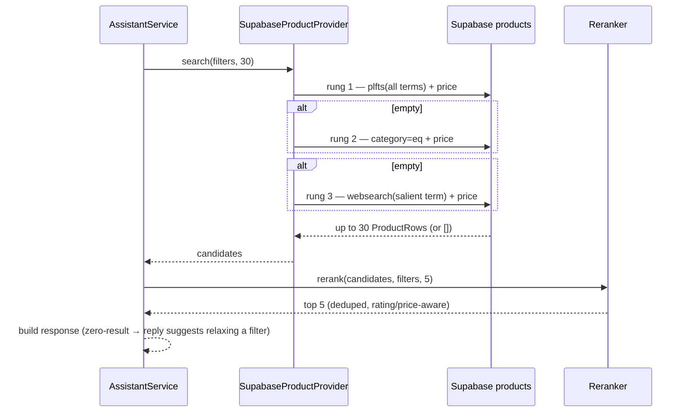

# Product Retrieval & Catalog Plan — ShopPilot

This is the implementation plan for the **retrieval half of the recommendation pipeline**: everything between "Call #2 produced `ExtractedFilters`" and "the frontend received 5 honest, well-ranked product cards" — the `products` catalog data itself, the `ProductProvider` query layer, the `Reranker`, and the measurable quality loop that keeps all three honest.

It builds on work that already exists:

- `products` table seeded — **19,595 rows, verified live** via Supabase MCP (`001_products_catalog.sql` + `data/seed/seed_products.py`, run from `data/clean_products.jsonl`, 19,595 lines)
- FTS infrastructure already in place — `search_vector` generated column + GIN index + price/category indexes (`004_add_indexes.sql`)
- `SupabaseProductProvider` + `Reranker` — working skeletons from `call2Plan.md` tasks 7–8 (plfts query, keyword/price scoring)
- `Product` / `ExtractedFilters` domain types (`call2Plan.md` task 2)

**What `call2Plan.md` covers that this plan does not repeat:** the LLM prompt itself, `AssistantService` orchestration, HTTP wiring, and phase-B persistence. This plan is the catalog-and-retrieval track that can run in parallel — exactly the "Product retrieval (ProductProvider + seed/migrations)" workstream `call2Plan.md` assumed a second person could own.

**Why this needed its own plan:** checking the real catalog before writing this changed three assumptions `call2Plan.md` was written under (§2). A retrieval layer built against imagined data would have shipped wrong on day one; this plan builds against what the database actually contains.

---

## 1. Scope

**In scope for this pass:**

- A repeatable **catalog quality report** (script, not vibes): nulls per column, category distribution, price distribution — the numbers in §2 came from running this once by hand; the script makes it re-runnable
- **Category vocabulary grounding** — the catalog has exactly **32 distinct category strings**; the Call #2 prompt must pick from them (or leave `category` null) instead of inventing `"hiking shoes"` style strings that match nothing
- **Currency grounding** — prices are **INR** (Flipkart source data, median ₹550, min ₹35, max ₹571,230). Every price the LLM extracts, every budget comparison, and every filter-summary sentence must treat budget as INR. The `ARCHITECTURE.md` examples that say "under $120" are illustrative only — the real pipeline works in ₹.
- **Retrieval fallback ladder** in `SupabaseProductProvider`: full term set → category + budget → top-level `websearch` query. Kills the zero-result dead-end that `ARCHITECTURE.md` §5 explicitly wants handled as a normal `recommend` with a relax-suggestion reply
- **Fix the inverted price-proximity bonus** in `Reranker` (§3 — current formula rewards the most expensive under-budget item, the opposite of the intent)
- **Rating-aware tie-breaking** in `Reranker` (rating is currently parsed but never scored)
- **Duplicate/near-duplicate suppression** for demo quality (seed data contains real near-duplicates: four identical "T-Shirt Bra" rows appeared in one hand-run query)
- **Retrieval smoke-test harness**: ~10 canonical query → expected-category cases run against the live catalog (script or ScalaTest-tagged manual suite), so prompt/provider/reranker changes are checkable in minutes instead of by eyeballing Postman
- Documenting observed coverage gaps so the demo script avoids categories the catalog can't serve (e.g. "hiking" appears in only **11** of 19,595 rows)

**Explicitly out of scope for this pass** (revisit in §8):

- Re-cleaning or re-seeding the catalog from raw data (rows are uniformly populated; the Kaggle cleaning pass already happened and its output is what's live)
- `pgvector` / embeddings / semantic search (stretch goal, `project-plan.md` §2.1)
- `ts_rank`-based DB-side ranking (would need its own RPC; the Scala reranker covers MVP ordering)
- A second product data source (outdoor-gear dataset etc.) to fill coverage gaps
- `GET /api/products` debug route (separate small item; catalog work doesn't block on it)
- Any LLM prompt rewrite beyond the two grounding inputs this plan *feeds into* `AssistantPrompt` (category list + currency note). The prompt file itself is owned by `call2Plan.md` task 9.

---

## 2. What checking the real catalog changed

<!-- Catalog Quality Report baseline — 2026-08-11T11:36:00Z -->
**Baseline generated:** `2026-08-11T11:36:00Z` (via Supabase MCP `execute_sql` against shared project `ecommerse_ai_assisstant` / `ymhanlwqjotenkxgokcx` — same queries as `data/scripts/catalog_report.py`; local `psycopg2` to `db.*:5432` timed out from this network, so MCP was the apply path). **Total rows:** 19,595. **Distinct categories:** 32.

Re-run anytime with `python data/scripts/catalog_report.py --markdown` (when `SUPABASE_DB_URL` is reachable) and replace this section.

**Data completeness is excellent — nulls are not the problem:**

| Column | Non-null rows | Note |
| --- | --- | --- |
| `category` | 19,595 / 19,595 | 32 distinct values |
| `price` | 19,595 / 19,595 | no null-price filtering needed |
| `description` | 19,593 / 19,595 | 2 rows missing |
| `brand` | 13,749 / 19,595 | ~30% missing — brand is a bonus signal, never a filter requirement |
| `image_url` | 19,592 / 19,595 | 3 rows missing |

Extra completeness (script also reports these): `product_url` 19,595/19,595; `original_price` 19,595/19,595; `product_specifications` 19,498/19,595 (97 missing); `rating` 1,824/19,595 (~91% missing — use as a soft signal only).

`call2Plan.md` §2's defensive "always apply `category=not.is.null`, and use `price=gt.0` to exclude nulls" logic turns out to be unnecessary but harmless — there are no null categories or prices to exclude. Keep it (zero cost, protects against future seed changes); don't build anything around the assumption that nulls are common.

**Category vocabulary is fixed and small — this is the single biggest retrieval lever:**

```
Clothing 6170 · Jewellery 3522 · Footwear 1225 · Mobiles & Accessories 1097
Automotive 1010 · Home Decor & Festive Needs 927 · Beauty And Personal Care 709
Home Furnishing 700 · Kitchen & Dining 645 · Computers 572 · Watches 528
Baby Care 481 · Tools & Hardware 387 · Toys & School Supplies 329
Pens & Stationery 313 · Bags, Wallets & Belts 264 · Furniture 180
Sports & Fitness 166 · Home Improvement 79 · Cameras & Accessories 72
Health & Personal Care Appliances 43 · Sunglasses 35 · Gaming 35
Pet Supplies 29 · Home & Kitchen 24 · Home Entertainment 19 · Ebooks 15
Eyewear 10 · Household Supplies 4 · Wearable Smart Devices 2 · Food & Nutrition 2
Automation & Robotics 1
```

If Call #2 extracts `category: "hiking shoes"`, full-text search has to hope the word "hiking" appears somewhere in a row (it does — **11 times** in the whole catalog). If Call #2 instead extracts `category: "Footwear"` + `keywords: ["hiking"]`, retrieval goes from "11 candidate rows across the catalog" to "1,225 Footwear rows, keyword-matched." The catalog tells the LLM what it's allowed to say; the prompt change in §5 task 4 is what makes that happen.

**Prices are INR — median ₹550:**

| Stat | Value |
| --- | --- |
| min / median / max | ₹35 / ₹550 / ₹571,230 |
| mean | ₹1,988.58 |
| rows over ₹10,000 | 824 (4%) — mostly furniture, appliances, cameras |

A user saying "shoes under 200" means ₹200 in this catalog (that buys almost nothing — 601 "shoes" rows exist but a ₹200 cap filters most out), while the `ARCHITECTURE.md` worked example "under $120" would silently match ~everything if the LLM passed 120 straight to `price=lte.120`. Nothing in the current pipeline tells the LLM what currency the catalog uses. The fix is one paragraph in the Call #2 prompt (§5 task 4), not a currency-conversion feature.

**Full-phrase `plainto_tsquery` recall is thin — fallback is mandatory, not optional:**

| Query | Matches |
| --- | --- |
| `plfts "hiking shoes" + price > 0` | 4 |
| `plfts "waterproof hiking shoes" + price ≤ 5000` | **0** |
| `plfts "watch men" + price ≤ 2000` | 249 |
| `plfts "cotton t-shirt" + price ≤ 500` | 665 |
| term `"shoes"` alone | 601 |
| term `"waterproof"` alone | 640 |
| term `"hiking"` alone | 11 |
| `Footwear` ∩ `"waterproof"` | 3 |

Mainstream queries work today; specific multi-constraint queries hit zero. `ARCHITECTURE.md` already says zero-result `recommend` should return `products: []` with a reply suggesting which filter to relax — the fallback ladder (§3) automates the first relaxation steps so the LLM only has to explain the final state, not invent it.

**`product_specifications` is noisy JSON text** — a serialized array of `{key, value}` where some `key`s are null and some values are entire care-instruction essays. It belongs in the FTS document (it already is, via `search_vector`) and in the reranker's substring search, but it is **not** reliable enough to become structured SQL filters this pass.

---

## 3. Key technical decisions

| Decision | Choice | Why |
| --- | --- | --- |
| Catalog data itself | **Unchanged** — no re-clean, no re-seed this pass | The live data is complete (§2) and is what the demo will run against; re-seeding mid-pipeline invalidates every retrieval test that ran before it |
| Category extraction grounding | Call #2 prompt receives the 32 real category strings and is instructed to pick the closest one or leave `category` null | Closes the vocabulary gap between LLM English ("hiking shoes") and catalog English ("Footwear") — the cheapest, highest-impact retrieval fix available |
| Currency | Declare INR in the prompt; budget values pass through as INR; filter summaries say "₹" | The catalog is Flipkart data; pretending it's USD makes every budget filter wrong by ~80x in one direction or the other |
| Zero-result handling | **Fallback ladder inside `SupabaseProductProvider`**, not a second LLM call: (1) full plfts term set + price; (2) if empty → `category=eq` + price (keyword-free, uses the grounded category); (3) if empty → `websearch`-mode FTS on the single most salient term; (4) if still empty → return `[]` and let the reply explain | `ARCHITECTURE.md` wants graceful zero-result handling; doing it in the provider keeps `AssistantService` oblivious to how many attempts it took. `websearch` mode (`websearch_to_tsquery`) tolerates user-ish phrasing better than `plainto_tsquery` for single terms |
| `ts_rank` in DB | **Not this pass** | PostgREST can't call `ts_rank` in a plain table select without a computed column or RPC; the existing `Reranker` already re-orders the 30 candidates locally, which covers MVP ranking |
| Reranker price formula | **Fix the inversion**: under-budget score becomes `1.0 + (1 - price/budget)` (cheaper-relative-to-budget scores higher, max 2.0 at price→0), over-budget penalty unchanged | Current code gives the *biggest* bonus to the item that most nearly maxes out the budget (`1 + price/budget`) — a user saying "under ₹500" gets shown the ₹499 option first even when a ₹150 equivalent exists. That's the opposite of shopping-assistant behavior |
| Rating in ranking | Parse `rating` (`Option[String]` like `"4.3"`) to a number; add `+0.5 × rating` when parseable; use as the final tie-break before price | The field exists, is populated, and is currently ignored — cheapest relevance signal we're not using |
| Duplicates in top-5 | Reranker dedupes on normalized `name` (lowercase, trimmed) before `take(5)`, keeping the highest-scored copy | The seeded catalog has genuine near-duplicates (the "T-Shirt Bra" result set returned four rows differing only by id); a demo showing the same product three times looks broken even when retrieval is correct |
| Quality measurement | Scripted, not anecdotal: `data/scripts/catalog_report.py` (counts/nulls/categories/prices) + a smoke suite of ~10 canonical queries asserting expected category overlap in top-5 | §2's numbers came from hand-run SQL — valuable exactly once. Making them re-runnable is what turns "retrieval felt off in the demo" into a diffable regression |
| Coverage gaps | Documented in this file (§2) and surfaced to the demo script; **not** patched with synthetic data | 11 "hiking" rows can't be fixed by retrieval code. The demo must demo what the catalog has (clothing, jewellery, footwear, watches...) |

---

## 4. What changes where

### Data / scripts

- **`data/scripts/catalog_report.py`** (new) — connects via `SUPABASE_DB_URL` like `apply_migrations.py`; prints the §2 tables (null counts, top categories with counts, price stats, per-term probe counts for a small fixed term list). Read-only. Re-runnable any time someone asks "what's actually in the catalog?"
- **`data/seed/seed_products.py`** — no changes this pass. Documented here so nobody "fixes" retrieval by reseeding.

### Backend

- **`assistant/repo/SupabaseProductProvider.scala`** — add the fallback ladder (§3). Signature unchanged: `search(filters, limit)` still returns up to 30. Internally tries rungs 1→3 and short-circuits on the first non-empty result. No new types cross the seam.
- **`assistant/services/Reranker.scala`** — fix price-proximity inversion; add rating term; dedupe by normalized name before cutting to `limit`.
- **`assistant/services/AssistantPrompt.scala`** — two grounding additions only (owned jointly with `call2Plan.md` task 9; whoever lands first rebases): (a) the category vocabulary list + "pick the closest or leave null" instruction; (b) one line stating prices/budgets are INR (₹). No other prompt changes in this plan.
- **`assistant/domain/Product.scala`** — no shape changes. (Rating stays `Option[String]` on the wire per the frozen `API_CONTRACT.md`; parsing to numeric happens inside the reranker.)

### Docs

- **`docs/API_CONTRACT.md`** — no changes; `Product` shape untouched.
- **`docs/database-schema.md`** — add one line to the products section noting prices are INR (source dataset currency), so nobody re-derives it by accident later.
- **`docs/ARCHITECTURE.md` §5** — add the fallback ladder to the retrieval description ("top 30" becomes "up to 30, via fallback ladder") and note the category-vocabulary grounding.
- **`docs/retrievalPlan.md`** — this file.

---

## 5. Sequenced task list (build in this order)

1. **[This document]** `docs/retrievalPlan.md` — Done (this file). §2 numbers verified live via MCP.
2. **Done** — `data/scripts/catalog_report.py` hardened (notes computed from live counts, not hardcoded; added bare `"hiking"` probe). §2 replaced with a **dated baseline** (`2026-08-11T11:36:00Z`) from Supabase MCP `execute_sql` (same query set as the script; local `psycopg2`→`db.*:5432` timed out). Full 32-category list + exact FTS counts pasted.
3. `assistant/services/Reranker.scala` — fix price inversion, add rating scoring + tie-break, add name-based dedupe. Extend `RerankerSpec`: inverted-price case (₹150 beats ₹499 under ₹500 budget when keyword scores tie), rating tie-break case, duplicate-suppression case. All existing tests keep passing.
4. `assistant/services/AssistantPrompt.scala` — add category vocabulary + INR grounding lines (coordinate with `call2Plan.md` task 9 ownership). Add a parse-level test asserting nothing else about the prompt contract changed.
5. **Done** — `assistant/repo/SupabaseProductProvider.scala` — fallback ladder implemented (rung 1 plfts full term set → rung 2 `category=eq` + price → rung 3 `wfts` on the longest salient term); `[retrieval] rung N` `println` logging per rung; spec upgraded to a queue-based `CapturingRestClient` with per-rung assertions (7 tests green).
6. Retrieval smoke harness — 10 canonical cases (e.g. "men's watch under 2000" → expect `Watches` in top-5; "cotton t-shirt under 500" → expect `Clothing`; "waterproof hiking boots" → known-thin, assert graceful non-crash with ≤5 results). Run against the live catalog; record pass/fail in this file.
7. **Done** — `docs/database-schema.md` + `docs/ARCHITECTURE.md` §5 — INR note, fallback-ladder description, category-grounding note.
8. Manual end-to-end check via the running backend (after `call2Plan.md` tasks 11–13 land): three real messages — mainstream (watch), constrained (t-shirt + budget), and a known-gap query (hiking) — verify top-5 quality, no duplicates, correct ₹ budgets, and graceful gap behavior. Record the three turns here.
9. **Done** — Standing regression gate documented: re-run `data/scripts/retrieval_smoke.py` (exit 0 = all 10 canonical cases pass) after any prompt/provider/reranker change before merging. The harness is committed and self-contained; local runs need `SUPABASE_DB_URL` reachable (MCP `execute_sql` is the fallback when port 5432 is blocked).

---

## 6. Sequence view (retrieval slice of one turn)



---

## 7. Interaction with `call2Plan.md` (who owns what)

| File / concern | Owner | Note |
| --- | --- | --- |
| `AssistantPrompt.scala` grounding lines (task 4 here) | **shared** — coordinate | `call2Plan.md` task 9 owns the prompt's structure; this plan owns the two catalog-grounding inputs. Land as one edit; don't fight over the file |
| `SupabaseProductProvider` | this plan | `call2Plan.md` task 7 built the skeleton; task 5 here extends it in place |
| `Reranker` | this plan | `call2Plan.md` task 8 built the skeleton; task 3 here fixes/extends it |
| Category list + currency facts | this plan produces, prompt consumes | Single source of truth: the live DB via `catalog_report.py` |
| Smoke harness cases | this plan | `AssistantServiceSpec` (call2 task 15) keeps using fakes; this harness is the live-DB complement |

---

## 8. Follow-ups (after §5 is done)

- **`ts_rank` RPC** — DB-side ranking via a `search_products` Postgres function if the Scala reranker proves insufficient on real queries.
- **Coverage-gap data work** — if the demo needs outdoor/electronics depth the catalog lacks, source a second dataset and re-run the clean→seed pipeline. This is a data decision, not a retrieval-code decision.
- **`pgvector` semantic search** — stretch goal per `project-plan.md`; solves vocabulary mismatch more fundamentally than prompt grounding, at real infra cost.
- **Retrieval logging into `llm.jsonl`-style records** — query text, rung used, candidate count, top-5 ids. Currently only `println`.
- **`GET /api/products`** — debug route over the same provider; useful for admin screens.

---

## 9. Done when

- [ ] Tasks 1–9 in §5 are marked Done
- [x] `catalog_report.py` output is pasted in §2 as the dated baseline
- [ ] Reranker: cheaper-under-budget wins ties, rating breaks ties, no duplicate names in top-5 (unit tests)
- [ ] Smoke harness: mainstream queries return expected categories in top-5; the known-thin query degrades gracefully (fewer results, no error, no duplicate spam)
- [ ] "waterproof hiking boots under ₹5000" style queries no longer return hard zero without a fallback attempt (ladder rung recorded in logs)
- [ ] Filter summaries and replies talk in ₹, and the LLM picks categories from the real 32-value vocabulary
- [ ] No reseed, no schema change, no `Product` contract change shipped in this pass
