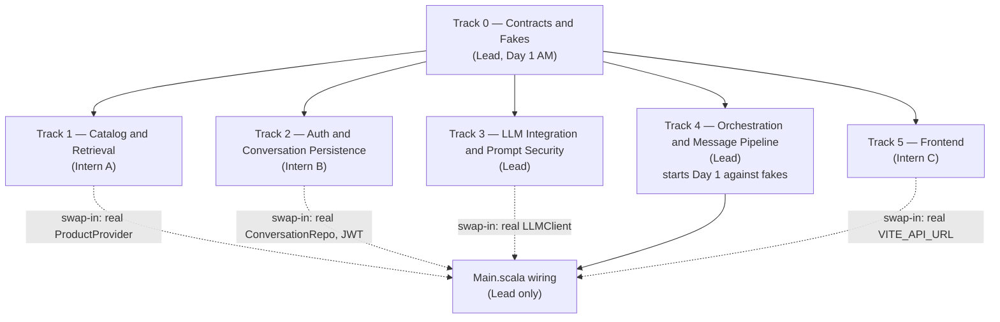

# Workflow — Horizontal, Seam-Based Parallel Execution

**Supersedes:** [`project-plan.md`](project-plan.md) §3 (Team Planning) and §8 (10-Day Development Timeline). Everything else in `project-plan.md` — scope, risks, tech stack, the "why Scala" section — still stands. This document replaces only *who builds what, in what order, and how they know it works* before the whole stack is wired together.

---

## 1. The problem this fixes

The original plan assigns **vertical** ownership: one person owns "catalog" end-to-end, another owns "auth" end-to-end, another owns "frontend" end-to-end. On paper that avoids merge conflicts, but it has a testing problem — nobody can prove the *message pipeline* works until catalog retrieval, auth, and LLM prompts are all separately finished and then wired together on one big "integration day" (Day 4 in the old plan). Until that day, most of what's been built is untestable except by manual code reading.

This document reorganizes the same work **horizontally**, around the seams (interfaces) the architecture already defines, so that:

- Every track can start on **Day 1**, without waiting for any other track's code to exist.
- Every track is **independently testable** the moment it's written — with real infrastructure where that's cheap (a real seeded Supabase table, a real curl call to Google AI Studio), and with fakes where a dependency hasn't landed yet.
- Integration is **continuous, not a single day** — real implementations get swapped in behind their interface as they land, one at a time, and the same tests that passed against the fake pass again against the real thing.

## 2. The current state (so nobody re-derives this from scratch)

Confirmed by reading the repo directly:

- Backend is only [`backend/src/main/scala/assistant/Main.scala`](../backend/src/main/scala/assistant/Main.scala) — a `cask.MainRoutes` object with `/` and `/health`. No `domain/`, `auth/`, `services/`, `repo/`, or `providers/` packages exist yet.
- Frontend is the default Vite + React template ([`frontend/src/App.tsx`](../frontend/src/App.tsx)) — no `ChatWidget`, no `ProductCard`, no `api/` client.
- `data/` has only `scripts/clean_products.py` and `clean_products.jsonl`. **`data/migrations/` and `data/seed/seed_products.py` do not exist yet**, even though `README.md`, `ARCHITECTURE.md`, and `ISSUES.md` describe them as if they're already built. Track 1 below has to write them, not just run them.
- [`backend/build.sbt`](../backend/build.sbt) has `cask`, `upickle`, and the raw `postgresql` JDBC driver — no test framework (`munit`), no `com.google.genai` (for calling Gemini/Gemma), no JWT/password-hashing library yet. Track 0 and Track 2/3 add these as they're needed.
- No CI exists yet.

None of this needs to be undone — it means every track below starts from a genuinely clean slate.

## 3. The fix: freeze contracts once, fake every seam, swap reals in later

1. **Day 1, lead only, half a day.** Codify the interfaces the docs already describe on paper — the domain shapes in [`API_CONTRACT.md`](API_CONTRACT.md), the `LLMClient` and `ProductProvider` traits already named in [`ARCHITECTURE.md`](ARCHITECTURE.md) §5 and [`project-plan.md`](project-plan.md) §4.4, plus one new trait (`ConversationRepo`) needed to make persistence fakeable too. This is mostly transcription of already-agreed shapes — low risk, fast, and it's the one PR everyone else's branch starts from.
2. **Every other track starts immediately** against those traits and their fakes. Nobody waits on anybody else's real implementation.
3. **Real implementations land continuously**, each provably correct in isolation, using whatever is cheapest to test against (real seeded Supabase for retrieval, real curl calls to Google AI Studio, real JWT round-trips for auth) — never blocked on another track's real implementation.
4. **The message pipeline is built and tested from Day 1** against fakes. As each real implementation lands, the lead flips one line of wiring in `Main.scala` and re-runs the *same* tests — now as true end-to-end checks. This replaces the old single "wire everything" day with a series of small, low-risk swaps.

Note what this diagram is *not*: there are no arrows between Track 1, 2, 3, and 5. They only depend on Track 0. That's what makes them genuinely parallel — none of the interns is ever blocked on another intern.

---

## 4. Tracks

Each track lists: **owner**, **files it owns**, **what it depends on**, **how to test it before any other track exists**, and **acceptance criteria**.

### Track 0 — Contracts & Fakes

**Owner:** Lead. **Timebox:** half a day, Day 1 morning. Nobody else writes real code until this merges.

**Deliverables:**

- `backend/src/main/scala/assistant/domain/` — case classes matching [`API_CONTRACT.md`](API_CONTRACT.md) exactly: `Product`, `ExtractedFilters`, `User`, `Conversation`, `ConversationSummary`, `ConversationTurn`/`Message`, `AssistantReply`, `ErrorBody`.
- `backend/src/main/scala/assistant/services/LLMClient.scala` — the trait only (see [`project-plan.md`](project-plan.md) §4.4 for the exact shape).
- `backend/src/main/scala/assistant/services/providers/ProductProvider.scala` — the trait only.
- `backend/src/main/scala/assistant/repo/ConversationRepo.scala` — **new trait**, not yet named in the docs. Needs at minimum:
  - `resolveOwner(sessionId): Future[Option[(conversationId, userId)]]`
  - `loadState(conversationId): Future[ExtractedFilters]`
  - `recentMessages(conversationId, limit): Future[Seq[ConversationTurn]]`
  - `appendMessage(conversationId, turn): Future[Unit]`
  - `updateState(conversationId, filters): Future[Unit]`
- Fakes: `FakeLLMClient` (returns canned `{"safe": true}` / canned filters+reply), `InMemoryProductProvider` (a handful of hardcoded products), `InMemoryConversationRepo` (in-memory maps, no DB).
- `backend/src/main/scala/assistant/logging/Logger.scala` — a trivial stub (`println`/console-only is fine) so every other track can start calling it immediately. Track 6 (below) fleshes it out later without other call sites changing.
- Add `munit` and `sttp` to `backend/build.sbt` now, since every later track needs one or both.

**Test:** `sbt compile` succeeds; one unit test per fake asserting its canned behavior (e.g. `FakeLLMClient` returns `safe: true` for any input by default, `InMemoryProductProvider.search` returns its fixture list).

**Acceptance criteria:**
- [ ] All domain case classes compile and match `API_CONTRACT.md` field-for-field (camelCase, same optionality).
- [ ] `LLMClient`, `ProductProvider`, `ConversationRepo` traits exist with no implementation logic in them.
- [ ] `FakeLLMClient`, `InMemoryProductProvider`, `InMemoryConversationRepo` exist and are unit-tested.
- [ ] PR reviewed and merged same day — this is the one hard dependency every other track has.

---

### Track 1 — Catalog & Retrieval

**Owner:** Intern (was "Intern 2" in the old plan).

**Owns:**
- `data/migrations/001_products_catalog.sql` (the `products` table + `search_vector` + GIN index, per [`database-schema.md`](database-schema.md#products-table))
- `data/migrations/004_add_indexes.sql` (the products-related indexes: `products_search_idx`, `products_price_idx`, `products_category_idx`)
- `data/seed/seed_products.py` (Kaggle CSV/JSONL → `products` upsert, per [`database-schema.md`](database-schema.md#seeding))
- `backend/src/main/scala/assistant/services/providers/SupabaseProductProvider.scala` (implements Track 0's `ProductProvider`)
- `backend/src/main/scala/assistant/services/Reranker.scala`

**Depends on:** Track 0's `ProductProvider` trait and `Product`/`ExtractedFilters` case classes. Nothing else.

**How to test in isolation:**
- Apply the migration and run the seed script against the shared Supabase project (see [README.md](../README.md#database-migrations--seeding)) — this alone is independently verifiable via the Supabase SQL editor, no backend code needed.
- `munit` test that instantiates `SupabaseProductProvider` directly and calls `.search(filters)` — asserts full-text search and price/category filters return real rows. No auth, no LLM, no HTTP route in the loop.
- `Reranker` is a pure function — unit-test it with fixture `List[Product]`, no DB connection at all.

**Acceptance criteria:**
- [ ] Migrations 001 and the products-related parts of 004 applied and announced in the team channel (per `ARCHITECTURE.md` §2).
- [ ] `python data/seed/seed_products.py` seeds the shared catalog idempotently.
- [ ] `SupabaseProductProvider.search()` returns correct results against real seeded data, proven by a test that does not touch any other track's code.
- [ ] `Reranker` has unit tests independent of the database.

---

### Track 2 — Auth & Conversation Persistence

**Owner:** Intern (was "Intern 3" in the old plan).

**Owns:**
- `data/migrations/002_init_users_and_conversations.sql`, `003_add_messages_and_state.sql`, and the non-product indexes in `004_add_indexes.sql`
- `backend/src/main/scala/assistant/auth/` — registration, login, JWT issue/verify, password hashing (Argon2/bcrypt)
- `backend/src/main/scala/assistant/repo/SupabasePostgresConversationRepo.scala` — the real implementation of Track 0's `ConversationRepo`
- The CRUD routes that never touch LLM or products: `POST /api/auth/register`, `POST /api/auth/login`, `POST /api/conversations`, `GET /api/conversations`, `POST /api/conversations/{id}/resume`, `PATCH /api/conversations/{id}`, `DELETE /api/conversations/{id}`

**Depends on:** Track 0's domain classes and `ConversationRepo` trait. Nothing else — notably, none of these routes need a real `LLMClient` or `ProductProvider` to be fully built and tested.

**How to test in isolation:**
- Unit tests: password hash + verify round-trip; JWT issue → verify → expiry.
- Integration tests via curl/Postman against every route listed above, run against the real shared Supabase project — every one of them is fully functional without a live LLM or real catalog existing.
- An explicit IDOR test: a second user's JWT against the first user's `conversationId` must get `403`, per [`ARCHITECTURE.md`](ARCHITECTURE.md) §3.

**Acceptance criteria:**
- [ ] Migrations 002/003 (+ relevant 004 indexes) applied and announced.
- [ ] `/api/auth/register` and `/api/auth/login` work end-to-end against curl, returning a real JWT.
- [ ] All six conversation CRUD routes work end-to-end against curl, ownership-checked.
- [ ] IDOR test passes (cross-user access is rejected with `403`).

---

### Track 3 — LLM Integration & Prompt Security

**Owner:** Lead (kept with the lead per the existing "only the lead touches `LLMClient`" rule in `project-plan.md` §3.2 — this is also where the security guarantees the whole pipeline depends on live).

**Owns:**
- `backend/src/main/scala/assistant/services/GemmaLLMClient.scala` — implements Track 0's `LLMClient` using Google AI Studio (`com.google.genai`): **primary** `gemini-3.5-flash-lite`, **fallback** `gemma-4-31b-it` on quota/rate-limit errors
- The two system prompts: validation (Call #1) and assistant/filter-extraction+explanation (Call #2), per [`ARCHITECTURE.md`](ARCHITECTURE.md) §6
- `backend/src/main/scala/assistant/services/RegexPreFilter.scala`

**Depends on:** Nothing but Track 0's `LLMClient` trait — no DB, no auth, no HTTP routes. The most independent track in the whole plan.

**How to test in isolation:**
- Prompt iteration via curl/Postman straight against the Google AI Studio endpoint — provable before any Scala code exists.
- Unit tests for defensive JSON parsing using canned response strings (valid, malformed, missing `safe` field) — proves the fail-closed rule without any network call.
- A network-gated integration test (skipped unless `GEMMA_API_KEY` is set) that exercises `GemmaLLMClient.complete()` against `gemini-3.5-flash-lite`, and verifies fallback to `gemma-4-31b-it` when the primary returns quota errors.
- `RegexPreFilter` is pure-function testable: known injection patterns must reject, known legitimate shopping phrases (e.g. *"ignore the mesh ones, I need leather"*) must pass.

**Acceptance criteria:**
- [ ] `GemmaLLMClient` implements `LLMClient`, uses `gemini-3.5-flash-lite` by default, and falls back to `gemma-4-31b-it` on quota/rate-limit errors.
- [ ] Covered by parsing unit tests independent of network access.
- [ ] Fail-closed proven: malformed/missing-`safe` JSON is treated identically to `safe: false`.
- [ ] `RegexPreFilter` denylist is narrow and pattern-specific (per `ARCHITECTURE.md` §6), with tests for both false positives and true positives.
- [ ] Manually verified against the real Google AI Studio API at least once before merging (primary model, and fallback path if possible).

---

### Track 4 — Orchestration & Message Pipeline

**Owner:** Lead — this is the integration-heavy "meat" of the project, and per the old plan's own risk table, it's where mistakes are most expensive.

**Owns:**
- `backend/src/main/scala/assistant/services/ConversationOrchestrator.scala` — regex → Call #1 → persist user message → Call #2 → retrieve → rerank → persist assistant message → reply
- `backend/src/main/scala/assistant/http/MessageRoutes.scala` — `POST /api/sessions/{sessionId}/messages`

**Depends on:** Track 0's traits and fakes only, to start. Real `LLMClient`/`ProductProvider`/`ConversationRepo` are swapped in later (see below) — this track is explicitly designed to **not wait** for Tracks 1–3.

**How to test in isolation, starting Day 1:**
- Build and test the entire orchestration function against `FakeLLMClient` + `InMemoryProductProvider` + `InMemoryConversationRepo`:
  - Regex match → rejects, and the fake repo records zero writes.
  - `FakeLLMClient` returns malformed/`safe:false` → rejects, zero writes, fail-closed.
  - Happy path → correct `filters_snapshot`/`safe` written via the fake repo, `conversation_state` updated, and the returned shape matches `AssistantReply` in `API_CONTRACT.md`.
  - Call #1 passes but `FakeLLMClient` is configured to fail Call #2 → generic "something went wrong" response, no stale state written.
- All of the above is provable with zero real infrastructure — no Supabase, no Google AI Studio API key needed.

**Swap-in checkpoints (replaces the old "wire everything on Day 4"):**
- As Track 1's `SupabaseProductProvider`, Track 2's `SupabasePostgresConversationRepo`, and Track 3's `GemmaLLMClient` each individually pass their own acceptance criteria, the lead changes one line each in `Main.scala` (the only file the lead exclusively owns) to point at the real implementation instead of the fake.
- The *same* orchestration tests are re-run after each swap — they should still pass, now as genuine end-to-end integration tests against real Supabase and/or real Google AI Studio. A failure at this point means the real implementation doesn't honor its trait's contract, not that the orchestration logic is wrong — this isolates the bug immediately.

**Acceptance criteria:**
- [ ] Full pipeline behavior (regex reject, fail-closed validation, happy path, Call #2 failure) is proven against fakes before any real dependency lands.
- [ ] Each of the three swap-ins (`ProductProvider`, `ConversationRepo`, `LLMClient`) is a single-line change in `Main.scala`, verified by re-running the existing test suite, not new tests.
- [ ] `POST /api/sessions/{sessionId}/messages` matches the `API_CONTRACT.md` response shape in both the `recommend` and `clarify` modes.

---

### Track 5 — Frontend

**Owner:** Intern (was "Intern 4" in the old plan) — already the most decoupled part of the original plan, unchanged in spirit here.

**Owns:** everything under `frontend/src/` — `components/ChatWidget/`, `components/ProductCard/`, login/register screens, `api/` client.

**Depends on:** nothing backend-related to start. Builds directly against [`API_CONTRACT.md`](API_CONTRACT.md).

**How to test in isolation:**
- Build a mock server (or in-memory stub in `frontend/src/api/`) returning the exact sample JSON bodies from `API_CONTRACT.md`, gated behind a `USE_MOCK_API` flag, per that doc's "Frontend integration checklist."
- Every screen — chat, product cards, login/register, conversation history — is fully clickable and demoable against the mock before the backend has a single real route.
- Swap-in: once Track 4 is live (even mid-swap-in, since the response *shape* was frozen from Track 0), flip `USE_MOCK_API` off and point `VITE_API_URL` at the real backend. No component code should need to change — only the flag.

**Acceptance criteria:**
- [ ] Every screen works end-to-end against the mock API.
- [ ] Switching `USE_MOCK_API` off requires no component changes, only the flag/env var.

---

### Cross-cutting — Logging

**Owner:** Lead, low priority, fleshed out opportunistically once Tracks 0–4 are moving.

Track 0 ships a stub `Logger` (console output is enough) so every track can call it immediately (`Logger.info(...)`, `Logger.error(...)`) without waiting. Later, the lead upgrades it in place to the real `app.log` / `error.log` / `llm.jsonl` format described in [`ARCHITECTURE.md`](ARCHITECTURE.md) §7 — because every call site already goes through the same `Logger` object, this upgrade touches one file, not every track's code.

---

## 5. Milestones (replaces the old Day 1–10 gantt)

| Day | What happens |
| --- | --- |
| **1** | Track 0 lands by midday (contracts + fakes). Tracks 1, 2, 3, 4, 5 all start in parallel that same afternoon. |
| **2–5** | Each track builds and tests independently per the acceptance criteria above. As each of Tracks 1/2/3 hits its own acceptance criteria, the lead performs that track's swap-in checkpoint in `Main.scala` — this can happen on different days for different tracks, not all at once. |
| **6** | **Mid-sprint demo + buffer** — kept from the old plan. By this point the pipeline should already be demoable end-to-end (fakes fully or partially swapped), because integration wasn't deferred to a single day. Retro + replan for week 2 as before. |
| **7–8** | Prompt tuning, reranker tuning, error handling/edge cases, logging fleshed out to its full format — same substance as the old plan's Days 7–8, just no longer gated on a big-bang integration day. |
| **9** | Deploy (Railway/Render/Fly.io), docs pass, full regression on the deployed demo. |
| **10** | **Demo day + buffer** — final bug bash, dry run, backup recording, same as before. |

The key difference from the old timeline: there is no day where "wire the full pipeline" is itself the task. By Day 6, the pipeline has already been exercised continuously against fakes and against each real dependency as it landed.

## 6. File/directory ownership (keeps merge conflicts near zero)

| Track | Owns |
| --- | --- |
| 0 (Lead) | `domain/`, `services/LLMClient.scala` (trait), `services/providers/ProductProvider.scala` (trait), `repo/ConversationRepo.scala` (trait), all `Fake*`/`InMemory*` test doubles, `logging/Logger.scala` (stub) |
| 1 (Intern A) | `data/migrations/001_*.sql`, products-related parts of `004_*.sql`, `data/seed/seed_products.py`, `services/providers/SupabaseProductProvider.scala`, `services/Reranker.scala` |
| 2 (Intern B) | `data/migrations/002_*.sql`, `003_*.sql`, non-product parts of `004_*.sql`, `auth/`, `repo/SupabasePostgresConversationRepo.scala`, `http/AuthRoutes.scala`, `http/ConversationRoutes.scala` |
| 3 (Lead) | `services/GemmaLLMClient.scala` (Gemini primary / Gemma fallback), prompt text/constants, `services/RegexPreFilter.scala` |
| 4 (Lead) | `services/ConversationOrchestrator.scala`, `http/MessageRoutes.scala`, `Main.scala` (wiring — lead-exclusive, per `project-plan.md` §3.2) |
| 5 (Intern C) | everything under `frontend/src/` |

This is the same "vertical ownership avoids conflicts" principle from the old plan (`project-plan.md` §3.2) — it isn't gone, it's just that ownership now maps to a *layer/interface* instead of a *feature*, which is what unlocks parallel testing.

## 7. See also

- [`ARCHITECTURE.md`](ARCHITECTURE.md) — the full design each track's real implementation must honor.
- [`API_CONTRACT.md`](API_CONTRACT.md) — the frozen request/response shapes Track 0 codifies and Track 5 mocks against.
- [`database-schema.md`](database-schema.md) — the DDL Tracks 1 and 2 turn into migrations.
- [`project-plan.md`](project-plan.md) — scope, risks, and tech stack, still authoritative outside of §3 and §8.
